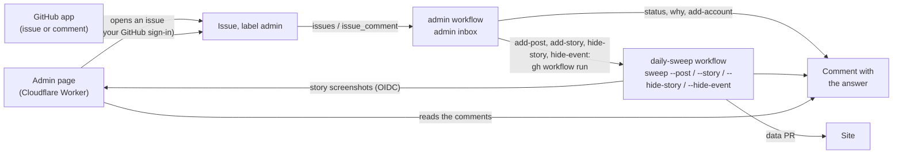

# Pa' Bailar admin tools

Tools for running Pa' Bailar day to day: see how the sweeps and quotas are doing, find out why an event isn't
on the site, add a post or an account by hand.

| What | Where | State |
|---|---|---|
| **The admin page**, two tabs: **Estadísticas** (sweeps, quotas, accounts, events) and **Herramientas** (new workshop series to look at, and Ocultar; check, add or read again a post; add an account; add an event from a story's screenshots) | https://pa-bailar-admin.jzamorac-9.workers.dev | Done |
| **The admin inbox**: the same requests as issues in this repository, from the GitHub app | Issues → New issue | Done |
| **Commands** on your computer: `admin status`, `admin why`, `admin add-account`, `sweep --post`, `sweep --story`, `sweep --hide-story`, `sweep --hide-event`, and `admin bakeoff` (re-checking the last resort's models) | Terminal | Done |
| Corrections: `corrections.json` and `admin fix`, fed by the site's report form | | Planned |

**None of these tools is AI.** They're fixed checks over what the sweeps record (`state/` on the
`sweep-state` branch). Only adding a post or a story sends it to Gemini: one request, from the same daily budget
as the sweeps (a post goes to the last resort, Groq or OpenRouter, when Gemini is out; a story never does).
`admin bakeoff`, on your computer only, runs models on purpose to compare them.

## Using it

### From the admin page

Open https://pa-bailar-admin.jzamorac-9.workers.dev and sign in with GitHub (only `jzamora5` gets in).

The page has two tabs, pinned at the top while you scroll:
- **Estadísticas:** what the last sweep left, read only (below).
- **Herramientas:** everything that changes something: the new series with their Ocultar buttons, adding a
  post, a story or an account, and the requests' answers. A number on the tab counts the new series waiting
  there.

The first visit opens Estadísticas; after that, the tab you picked last (kept in this browser). Something
shared to the page (a post's link, a story's link, story screenshots, also when they wait through a sign-in)
always opens Herramientas. `#estadisticas` or `#herramientas` at the end of the address opens that tab; the
address follows the tab you pick. On a keyboard, ← and → (or Home, End) move between the tabs.

**Herramientas**, from the top:

- **Series nuevas** (only when there are some): workshop series (one event with several dated sessions,
  ARCHITECTURE.md section 9.1) first published in the last 14 days and not over yet (`NEW_SERIES_DAYS`,
  `status.new_series`). Each shows its title (linked to the site), @cuenta, its sessions ("4 sesiones: 8, 22,
  29 nov y 6 dic"), where it came from (its posts' links, or "historia") and **Ocultar del sitio**: one tap (it
  asks first) opens an "Ocultar evento" request, like the other tools. It's a safety net while Gemini learns
  this new kind of event: look at each new series once. It comes from `status.json` but sits here, not in
  Estadísticas, because its button changes the site.
- **Revisar o agregar un evento:** paste a post's Instagram link.
  - **Revisar:** whether its event is on the site and, if not, why. An answer in about a minute.
  - **Agregar:** reads the post and publishes its event. A few minutes: it waits for a running sweep (and
    any earlier request) to finish, then publishes through the usual data PR. If the sweeps are still busy
    after 50 minutes, it answers so and doesn't start: ask again later. If the account isn't swept yet, it's added too.
    Posts the API can't give (a personal account's, a collaboration, Instagram's limit reached) are read from
    the post's public page instead (see below).
  - **Volver a leer:** like Agregar, but it reads the post again even if it was read before and hasn't
    changed (Agregar answers "Ya la había leído y no ha cambiado" without reading it). For an event that was
    published with wrong data, e.g. a congress stored with its first day only: one Gemini request, and the
    event keeps its link.
  - **@cuenta:** rarely needed: when the link doesn't say the account, it's read from the post's public page.
- **Agregar una cuenta a los barridos:** checks that Instagram can read it (business or creator accounts
  only), then adds it. The next sweep reads its last 30 days of posts.
- **Agregar desde una historia:** an event announced in an Instagram story, from **screenshots** of it
  (Instagram doesn't let anything outside the app read a story, and a story's link alone can't be read).
  See "Adding an event from a story" below.
- **Pedidos recientes:** the latest requests; tap one to see its answer again. The page follows a request it
  sent (or one you tapped) for 15 minutes; if it's still running then, it says so: tap it again later.
  Each button sends one request per tap. It stays in Herramientas: it's where the requests' answers show.

**Estadísticas:** the sweeps (✅ or ⚠️, with links to the runs), Gemini usage per model and when it resets,
the last resort's use (Groq, OpenRouter: a card only on a day Gemini ran out), Instagram, accounts and events. It's the latest `status.json`, as of the last sweep. When it can't be read
(none saved yet, GitHub failing, offline), a note takes its place and Herramientas still works.

Each request is an issue in this repository (label `admin`), answered by the `admin` workflow: the page
opens it and shows the answer when it arrives.

**Sharing from Instagram (Android):** install the page once (Chrome → ⋮ → "Instalar app" or "Agregar a la
pantalla principal"). It then shows up as **PB Admin** (the record on marigold, with a wrench) in the share
menu, for links and for images:
- **A post:** the paper plane → "Compartir en…" → PB Admin. The page opens with the post's link filled in
  (without Instagram's `?igsh=` tracking): tap Revisar, Agregar or Volver a leer. If the session ended, it asks
  you to sign in and keeps the link for 30 minutes.
- **A story's screenshot** (or several): see "Adding an event from a story" below.
- **A story's link:** a link alone can't be read, so the page keeps its @cuenta for 30 minutes, fills it in
  under "Agregar desde una historia" and asks for the screenshot.
- Anything else (a profile) opens the page with a note that it isn't a post's link.

iPhones don't support sharing to web pages: there, copy a post's link and paste it, and pick story screenshots
with **Elegir capturas**.

If PB Admin was installed before story screenshots could be shared (October 2026), Android may take up to a day
to list it for images: uninstall it and install it again (Chrome → the page → ⋮ → "Instalar app") to see it
right away. The first share right after installing can arrive before the page is ready: it then says so, and
sharing again works.

### Adding an event from a story

1. Open the story and take a **screenshot** (power + volume down). If the story shows another post's card
   (a reshared post), tap the card and share **that post** instead: its link gives a better image and the
   caption.
2. **Android:** on the screenshot's preview (or later in Photos / Files), Share → **PB Admin**. A story spread
   over several slides: take one screenshot per slide and share them together (up to 4), or one at a time:
   they add up. **iPhone or computer:** open the page and tap **Elegir capturas**.
3. The page shows the screenshots under **Agregar desde una historia**, with two optional fields:
   - **@cuenta:** whose story it is. Usually not needed: it's read from the name at the top of the story. A
     story's link shared just before fills it in.
   - **Notas:** what the image doesn't say or says badly ("sábado 12, Galería Café Libro"). They help read the
     story and are never published.
4. Tap **Agregar desde historia**. Each screenshot is made smaller (1080 px wide, JPEG, the phone's status bar
   cut off) on the phone, uploaded, and a request is opened like the others. The answer appears below.
5. A few minutes later (it takes its turn after a running sweep, like Agregar): the answer, a **receipt**
   of what was read:
   - the events published (title, weekday and date, time, venue), with links; a workshop series shows its
     sessions ("4 sesiones: 8, 22, 29 nov y 6 dic");
   - **Lo que leí:** the account and where it came from (typed, the post the story reshares, the name at the
     top of the story, or completed from a known account when that name was cut off; ⚠️ when Instagram
     couldn't confirm it), how each date was worked out ("año deducido", "fecha deducida del día de la
     semana", "semanal: publiqué la próxima fecha", a weekday that doesn't match the date), the location
     sticker, the mentions (never the event's account), and when the screenshot was taken;
   - the published flyer: a crop of the screenshot, never the whole screenshot;
   - **Ocultar del sitio (deshacer)**: takes what this story published off the site (it asks first). Then
     share it again with the @cuenta or a note to fix it.

Screenshots shared or picked wait on the phone (for a day) until they're sent, so signing in again doesn't
lose them; ✕ removes one. Once uploaded, they're kept on Cloudflare (KV) for at most 7 days: deleted as soon as
their event is published, otherwise they expire. **Capturas en espera** (under the form) counts them.

### From GitHub (the inbox)

In this repository: **Issues → New issue → "Pedido a las herramientas de administración"**, or any new issue or
comment of yours that the inbox understands (`pa_bailar/inbox.py`):

| Write | It does |
|---|---|
| A post's Instagram link | **Revisar**: why its event is or isn't on the site |
| `/agregar` and the link (and `@cuenta` if needed) | **Agregar**: reads the post and publishes it |
| `/releer` and the link | **Volver a leer**: reads it again even if it hasn't changed |
| `/cuenta @academia` | Adds the account to the sweeps |
| `/estado` | The status, as on the page |
| `/historia` and screenshot ids (then `@cuenta` and notes, on the same line) | **Agregar historia**: the screenshots must have been uploaded by the page (it writes this request itself) |
| `/ocultar story-…` | **Ocultar historia**: takes what that story published off the site (the id is in its answer) |
| `/ocultar` and an event's id (`/ocultar programa-intensivo-8-nov`, or its link on the site) | **Ocultar evento**: takes that event off the site, whatever it came from (posts or stories); see "Ocultar evento" below |
| A command without its link, or anything else on a request issue (the form, the page) | The list above |

A command is a word starting with `/` at the start of a line (any case: `/Agregar` works too). Ordinary
words never are: "revisar el estado de…", "agrega", "publica", "volver a leer" or "agregar cuenta" in a note
start nothing, because some commands spend Gemini or change `accounts.txt`.

The answer arrives as a comment (from github-actions), and the issue closes once it's done. Writing again on
a closed issue works too. Only your issues and comments count (`jzamora5`, in `.github/workflows/admin.yml`),
and only requests: an issue from the form or the page (label `admin`), or a text with a post link or a
command from the table. Your other issues and comments (notes, ideas) get no answer and no label.

### From your computer

From the repository root (`.env` has the keys):

```bash
.venv\Scripts\python -m pa_bailar admin status
.venv\Scripts\python -m pa_bailar admin why https://www.instagram.com/p/<code>/ [--account @x] [--json]
.venv\Scripts\python -m pa_bailar admin add-account @academia
.venv\Scripts\python -m pa_bailar sweep --post https://www.instagram.com/p/<code>/ [--account @x] [--again]
.venv\Scripts\python -m pa_bailar sweep --story <id> [<id>…] --story-dir <folder> [--account @x] [--notes "…"]
.venv\Scripts\python -m pa_bailar sweep --hide-story story-<hash>
.venv\Scripts\python -m pa_bailar sweep --hide-event <event id>
```

`sweep --story` reads `<id>.jpg` (and `<id>.json`, the file's name and dates, if there) from the folder: on
GitHub the workflow downloads them from the page first.

`status` and `why` read the sweeps' latest state from the `sweep-state` branch, fetched each time.
`sweep --post` runs like a local sweep, with your own `state/`, and with `add-account` it changes
`accounts.txt` and the data in `..\pa-bailar-web\data` on your computer: commit and open the PRs yourself, or
use the page or the inbox, which do it.

### Re-checking the last resort's models (`admin bakeoff`)

When Gemini runs out of quota, the sweep extracts with Groq and then OpenRouter's free models (docs/ARCHITECTURE.md,
section 7.3). Free models change, slow down or disappear without notice, so every so often (or when the health
report shows them failing) check them against Gemini Flash:

```bash
.venv\Scripts\python -m pa_bailar admin bakeoff --discover                 # OpenRouter's free vision models now
.venv\Scripts\python -m pa_bailar admin bakeoff                            # Flash-Lite and every last-resort model
.venv\Scripts\python -m pa_bailar admin bakeoff --models "openrouter:new/vision:free" --posts 10
.venv\Scripts\python -m pa_bailar admin bakeoff --score                    # only the score, no requests
```

- It picks recent posts Flash read on its own (final, the only post of their events, with a flyer stored) from
  the site's `data/` (`..\pa-bailar-web\data`) and the sweeps' records, a third of them with a workshop series
  or several days when there are. `--repick` chooses again; a different `--posts` does too.
- Each model reads each post's caption and stored flyer with the sweep's own extraction prompt: one request per
  model and post, **from the same daily quotas as the sweeps** (Gemini's, Groq's and OpenRouter's 50 a day). Run it
  between sweeps, not on a day the quotas are tight.
- Models are named as the sweep records them: `gemini-3.5-flash-lite`, `groq:qwen/qwen3.8-27b`,
  `openrouter:google/gemma-4-31b-it:free`. A provider's model needs its key in `.env` (`GROQ_API_KEY`,
  `OPENROUTER_API_KEY`).
- Answers are cached in `state/bakeoff/` (git-ignored): a second run spends nothing on what was answered and
  retries only the failures. Groq waits for its 8,000 tokens a minute between posts (about a post a minute), and a
  request its limits kept from being sent isn't cached: the next run asks it again.
- The score, per model: events found, missed and extra against Flash's, errors, average seconds, and each field's
  agreement (date, end date, start time, type, title, styles, prices, venue, sessions), with the first
  differences. Agreement with Flash measures similarity, not truth.
- `--discover` lists OpenRouter's free models that take images (one request, no key), marking the ones already
  listed and whether each takes structured output. To use a new one, add it to `config.EXTERNAL_PROVIDERS`
  (`structured=True` if it does) in a pull request: nothing switches by itself.

## What the answers mean

### Revisar (`admin why`, `pa_bailar/why.py`)

The checks, in the order a post goes through the sweep:

1. **Was the post analyzed?** The sweeps record every analyzed post (`processed_posts.json`) with what became
   of it:
   - **Está en el sitio:** it became events (links to them, with their dates: "13–15 nov 2026" for an event
     over several days, "4 sesiones: 8, 22, 29 nov y 6 dic" for a workshop series), or joined an event
     another post announced.
   - **Ya pasó su fecha:** the event left the site after its date (its last day, over several days; its last
     session, for a workshop series).
   - **Gemini dijo que no es un evento:** with Gemini's reason. If it's wrong, **Agregar** reads it again
     without that first filter.
   - **Se descartó a propósito:** an event that repeats (a weekly class, or a course: more than 12 sessions,
     more than 4 months, or sessions without their dates) or without a clear date, in another city or country,
     already over when it was read (a new account's first sweep reads posts a month old), or announced as
     cancelled or postponed. The site only lists upcoming one-time dated events in Bogotá, and workshop series
     with every session dated (ARCHITECTURE.md, sections 6.3 and 9.1).
   - **Gemini no pudo leerla**, or **se quitó a mano** (removed on purpose).
2. **If it was never analyzed:** whose post is it? The link, or else the post's public page, says the
   account. When the public page names another author, the post is a collaboration: it's its author's,
   shown on both profiles, and the checks follow the author. Is that account swept? If it is, one Instagram
   call finds the post among the account's latest 50, and its date says why:
   - **posted after the account was last read:** its next turn takes it (each account is read about once
     a day; Agregar publishes it now);
   - **the account was added recently** and hasn't been swept yet;
   - **older than 7 days:** the sweeps only check recent posts;
   - **the last sweep that tried the account couldn't read it**, or **the last sweep is waiting** for
     Gemini quota or time;
   - **not among the account's latest:** an older post, or a collaboration posted from another account;
   - **the API can't read the account:** a personal or private account. The sweeps can't follow it, but
     Agregar reads the post from its public page.

### Agregar (`sweep --post`)

The sweep workflow runs in single-post mode (`sweep --post`), one at a time with the sweeps:

1. Finds the post among the account's latest 50 (one Instagram call); adds the account if it isn't swept.
   When the API can't give it, it reads the post's **public page** instead (`public_post.py`): the embed
   page any website uses to show a post, read without logging in. It has the author, caption, image, video
   and slides; the answer says "La leí desde su página pública". An account the API can't read (personal or
   private) isn't added to the sweeps, and the answer says so.
2. Extracts it with Gemini **without the first filter** (whoever asks knows it's an event): Flash, or
   Flash-Lite as provisional when Flash's quota is used up, or the last resort (Groq, then OpenRouter, also
   provisional) when Flash-Lite's is too. **Only when that can change something:** a post
   analyzed before, with the same caption, isn't read again (no Gemini request): the answer says "Ya la había
   leído y no ha cambiado", links its events and offers **Volver a leer**. It is read again when its caption
   changed, or when the first filter had called it "not an event" or Gemini had rejected it, or with
   **Volver a leer** (`sweep --post <link> --again`): then always, one Gemini request, as the same post (its
   events keep their ids). Sharing the same post twice never
   duplicates its event, whether it was read through the API or from its public page. A provisional read is
   upgraded to Flash by a later sweep only if the sweeps read that account: a post from its public page
   keeps its Flash-Lite read (adding it again doesn't redo it while its caption is the same), and the answer
   says "Flash no tenía cuota" instead of "se relee con Flash".
3. Publishes through the usual data PR (it merges itself and the site deploys), and answers: the events it
   became (with links and dates, a range for an event over several days, the sessions of a workshop series),
   or why not (not an event, recurring, no date, no Gemini quota left today).

Such runs don't count for the health checks, and don't report to healthchecks.io.

### Agregar historia (`sweep --story`, `pa_bailar/stories.py`)

The sweep workflow runs in story mode, one at a time with the sweeps:

1. **Downloads the screenshots** from the page's Worker (job `story-images`), signed in with GitHub's identity
   token (OIDC): no secret. KV can take up to a minute to show a new screenshot elsewhere, so each download
   retries for about 2 minutes. Not found (expired after 7 days, or already published and deleted): it answers
   "compártelas otra vez".
2. **Already published?** The same screenshots (the story's id, `story-<hash>` of their bytes) aren't read
   again: the answer links the event ("Ya está en el sitio"). Neither is another screenshot of a story published
   in the last 36 hours (a perceptual hash of each screenshot, 10 bits or fewer apart), unless it comes with
   notes: then it's read, in case it's another story made from the same template.
3. **Reads them with Gemini, one request for all of them** (Flash, or Flash-Lite when Flash is out of quota,
   kept as it is: no later sweep sees a story). The prompt (`STORY_PROMPT`) says it's a story screenshot and to
   ignore Instagram's interface; the notes go in as trusted hints and are never published. Gemini returns the
   events with their dates **as printed** (day, month, year only if printed, weekday, "hoy"/"mañana"), the
   name at the top, a reshared post's author, mentions, the location sticker, the story's age ("5 h") and,
   for each screenshot, a box around the flyer.
4. **The account:** the one typed; else the author of a post or story the story reshares (the event is
   theirs); else the name at the top. One Instagram call checks it. A cut-off name ("salsa_cl…") is matched to
   the only known account it starts; a name Instagram can't read, to a known account spelled almost the same.
   Mentions are never the account. An account the API can read and isn't swept yet is added, as with posts.
   If no account can be told, it answers "escribe la @cuenta" (the screenshots stay for a retry).
5. **The dates, worked out in code** (`stories.resolve_date`), from the day the screenshot was taken (its file
   name, `Screenshot_20261004-183012…`, else the file's date, else when it was uploaded): the next such date
   on or after it, or one up to 7 days before it (`stories.RECENT_PAST_DAYS`: "SÁB 3 OCT" shared at 00:30 on
   4 October is last night's, so it isn't published, rather than next year's), the printed weekday settling the
   year (or the month, for "sábado 12"); "este sábado" is the
   next Saturday; a weekly night ("todos los viernes") publishes only its next date. A workshop series' sessions
   (each printed with its day and month, `stories.resolve_sessions`) take the year that makes the series the
   earliest one not over yet, so a story shared after its first sessions still publishes it. A weekday that
   doesn't match the date makes the event low-confidence, with a doubt; a date more than 60 days ahead gets a
   doubt. An event whose date (a series: its last session) has passed isn't published.
6. **The flyer:** each screenshot is cropped to Gemini's box, if it's plausible (at least 12% of the
   screenshot, shaped like a flyer), with 3% padding; otherwise 12% comes off the top and the bottom. Each event
   uses the crop of the screenshot that shows it best. Only the crop is published.
7. **Publishes** like any post: the event's `media` gets a `STORY` item (its permalink is the account's profile,
   `https://www.instagram.com/<account>/`, since stories last 24 hours; its caption is null), merged with the
   same event from the account's posts (the story goes last: a post's flyer stays the cover). The answer is
   the receipt described above.
8. **Deletes the screenshots** from the page's KV (job `story-cleanup`) once the run succeeded, data PR merged
   included. Otherwise they stay (a retry needs them) until they expire.

**Ocultar historia** (`sweep --hide-story story-…`): takes the story off every event; an event only the story
announced disappears with its flyer, one other posts announce stays (without the story). The story is
recorded as `hidden`; sharing the same screenshots again reads them again.

**Ocultar evento** (`sweep --hide-event <id>`, `Sweep.hide_event`): takes one event off the site, whatever it came
from: the button in "Series nuevas", `/ocultar <id>`, or the form's "Ocultar evento" (field Evento). The id is
the last part of the event's link on the site (`/evento/<id>/`).
- The event leaves `events.json` (and its flyers, when nothing else uses them). Its posts' records lose it, and
  a post that announced nothing else is recorded as `hidden` ("Revisar" says it was taken off by hand).
- It's kept in `state/hidden_events.json` (`models.HiddenEvent`: the event as it was, and when), so it stays
  off: the sweeps don't publish it again from **the same posts** (a caption edit, a provisional read upgraded
  to Flash: the same event read again; another event of the same post, a social at 21:00 after a hidden workshop
  at 16:00 that day, stays published) nor from **a later post of the same event** (a reminder of one session, a collaborator's post), as
  the merging rules tell (`merging.matches_hidden`). A **genuinely new event**, one those rules don't match
  (another date, another title or time), is published as usual, even from the same account.
- If the run that hid it couldn't get its data PR merged, the next sweep takes it off anyway (events in
  `hidden_events.json` are never loaded).
- **To publish it again** (hidden by mistake): Agregar or Volver a leer one of its posts, or share its story's
  screenshots again (by hand, whoever asks wants it): it comes back with its old link. Its id isn't given to
  another event meanwhile. A post or story a hidden event came from is always read again when added by hand, even
  unchanged and even when its other events are still published (`_announced_hidden`). The answer to "Ocultar"
  lists its posts, each with a **Volver a publicarla** link: the admin page with that post filled in
  (`ADMIN_URL/?url=<post>`, the same address its share target uses), where Agregar publishes it again; for a
  story it says to share the screenshots again.
- Forgotten 60 days after its last day, like the events themselves.

## How it works



- **`.github/workflows/admin.yml`:** runs on new issues and comments, only from `jzamora5`. It reads the
  sweep state and the site's `events.json`, runs `python -m pa_bailar admin inbox` (which skips anything that
  isn't a request: no label, no answer), labels the issue `admin`, comments the answer and closes the issue.
  An added account is committed to `main` (`accounts.txt`). Adding a post starts the sweep workflow with
  `post_url`, `account` and `issue`, and `again` (true for Volver a leer); adding a story with `story` (the
  screenshots' ids), `account`, `notes` and `issue`; hiding a story or an event with `hide` (its id) and
  `issue`. Requests take turns, first come
  first served: each waits until no sweep is running or waiting and no earlier `admin` run is going (GitHub
  would cancel a second queued sweep), up to 50 minutes; past that it answers that it didn't start. The
  workflow has no concurrency group either, for the same reason: several comments on one issue are all
  answered.
- **`.github/workflows/daily-sweep.yml`**, with `post_url`: `sweep --post` (`--again` with `again`) instead of the sweep, then the same
  data PR and state save; it commits an added account and answers on the issue. With `story`: the
  `story-images` job downloads the screenshots (the only job besides `story-cleanup` that may ask GitHub for an
  identity token), then `sweep --story`, and `story-cleanup` deletes them from KV after a successful run. With
  `hide`: `sweep --hide-story` for a story's id (`story-<16 hex>`), `sweep --hide-event` for an event's id
  (lowercase words joined by hyphens, at most 120 characters). If its `request` check fails (not exactly one of `post_url`, `story` or `hide`,
  values of the wrong shape, or the issue isn't an open admin request), it answers on the issue when that issue
  is an open `admin` issue of yours.
- **`.github/actions/answer-issue`:** every answer on an admin issue, in both workflows, goes through this
  action. It comments (and closes, when asked) only on an issue of yours labelled `admin`: in `daily-sweep`
  also only an open one; `admin` answers closed issues too (a request made by commenting on an answered issue).
  Any other issue number gets no comment. The answer reaches it as a file or an input, never inside a script.
- **`.github/ISSUE_TEMPLATE/admin.yml`:** the form (Acción: Revisar, Agregar, Volver a leer, Agregar cuenta,
  Estado, Ocultar historia or Ocultar evento; Enlace; Cuenta; Historia; Evento). The page writes its issues the same way, and also
  "Agregar historia" (Capturas, Cuenta, Notas), which isn't in the form: its screenshots come from the page.

## The admin page

- **Where:** https://pa-bailar-admin.jzamorac-9.workers.dev, the Cloudflare Worker `pa-bailar-admin` (free).
  Cloudflare deploys it from this repository's `admin-web/` folder on every push to `main`.
- **Files:**
  - `admin-web/wrangler.jsonc`: the Worker's settings. Its `name` must match the Worker's name in Cloudflare.
  - `admin-web/public/`: the page (`index.html`, `app.js`, `admin.css`, `render.js`: the parts that only
    turn data into HTML, such as the new series card, escaped and tested in Node, and `tabs.js`: which tab
    opens, the arrow keys and the tabs' markup, also tested in Node; `patterns.js`: the shapes a request may
    take, a post link, an @account, a story's or an event's id, an upload's id, which `src/index.js` imports
    too), with no data in it, and what
    makes it installable: `manifest.webmanifest` (name, colors, icons in `icons/`) with a `share_target`:
    Android posts what's shared (a link's text, up to 4 images) to `/share`. `sw.js`, the page's service
    worker, answers that in the browser: it keeps shared images in the browser's Cache Storage (where
    `app.js` picks them up, also after a sign-in) and sends links on to `/?text=<link>`. It handles nothing
    else (no offline copy). `_headers` gives these files their security headers (below); Cloudflare applies
    it and doesn't serve it.
  - `admin-web/icons-src/make-icons.mjs`: draws those icons, the site's record on marigold with a wrench badge,
    so the two apps can't be confused on the phone (`node admin-web/icons-src/make-icons.mjs`).
  - `admin-web/src/index.js`: the server side:
    - sign-in: `/auth/login`, `/auth/callback`, `/auth/logout`;
    - data: `/api/health`, `/api/me`, `/api/status`;
    - requests: `/api/requests` (POST opens a request issue, GET lists the latest) and
      `/api/requests/<number>` (its answers);
    - story screenshots: `/api/uploads` (POST stores one, GET counts those waiting) and
      `/api/uploads/<id>` (GET, DELETE: only for the sweep workflow, below);
    - `/share`: what Android shares when `sw.js` isn't running yet (the first share after installing): a
      link goes on to the page, images get "share again".
  - `admin-web/test/worker.test.mjs`: the Worker's tests (`node --test "admin-web/test/*.test.mjs"`, run by
    `ci`), with fakes for GitHub, its keys and KV; `render.test.mjs`, the page's rendering (escaping included);
    `tabs.test.mjs`, the tabs; `patterns.test.mjs`, `patterns.js` against the examples in
    `tests/fixtures/patterns.json`, which `tests/test_patterns.py` checks against `pa_bailar/patterns.py` (the
    inbox's), so the page and the inbox can't drift apart.
  - `patterns.js`, `render.js` and `tabs.js` start with `// @ts-check`: editors type-check them from their JSDoc
    (no build step).
- **Story screenshots (KV):** the KV namespace bound as `UPLOADS` (`wrangler.jsonc`) keeps them as the page
  sent them (the Worker does no image work: its CPU limit is 10 ms), each with its file name and date, under
  `upload:<id>` with a 7-day expiry.
  - Uploading needs the session and the page's origin; only JPEG, at most 8 MB (the page sends well under
    1 MB).
  - Reading or deleting one (`/api/uploads/<id>`) takes no session and no secret: GitHub Actions' identity
    token (OIDC). The Worker checks its RS256 signature against GitHub's published keys (fetched from
    `https://token.actions.githubusercontent.com/.well-known/jwks`, kept for an hour), and that it's for this
    Worker (`aud`: `OIDC_AUDIENCE`), unexpired, from `pa-bailar/backend` on `refs/heads/main`, and from the
    `daily-sweep.yml` workflow. Nothing else gets in, a session included.
  - KV's free plan: 1,000 writes a day (one per screenshot), 25 MiB per value, and a new value can take up
    to 60 s to reach other Cloudflare locations, so the download retries for about two minutes.
- **Sign-in:** "Iniciar sesión con GitHub", through the `pa-bailar-admin` GitHub App. Only `jzamora5`
  (`ALLOWED_USER` in `wrangler.jsonc`) gets in.
  - The session is a cookie holding the GitHub token, encrypted with `SESSION_SECRET`.
  - It renews the 8-hour GitHub token by itself, and each renewal sends a new 30-day cookie: it ends after 30
    days without opening the page. Nothing to paste or renew. If GitHub turns the token down (the App's access
    was revoked), the page asks to sign in again.
  - **Salir** deletes the cookie on that device only. To end a session on a lost phone: GitHub → Settings →
    Applications → Authorized GitHub Apps → `pa-bailar-admin` → Revoke (its tokens stop working), or change
    `SESSION_SECRET` (every device is signed out).
  - Everything is read and written with your own GitHub access, limited to what the App may do: read this
    repository, open issues and comment, see runs.
  - Requests are only accepted from the page itself (same origin).
- **Security headers** on every answer, the page's files (`public/_headers`) and the Worker's own JSON and
  redirects (`SECURITY_HEADERS` in `src/index.js`):
  - **Content-Security-Policy.** The page may load only its own files (`app.js`, `admin.css`, the manifest and
    icons) and Google Fonts, and talk only to its own Worker:
    `default-src 'none'; script-src 'self'; style-src 'self' https://fonts.googleapis.com;
    font-src https://fonts.gstatic.com; img-src 'self' blob: https://pa-bailar.github.io; connect-src 'self';
    manifest-src 'self'; worker-src 'self'; form-action 'none'; base-uri 'none'; frame-ancestors 'none'`.
    Images: the page's own, the screenshots being prepared (`blob:`), and a published story's flyer on the site
    (in its answer). The only worker is `sw.js`. No inline scripts or `style=""` attributes: `app.js` sets the
    meters' width through `element.style`. The Worker's answers aren't pages, so theirs allows nothing
    (`default-src 'none'`).
  - `X-Content-Type-Options: nosniff`, `X-Frame-Options: DENY` (no other site can frame the page),
    `Referrer-Policy: strict-origin-when-cross-origin`, `Strict-Transport-Security`. The page's files also get
    `Permissions-Policy` (no camera, microphone, location, sensors, payments or USB) and
    `Cross-Origin-Opener-Policy: same-origin`.
  - Not `Referrer-Policy: no-referrer`: with it, the browser sends `Origin: null` with the page's POSTs, and the
    Worker would reject every request.
  - To check them: `curl -sI https://pa-bailar-admin.jzamorac-9.workers.dev/` (the page) and
    `curl -sI https://pa-bailar-admin.jzamorac-9.workers.dev/api/health` (the Worker).

### Cloudflare setup (done once)

1. Cloudflare dashboard → **Workers & Pages** → **Create** → import a repository from GitHub.
2. Connect GitHub: allow Cloudflare's app on the `pa-bailar` organization, **only the `backend` repository**.
3. Choose `pa-bailar/backend`, then:
   - **Project name:** `pa-bailar-admin` (the same as `name` in `wrangler.jsonc`)
   - **Build command:** empty
   - **Deploy command:** `npx wrangler deploy`
   - **Enable preview builds:** off, so only `main` is published
   - **Protect with Cloudflare Access:** off (the page has its own sign-in with GitHub)
   - **Advanced settings → path:** `/admin-web`
   - **API token:** let Cloudflare create one (it's for Cloudflare's own build, kept inside Cloudflare)
4. **Deploy.**

### Sign-in setup (done once)

1. **The GitHub App:** pa-bailar organization → **Settings** → **Developer settings** → **GitHub Apps** →
   **New GitHub App**:
   - **Name:** `pa-bailar-admin`; **Homepage URL:** the page's address
   - **Redirect URI** (under "Identifying and authorizing users"):
     `https://pa-bailar-admin.jzamorac-9.workers.dev/auth/callback`, without wildcard matching
   - **Expire user authorization tokens:** on. Request user authorization during installation and Device
     Flow: off. Setup URL: empty
   - **Webhook → Active:** off
   - **Repository permissions:** Contents: Read-only · Issues: Read and write · Actions: Read-only
   - **Where can it be installed:** only on this account
2. On the App's page: **Generate a new client secret** (no private key needed).
3. **Install App** → pa-bailar → only the **backend** repository.
4. Cloudflare → the `pa-bailar-admin` Worker → **Settings** → **Variables and Secrets**, each as a **Secret**:
   - `GITHUB_CLIENT_ID`: the App's Client ID (starts with `Iv`)
   - `GITHUB_CLIENT_SECRET`: the secret from step 2
   - `SESSION_SECRET`: a random value, e.g. from PowerShell:
     `[Convert]::ToBase64String((1..32 | ForEach-Object { Get-Random -Maximum 256 }))`.
     Changing it signs everyone out.

Until the three secrets exist, the page says that the sign-in isn't set up yet.

### Story screenshots setup (done once)

Cloudflare dashboard → **Storage & Databases** → **KV** → **Create** (any name, e.g. `pa-bailar-uploads`), then
put its id in `admin-web/wrangler.jsonc` (`kv_namespaces`, binding `UPLOADS`; an id isn't a secret). Done for
the namespace `e276f117718d4ff184e7a55567c49212`. Without the binding, the page says that the screenshots'
storage isn't set up. No new secret: the sweep workflow signs in with GitHub's identity token.
