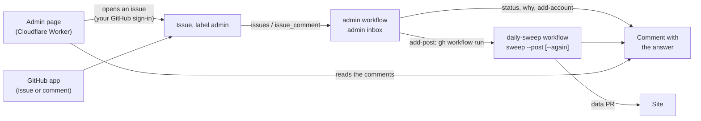

# Pa' Bailar admin tools

Tools for running Pa' Bailar day to day: see how the sweeps and quotas are doing, find out why an event isn't
on the site, add a post or an account by hand.

| What | Where | State |
|---|---|---|
| **The admin page**: status dashboard, check, add or read again a post, add an account | https://pa-bailar-admin.jzamorac-9.workers.dev | Done |
| **The admin inbox**: the same requests as issues in this repository, from the GitHub app | Issues → New issue | Done |
| **Commands** on your computer: `admin status`, `admin why`, `admin add-account`, `sweep --post` | Terminal | Done |
| Corrections: `corrections.json` and `admin fix`, fed by the site's report form | | Planned |

**None of these tools is AI.** They're fixed checks over what the sweeps record (`state/` on the
`sweep-state` branch). Only adding a post sends it to Gemini: one request, from the same daily budget as the
sweeps.

## Using it

### From the admin page

Open https://pa-bailar-admin.jzamorac-9.workers.dev and sign in with GitHub (only `jzamora5` gets in).

- **Revisar o agregar un evento:** paste a post's Instagram link.
  - **Revisar:** whether its event is on the site and, if not, why. An answer in about a minute.
  - **Agregar:** reads the post and publishes its event. A few minutes: it waits for a running sweep (and
    any earlier request) to finish, then publishes through the usual data PR. If the sweeps are still busy
    after 50 minutes, it answers so and doesn't start: ask again later. If the account isn't swept yet, it's added too.
    Posts the API can't give (a personal account's, a collaboration, Instagram's limit reached) are read from
    the post's public page instead (see below).
  - **Volver a leer:** like Agregar, but it reads the post again even if it was read before and hasn't
    changed (Agregar answers "Ya la había leído y no ha cambiado" without reading it). For an event that was
    published with wrong data, e.g. a congress stored with its first day only: one Gemini request, and the
    event keeps its link.
  - **@cuenta:** rarely needed: when the link doesn't say the account, it's read from the post's public page.
- **Agregar una cuenta a los barridos:** checks that Instagram can read it (business or creator accounts
  only), then adds it. The next sweep reads its last 30 days of posts.
- **Pedidos recientes:** the latest requests; tap one to see its answer again.
- **Below:** the sweeps (✅ or ⚠️, with links to the runs), Gemini usage per model and when it resets,
  Instagram, accounts and events. It's the latest `status.json`, as of the last sweep.

Each request is an issue in this repository (label `admin`), answered by the `admin` workflow: the page
opens it and shows the answer when it arrives.

**Sharing from Instagram (Android):** install the page once (Chrome → ⋮ → "Instalar app" or "Agregar a la
pantalla principal"). It then shows up as **PB Admin** (the record on marigold, with a wrench) in the share
menu: on a post, the paper plane → "Compartir en…" → PB Admin. The page opens with the post's link filled in
(without Instagram's `?igsh=` tracking): tap Revisar, Agregar or Volver a leer. If the session ended, it asks you to sign in
and keeps the link for 30 minutes. iPhones don't support sharing to web pages: there, copy the link and paste
it.

### From GitHub (the inbox)

In this repository: **Issues → New issue → "Pedido a las herramientas de administración"**, or any new issue or
comment of yours that the inbox understands (`pa_bailar/inbox.py`):

| Write | It does |
|---|---|
| A post's Instagram link | **Revisar**: why its event is or isn't on the site |
| `/agregar` and the link (and `@cuenta` if needed) | **Agregar**: reads the post and publishes it |
| `/releer` at the start of a line, and the link | **Volver a leer**: reads it again even if it hasn't changed. The words "volver a leer" in a sentence don't count: it spends Gemini |
| `/cuenta @academia` | Adds the account to the sweeps |
| `/estado` | The status, as on the page |
| Anything else, on a request issue (the form, the page) | The list above |

The answer arrives as a comment (from github-actions), and the issue closes once it's done. Writing again on
a closed issue works too. Only your issues and comments count (`jzamora5`, in `.github/workflows/admin.yml`),
and only requests: an issue from the form or the page (label `admin`), or a text with a link or a command
from the table. Your other issues and comments (notes, ideas) get no answer and no label.

### From your computer

From the repository root (`.env` has the keys):

```bash
.venv\Scripts\python -m pa_bailar admin status
.venv\Scripts\python -m pa_bailar admin why https://www.instagram.com/p/<code>/ [--account @x] [--json]
.venv\Scripts\python -m pa_bailar admin add-account @academia
.venv\Scripts\python -m pa_bailar sweep --post https://www.instagram.com/p/<code>/ [--account @x] [--again]
```

They read the sweeps' latest state from the `sweep-state` branch, fetched each time. `sweep --post` and
`add-account` change `accounts.txt` and the data in `..\pa-bailar-web\data` on your computer: commit and open
the PRs yourself, or use the page or the inbox, which do it.

## What the answers mean

### Revisar (`admin why`, `pa_bailar/why.py`)

The checks, in the order a post goes through the sweep:

1. **Was the post analyzed?** The sweeps record every analyzed post (`processed_posts.json`) with what became
   of it:
   - **Está en el sitio:** it became events (links to them, with their dates: "13–15 nov 2026" for an event
     over several days), or joined an event another post announced.
   - **Ya pasó su fecha:** the event left the site after its date (its last day, over several days).
   - **Gemini dijo que no es un evento:** with Gemini's reason. If it's wrong, **Agregar** reads it again
     without that first filter.
   - **Se descartó a propósito:** an event that repeats (a weekly class) or without a clear date. The site only
     lists one-time dated events.
   - **Gemini no pudo leerla**, or **se quitó a mano** (removed on purpose).
2. **If it was never analyzed:** whose post is it? The link, or else the post's public page, says the
   account. When the public page names another author, the post is a collaboration: it's its author's,
   shown on both profiles, and the checks follow the author. Is that account swept? If it is, one Instagram
   call finds the post among the account's latest 50, and its date says why:
   - **posted after the account was last read:** its next turn takes it (each account is read about once
     a day; Agregar publishes it now);
   - **the account was added recently** and hasn't been swept yet;
   - **older than 7 days:** the sweeps only check recent posts;
   - **the last sweep that tried the account couldn't read it**, or **the last sweep is waiting** for
     Gemini quota or time;
   - **not among the account's latest:** an older post, or a collaboration posted from another account;
   - **the API can't read the account:** a personal or private account. The sweeps can't follow it, but
     Agregar reads the post from its public page.

### Agregar (`sweep --post`)

The sweep workflow runs in single-post mode (`sweep --post`), one at a time with the sweeps:

1. Finds the post among the account's latest 50 (one Instagram call); adds the account if it isn't swept.
   When the API can't give it, it reads the post's **public page** instead (`public_post.py`): the embed
   page any website uses to show a post, read without logging in. It has the author, caption, image, video
   and slides; the answer says "La leí desde su página pública". An account the API can't read (personal or
   private) isn't added to the sweeps, and the answer says so.
2. Extracts it with Gemini **without the first filter** (whoever asks knows it's an event): Flash, or
   Flash-Lite as provisional when Flash's quota is used up. **Only when that can change something:** a post
   analyzed before, with the same caption, isn't read again (no Gemini request): the answer says "Ya la había
   leído y no ha cambiado", links its events and offers **Volver a leer**. It is read again when its caption
   changed, or when the first filter had called it "not an event" or Gemini had rejected it, or with
   **Volver a leer** (`sweep --post <link> --again`): then always, one Gemini request, as the same post (its
   events keep their ids). Sharing the same post twice never
   duplicates its event, whether it was read through the API or from its public page. A provisional read is
   upgraded to Flash by a later sweep only if the sweeps read that account: a post from its public page
   keeps its Flash-Lite read (adding it again doesn't redo it while its caption is the same), and the answer
   says "Flash no tenía cuota" instead of "se relee con Flash".
3. Publishes through the usual data PR (it merges itself and the site deploys), and answers: the events it
   became (with links and dates, a range for an event over several days), or why not (not an event, recurring, no date, no Gemini quota left today).

Such runs don't count for the health checks, and don't report to healthchecks.io.

## How it works



- **`.github/workflows/admin.yml`:** runs on new issues and comments, only from `jzamora5`. It reads the
  sweep state and the site's `events.json`, runs `python -m pa_bailar admin inbox` (which skips anything that
  isn't a request: no label, no answer), labels the issue `admin`, comments the answer and closes the issue.
  An added account is committed to `main` (`accounts.txt`). Adding a post starts the sweep workflow with
  `post_url`, `account` and `issue`, and `again` (true for Volver a leer). Requests take turns, first come
  first served: each waits until no sweep is running or waiting and no earlier `admin` run is going (GitHub
  would cancel a second queued sweep), up to 50 minutes; past that it answers that it didn't start.
- **`.github/workflows/daily-sweep.yml`**, with `post_url`: `sweep --post` (`--again` with `again`) instead of the sweep, then the same
  data PR and state save; it commits an added account and answers on the issue. If its `request` check fails
  (no link, or the issue isn't an open admin request), it answers on the issue when that issue is an open
  `admin` issue of yours.
- **`.github/ISSUE_TEMPLATE/admin.yml`:** the form (Acción: Revisar, Agregar, Volver a leer, Agregar cuenta or
  Estado; Enlace; Cuenta). The page writes its issues the same way.

## The admin page

- **Where:** https://pa-bailar-admin.jzamorac-9.workers.dev, the Cloudflare Worker `pa-bailar-admin` (free).
  Cloudflare deploys it from this repository's `admin-web/` folder on every push to `main`.
- **Files:**
  - `admin-web/wrangler.jsonc`: the Worker's settings. Its `name` must match the Worker's name in Cloudflare.
  - `admin-web/public/`: the page (`index.html`, `app.js`, `admin.css`), with no data in it, and what
    makes it installable: `manifest.webmanifest` (name, colors, icons in `icons/`) with a
    `share_target`, so Android sends shared posts to `/?text=<link>`. `_headers` gives these files their
    security headers (below); Cloudflare applies it and doesn't serve it.
  - `admin-web/icons-src/make-icons.mjs`: draws those icons, the site's record on marigold with a wrench badge,
    so the two apps can't be confused on the phone (`node admin-web/icons-src/make-icons.mjs`).
  - `admin-web/src/index.js`: the server side:
    - sign-in: `/auth/login`, `/auth/callback`, `/auth/logout`;
    - data: `/api/health`, `/api/me`, `/api/status`;
    - requests: `/api/requests` (POST opens a request issue, GET lists the latest) and
      `/api/requests/<number>` (its answers).
- **Sign-in:** "Iniciar sesión con GitHub", through the `pa-bailar-admin` GitHub App. Only `jzamora5`
  (`ALLOWED_USER` in `wrangler.jsonc`) gets in.
  - The session is a cookie holding the GitHub token, encrypted with `SESSION_SECRET`.
  - It lasts 30 days and renews the 8-hour GitHub token by itself. Nothing to paste or renew.
  - Everything is read and written with your own GitHub access, limited to what the App may do: read this
    repository, open issues and comment, see runs.
  - Requests are only accepted from the page itself (same origin).
- **Security headers** on every answer, the page's files (`public/_headers`) and the Worker's own JSON and
  redirects (`SECURITY_HEADERS` in `src/index.js`):
  - **Content-Security-Policy.** The page may load only its own files (`app.js`, `admin.css`, the manifest and
    icons) and Google Fonts, and talk only to its own Worker:
    `default-src 'none'; script-src 'self'; style-src 'self' https://fonts.googleapis.com;
    font-src https://fonts.gstatic.com; img-src 'self'; connect-src 'self'; manifest-src 'self';
    form-action 'none'; base-uri 'none'; frame-ancestors 'none'`. No inline scripts or `style=""` attributes:
    `app.js` sets the meters' width through `element.style`. The Worker's answers aren't pages, so theirs allows
    nothing (`default-src 'none'`).
  - `X-Content-Type-Options: nosniff`, `X-Frame-Options: DENY` (no other site can frame the page),
    `Referrer-Policy: strict-origin-when-cross-origin`, `Strict-Transport-Security`. The page's files also get
    `Permissions-Policy` (no camera, microphone, location, sensors, payments or USB) and
    `Cross-Origin-Opener-Policy: same-origin`.
  - Not `Referrer-Policy: no-referrer`: with it, the browser sends `Origin: null` with the page's POSTs, and the
    Worker would reject every request.
  - To check them: `curl -sI https://pa-bailar-admin.jzamorac-9.workers.dev/` (the page) and
    `curl -sI https://pa-bailar-admin.jzamorac-9.workers.dev/api/health` (the Worker).

### Cloudflare setup (done once)

1. Cloudflare dashboard → **Workers & Pages** → **Create** → import a repository from GitHub.
2. Connect GitHub: allow Cloudflare's app on the `pa-bailar` organization, **only the `backend` repository**.
3. Choose `pa-bailar/backend`, then:
   - **Project name:** `pa-bailar-admin` (the same as `name` in `wrangler.jsonc`)
   - **Build command:** empty
   - **Deploy command:** `npx wrangler deploy`
   - **Enable preview builds:** off, so only `main` is published
   - **Protect with Cloudflare Access:** off (the page has its own sign-in with GitHub)
   - **Advanced settings → path:** `/admin-web`
   - **API token:** let Cloudflare create one (it's for Cloudflare's own build, kept inside Cloudflare)
4. **Deploy.**

### Sign-in setup (done once)

1. **The GitHub App:** pa-bailar organization → **Settings** → **Developer settings** → **GitHub Apps** →
   **New GitHub App**:
   - **Name:** `pa-bailar-admin`; **Homepage URL:** the page's address
   - **Redirect URI** (under "Identifying and authorizing users"):
     `https://pa-bailar-admin.jzamorac-9.workers.dev/auth/callback`, without wildcard matching
   - **Expire user authorization tokens:** on. Request user authorization during installation and Device
     Flow: off. Setup URL: empty
   - **Webhook → Active:** off
   - **Repository permissions:** Contents: Read-only · Issues: Read and write · Actions: Read-only
   - **Where can it be installed:** only on this account
2. On the App's page: **Generate a new client secret** (no private key needed).
3. **Install App** → pa-bailar → only the **backend** repository.
4. Cloudflare → the `pa-bailar-admin` Worker → **Settings** → **Variables and Secrets**, each as a **Secret**:
   - `GITHUB_CLIENT_ID`: the App's Client ID (starts with `Iv`)
   - `GITHUB_CLIENT_SECRET`: the secret from step 2
   - `SESSION_SECRET`: a random value, e.g. from PowerShell:
     `[Convert]::ToBase64String((1..32 | ForEach-Object { Get-Random -Maximum 256 }))`.
     Changing it signs everyone out.

Until the three secrets exist, the page says that the sign-in isn't set up yet.
