# Pa' Bailar: architecture and infrastructure (backend)

How the whole system works, from an academy posting a flyer on Instagram to that event showing up on
<https://pa-bailar.github.io>. This document covers the **backend** (this repository, public since 6 Oct 2026,
`pa-bailar/backend`) in depth, and every service around it. The site's side is in the site
repository's `docs/ARCHITECTURE.md` (`pa-bailar/pa-bailar.github.io`).

Last reviewed: 5 October 2026.

Contents:

1. [The system in one picture](#1-the-system-in-one-picture)
2. [Repositories and what each one owns](#2-repositories-and-what-each-one-owns)
3. [External services](#3-external-services)
4. [Secrets and settings](#4-secrets-and-settings)
5. [The daily sweep, end to end](#5-the-daily-sweep-end-to-end)
6. [Inside the sweep: the pipeline](#6-inside-the-sweep-the-pipeline)
7. [Gemini: models, prompts and quotas](#7-gemini-models-prompts-and-quotas)
8. [Instagram: what is read and how](#8-instagram-what-is-read-and-how)
9. [One event, many posts: identity and merging](#9-one-event-many-posts-identity-and-merging)
10. [State and outputs](#10-state-and-outputs)
11. [Monitoring and health](#11-monitoring-and-health)
12. [The other commands: discover, refresh-token and admin](#12-the-other-commands-discover-refresh-token-and-admin)
13. [CI, dependencies and security](#13-ci-dependencies-and-security)
14. [Quotas and capacity](#14-quotas-and-capacity)
15. [Failure modes and runbook](#15-failure-modes-and-runbook)
16. [Code map](#16-code-map)

---

## 1. The system in one picture

Pa' Bailar has no server. Everything runs on free services:

- the sweep runs on **GitHub Actions**;
- the site is static files on **GitHub Pages**;
- the reading of posts is done by **Gemini** on Google AI Studio's free tier (with Groq and OpenRouter's free
  models as the last resort when its quota runs out, section 3.10).


In words:

1. **cron-job.org** calls GitHub's API twice a day to start the `daily-sweep` workflow. This is the same
   as pressing *Run workflow*.
2. **The sweep** reads the recent posts of every followed academy from **Instagram**. It asks **Gemini**
   which posts announce one-time events, and to extract their details. It saves the events, plus a copy of
   each flyer, into a checkout of the site repository.
3. **When events changed**, the sweep opens a **data pull request** in the site repository as the
   **pa-bailar-bot** GitHub App. The site's `ci` checks the data and the build. The PR then merges itself,
   and the merge triggers the **deploy** to GitHub Pages.
4. **Every run** reports to **healthchecks.io**, and is checked by rules against the previous runs
   (section 11).
5. **State** stays in this repository's `sweep-state` branch: which posts were already analyzed, how far
   each new account's first sweep got, today's Gemini usage and the last resort's (`external_usage.json`), and
   the events hidden by hand (`hidden_events.json`); section 10.1 lists every file.

---

## 2. Repositories and what each one owns

| Repository | Visibility | Owns | Does not own |
|---|---|---|---|
| `pa-bailar/backend` (this one) | Public (since 6 Oct 2026) | The collector: the `pa_bailar` Python package, `accounts.txt`, the prompts, the sweep workflow, the sweep state (`sweep-state` branch), the health checks, local tools (`discover`, `refresh-token`), the admin page (`admin-web/`, docs/ADMIN.md), the video toolkit (`media/`, its README) | The data files and the site: it only writes them into a checkout of the site repository and proposes them through a PR |
| `pa-bailar/pa-bailar.github.io` | Public | The site (`frontend/`, Astro), the published data (`data/events.json`, `data/meta.json`, `data/flyers/`, `data/previews/`), the data contract (`docs/DATA.md`), its CI and the GitHub Pages deploy | Collecting data. It never calls Instagram or Gemini |

**Why two repositories:**
- **The collector apart from the site:** its secrets, state and workflows, with their own checks and history. It
  was private until 6 Oct 2026 (the owner made it public; its history was checked for secrets first: none). The
  keys live only in GitHub secrets, `.env` and `private/`, never in a commit: every push is public.
- **The site repository has to be public:** GitHub Pages is free for public repositories. Both have unlimited
  Actions minutes, being public.

The site repository's name (`<org>.github.io`) makes the site live at the organization's root,
`https://pa-bailar.github.io`.

The only link between the two repositories:
- **Backend to site:** the backend checks the site out (anonymously, it's public), writes `data/`, and
  pushes a branch plus opens a PR with the pa-bailar-bot App's token. On days without changes, the same
  token starts the site's deploy.
- **Site to backend:** none. The site knows nothing about the backend except the data contract
  (`docs/DATA.md` in the site repository).

---

## 3. External services

Every service the system depends on. All of them are on free plans.

### 3.1 Meta: Instagram Graph API (Business Discovery)

| | |
|---|---|
| **What for** | Reading the public posts of the academies (photos, carousels, videos, captions, dates, links), and the profiles of accounts during discovery |
| **Endpoint** | `GET https://graph.facebook.com/v26.0/{IG_USER_ID}?fields=business_discovery.username(<account>){media.limit(N){…}}` (`config.GRAPH_API_URL`) |
| **What it needs** | A **Meta app** (Meta for Developers, with the Instagram Graph API product). A **Facebook Page** linked to **our own Instagram professional account**, whose id is `IG_USER_ID`. An access token for that Page (`META_ACCESS_TOKEN`) |
| **Token** | A **Page access token that doesn't expire**. It's made from a short-lived Graph API Explorer token by `python -m pa_bailar refresh-token` (section 12.2). It stops working only if it's revoked (for example, a Facebook password change) |
| **What it can see** | Only **business and creator** accounts. Personal or private accounts answer with error 100/110 ("not visible") |
| **Limits** | A quota for our app, counted by Meta over a rolling window. Every answer reports the share used in the `X-Business-Use-Case-Usage` header (`X-App-Usage` on older apps); `InstagramClient.app_usage_percent` reads both and keeps the highest, with each of Meta's measures (calls, CPU time, total time: `usage_detail`) and the run's peak (`peak_usage_percent`). The sweep stops reading accounts at 90% (`INSTAGRAM_USAGE_STOP`) instead of running into the limit; when the quota is spent anyway, the answer is error 4, 17, 32, 613 or 80001–80009 (`is_rate_limited`). Accounts not reached stay due and go first next run (section 5) |
| **Cost per sweep** | **1 call per account read**, no matter how many posts are asked for (10 regular, 30 for a new account). Each account is read about once a day, so a sweep reads about half of them (section 5). Images are then downloaded from Instagram's CDN, which isn't an API call |
| **Cost** | Free |
| **If it fails** | Token invalid: the run stops at the start and fails, and healthchecks.io emails you. Rate limit: the run stops calling Instagram, and the remaining accounts wait for the next run (a notice, and a warning after 3 runs in a row). One account fails: logged, and the others continue |

### 3.2 Google AI Studio: Gemini API

| | |
|---|---|
| **What for** | Deciding whether a post announces an event (triage), extracting the event's details as JSON (extraction), and classifying accounts during discovery |
| **SDK** | `google-genai` (`pa_bailar/gemini.py`), using structured output: `response_mime_type="application/json"` plus a Pydantic `response_schema` |
| **Key** | `GEMINI_API_KEY`, an API key from Google AI Studio (aistudio.google.com) |
| **Models and roles** | Each model has its own free daily quota, so each role takes several, in order (the owner, 6 Oct 2026). Flash-Lite (`gemini-3.5-flash-lite`, then `gemini-3.1-flash-lite`, `config.LITE_MODELS`: 1,000 a day) does triage and discovery. Flash of this generation (`gemini-3.8-flash`, `3.7`, `3.6`, then `3.5`: 80 a day) does extraction. Provisional extraction, when those are out: `gemini-3-flash-preview` (an older Flash, not yet compared with this generation's), then Flash-Lite (`config.TRIAGE_MODELS`, `EXTRACTION_MODELS`, `PROVISIONAL_MODELS`) |
| **Free quotas** | Flash-Lite: 15 requests/minute and 500/day. Each Flash model: 5/minute and 20/day (`config.MODEL_LIMITS`, read from AI Studio on 2026-10-02). Each model has its own quota. Days reset at **midnight Pacific time** |
| **Cost** | Free (the free tier may use prompts to improve Google's products; posts are public anyway) |
| **If it fails** | Out of quota: the next model, then the last resort (section 3.10), else the post waits. Busy or unreachable: retried, then the next model, else the post waits. Rejected: recorded as rejected, never retried. Details in section 7.2 |

### 3.3 GitHub

| Piece | What for |
|---|---|
| **Repositories** | Section 2 |
| **GitHub Actions** | Runs the sweep (`daily-sweep.yml`), the admin inbox (`admin.yml`, section 12.3) and the backend's checks (`ci.yml`) on `ubuntu-latest` runners. Both repositories are public: their minutes are free and unlimited (the backend had 2,000 a month while it was private, until 6 Oct 2026) |
| **Actions secrets and variables** | Hold the keys (section 4) |
| **`sweep-state` branch** | The sweep's memory between runs (section 10.1). An orphan branch that only holds JSON files |
| **pa-bailar-bot (GitHub App)** | App id `5164772`, installed on the `pa-bailar` organization for the site repository. The sweep uses it to push the data branch, open the data PR, enable auto-merge and start the site's deploy. A short-lived token is minted per run with `actions/create-github-app-token`. Using an App, rather than the workflow's own token, means its PR runs the site's `ci` like anyone's |
| **Issues** | The `Sweep health` issue (label `sweep-health`), opened and updated by the sweep (section 11). The admin inbox: requests to the admin tools (label `admin`), answered by `admin.yml` and, for adding a post, by the sweep ([`docs/ADMIN.md`](ADMIN.md)) |
| **Dependabot** | Weekly update PRs for the Python dependencies and the GitHub Actions used (`.github/dependabot.yml`) |
| **GitHub Pages** | Hosts the site, deployed by the site repository's `deploy` workflow |
| **Rulesets** | The site repository's `main` is protected (`protect-main`): changes only through squash-merged PRs that pass `ci`; force pushes and deletion blocked; no bypass. The backend's `main` likewise since it went public (6 Oct 2026; rulesets on private repositories need a paid plan): PRs only, `ci` required (so `ci.yml` has no path filter: a skipped required check leaves a PR unmergeable), force pushes and deletion blocked, no bypass |

### 3.4 cron-job.org

| | |
|---|---|
| **What for** | Starting the sweep at fixed times: **6:30 AM and 9:00 PM, Bogotá time** (`config.SWEEP_TIMES`, which they must match). Until 7 Oct 2026 the morning run was at 9:00, where Google's Flash refused 97% of weekday requests as busy (the owner moved it, from the logs of 29 runs) |
| **Why not GitHub's own `schedule`** | It never fired in this repository. That's a known, undocumented problem of new private repositories, with no fix from GitHub, and community reports describe runs delayed by hours or dropped. The workflow has **no `schedule:` trigger** on purpose: if GitHub's scheduler started working, every run would happen twice |
| **The two jobs** | `pa-bailar sweep 6:30` and `pa-bailar sweep 21:00`, time zone America/Bogota |
| **The request** | `POST https://api.github.com/repos/pa-bailar/backend/actions/workflows/daily-sweep.yml/dispatches`, with body `{"ref":"main"}` and headers `Accept: application/vnd.github+json`, `X-GitHub-Api-Version: 2022-11-28`, `Content-Type: application/json` and `Authorization: Bearer <token>`. GitHub answers `204 No Content` |
| **Token** | A **fine-grained personal access token**, owned by the `pa-bailar` organization, limited to this repository and to **Actions: read and write**. It can start and cancel runs; it can't read the code or the secrets. Stored only in cron-job.org |
| **Cost** | Free |
| **If it fails** | cron-job.org emails when a call fails (for example `401` once the token expires), and disables a job after repeated failures (that email is also on). healthchecks.io emails when no run arrives |

### 3.5 healthchecks.io

| | |
|---|---|
| **What for** | A dead man's switch: it emails when a sweep **fails**, or when **no sweep arrives** in time, which is the case GitHub itself never reports |
| **How** | The workflow's last step always runs. It pings `HEALTHCHECK_URL` on success, or `HEALTHCHECK_URL/fail` on failure, with the run's health report as the body, so the report shows in the check's event log |
| **Schedule** | **Period 15 hours, grace 2 hours:** the runs are 14.5 and 9.5 hours apart (6:30 and 21:00), so a single missed run is noticed within about 17 hours (12 hours until the morning run moved, 7 Oct 2026) |
| **Cost** | Free |

### 3.6 Cloudflare Workers

| | |
|---|---|
| **What for** | Hosting the admin page (Worker `pa-bailar-admin`, at `https://pa-bailar-admin.jzamorac-9.workers.dev`) and its server side: the sign-in with GitHub (the `pa-bailar-admin` GitHub App), reading the status, and keeping story screenshots (Workers KV, bound as `UPLOADS`, 7-day expiry) until the sweep workflow downloads them with GitHub's identity token (OIDC, no secret). GitHub Pages can't: it's not free for a private repository and has no server side |
| **How** | Cloudflare's build (Workers Builds) deploys `admin-web/` (`wrangler.jsonc`) from this repository on every push to `main`, no preview builds; its GitHub connection is limited to this repository. Security headers and the rest: [`docs/ADMIN.md`](ADMIN.md), "The admin page" |
| **Cost** | Free (KV's free plan: 1,000 writes a day, one per screenshot) |

### 3.7 Instagram's public post pages (fallback)

| | |
|---|---|
| **What for** | Reading one post the Graph API can't give, for the admin tools only: a personal or private account's post, a collaboration listed under its author, or any post once Meta's quota is spent. Never in the sweeps |
| **Endpoint** | `https://www.instagram.com/p/<code>/embed/captioned/` (`public_post.EMBED_URL`): the page websites embed to show a post. No login, no token |
| **How** | `public_post.fetch_public_post` asks for it as a browser would (`curl_cffi`, `impersonate="chrome"`): plain scripts get an empty page. It reads the post's data from the page (`contextJSON`), or else from its HTML (author, caption, image). The author must be a valid username (`links.account_name`), since it becomes an account; otherwise the page counts as unreadable |
| **Limits** | Unofficial: Instagram can change the page or block it at any time. One request per use, so it stays well under any limit. It can't list an account's posts (that needs a login), so it can't sweep personal accounts |
| **Cost** | Free |

### 3.8 Services used by the site only

- **GoatCounter:** visit statistics without cookies.
- **Google Fonts:** the site's typefaces.
- **GitHub Pages:** hosting.

They're described in the site repository's `docs/ARCHITECTURE.md`. The backend doesn't use them.

### 3.9 Your computer

- **The discovery tool runs locally.** `python -m pa_bailar discover` reads your Instagram data export
  from `private/`, which is never committed (section 12.1).
- **`refresh-token` runs locally.** It needs the Meta app's id and secret, which exist only in the local
  `.env`.
- **The local `.env`** holds the same keys as the GitHub secrets, plus `META_APP_ID` and
  `META_APP_SECRET`.
- **The App's private key** (`private/*.pem`) stays on your computer. Its contents are the
  `APP_PRIVATE_KEY` secret.
- **Videos are made locally** with `media/` (its README): Gemini TTS with `MEDIA_GEMINI_API_KEY` (a separate
  free-tier project, only in the local `.env`), Whisper and ACE-Step from `D:\AI`, Remotion and ffmpeg; what they
  generate lives in a media home outside the checkout (`D:\AI\pa-bailar-media`). Nothing there runs in the sweep;
  CI lints and unit-tests its Python tools with the rest of the repository, and `media-ci.yml` type-checks the
  Remotion code on pull requests that change `media/` (no secrets). `media/site-checks/`, Claude's browser checks of
  the site (Playwright, Chrome and WebKit), runs only on this machine: both workflows ignore it (the owner, 6 Oct
  2026: no Actions minutes for them).

### 3.10 Groq and OpenRouter: the last resort

| | |
|---|---|
| **What for** | Extracting posts when Gemini can't: Flash and Flash-Lite are both out of today's quota or not available to the key (only quota: a busy or refusing Gemini never reaches it). Never the triage, never before Gemini, and never for stories or upgrades (section 7.3) |
| **API** | Both are OpenAI-compatible: `POST …/chat/completions` with the prompt's text and the images as base64 data URLs (`pa_bailar/external.py`, `config.EXTERNAL_PROVIDERS`). Plain `httpx`, no SDK |
| **Keys** | `GROQ_API_KEY` (console.groq.com) and `OPENROUTER_API_KEY` (openrouter.ai). Both optional: a provider without its key is skipped, and without either there's no last resort |
| **Models** | Groq: `qwen/qwen3.8-27b`, its only vision model, in JSON mode with the schema in the prompt. OpenRouter: `google/gemma-4-31b-it:free` and `google/gemma-4-26b-a4b-it:free` (JSON mode, the schema in the prompt; one request with its `models` list), then `openrouter/free`, a router to a random free model that takes the schema (structured output: the schema as `response_format`, strict, with `provider.require_parameters`). Every answer is checked against the same Pydantic schemas as Gemini's |
| **Free limits** | Groq (2026-10-05): 30 requests/minute and 1,000/day, but 8,000 tokens/minute and 200,000/day; each image counts as 2,048 input tokens, at most 3 images per request. OpenRouter without credit: 20 requests/minute and 50/day for all free models together. Daily limits reset at midnight UTC (7:00 p.m. Bogotá) |
| **Our budgets** | Groq: 900 requests and 180,000 tokens a day. OpenRouter: 40 requests a day. Kept under the free limits, for manual runs and the bake-off |
| **Cost** | Free. Free models get pulled or paywalled without notice: `admin bakeoff` re-checks them (section 12.3) |
| **If it fails** | Fail fast: one request per model and post, no retries, at most 3 minutes per post. A busy model or an invalid answer moves on to the next model, and when none answers, the post waits for the next run. A 401, 402 or 403 turns that provider off for the run (a notice; a warning after 3 runs). Details in section 7.3 |

---

## 4. Secrets and settings

| Name | Kind | Where | Used by | Notes |
|---|---|---|---|---|
| `GEMINI_API_KEY` | Secret | GitHub Actions secret, local `.env` | Sweep step, `discover`, `admin bakeoff` | Google AI Studio API key |
| `META_ACCESS_TOKEN` | Secret | GitHub Actions secret, local `.env` | Sweep step, the status step, the admin workflow's Answer step (`admin why`, `admin add-account`, the status), `discover`, `refresh-token` | Non-expiring Page token (section 3.1) |
| `IG_USER_ID` | Secret | GitHub Actions secret, local `.env` | The same as `META_ACCESS_TOKEN` | Id of our Instagram professional account |
| `META_APP_ID`, `META_APP_SECRET` | Secret | Local `.env` only | `refresh-token` | Never on GitHub: only the token command needs them |
| `APP_PRIVATE_KEY` | Secret | GitHub Actions secret (the `.pem` file stays in `private/`) | "Get a token" step | pa-bailar-bot's private key, used to mint a short-lived installation token |
| `APP_ID` | Variable | GitHub Actions variable | "Get a token" step | `5164772` |
| `GROQ_API_KEY` | Secret (optional) | GitHub Actions secret, local `.env` | Sweep step, `admin bakeoff` | Groq's key: the first of the last resort (section 3.10). Unset: Groq is never used |
| `OPENROUTER_API_KEY` | Secret (optional) | GitHub Actions secret, local `.env` | Sweep step, `admin bakeoff` | OpenRouter's key: the last resort after Groq (section 3.10). Unset: OpenRouter is never used |
| `GEMINI_LITE_ONLY` | Variable | GitHub Actions variable (optional) | Sweep step | `1`: Flash-Lite also extracts, as final results (`config.LITE_ONLY`). For when Flash isn't available to the key; unset otherwise |
| `HEALTHCHECK_URL` | Secret | GitHub Actions secret | "Report to the health check" step | The check's ping URL. Optional: without it the step does nothing |
| `GITHUB_TOKEN` | Automatic | Created by GitHub per run | daily-sweep: the `request` job (reads the admin issue, answers it if adding can't start), `story-images` (answers if the screenshots can't be downloaded), the open-PR check (reads the public site), the state save, the account commit (`main`), the health issue, the answer on the admin issue. admin: labels and answers the issue, commits an added account, starts the sweep | daily-sweep: `contents: write` and `issues: write` (`request` and `story-images`: `contents: read` and `issues: write`). admin: `contents: write`, `issues: write`, `actions: write`. Only handed to the steps that need it |
| GitHub's identity token (OIDC) | Automatic | Minted per job by GitHub, only in daily-sweep's `story-images` and `story-cleanup` jobs (`id-token: write`) | Downloading and deleting story screenshots on the admin page's Worker | Short-lived, audience `pa-bailar-admin`; the Worker checks GitHub's signature, the repository, `main` and the workflow. Nothing to store or rotate |
| cron-job.org token | Secret | cron-job.org only | The two cron jobs | Fine-grained PAT, Actions read/write on this repository only |

Settings that aren't secrets live in code, mostly in `pa_bailar/config.py`. That includes the models and
quotas, the lookback windows, the retention, the sweep times and the time budget. The followed accounts
are in `accounts.txt`.

---

## 5. The daily sweep, end to end

### 5.1 Sequence

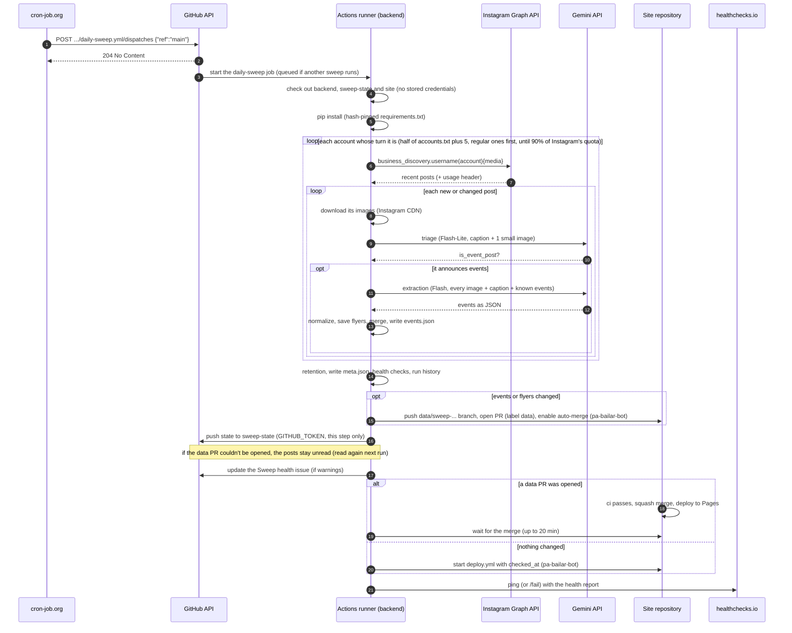

### 5.2 The workflow's steps

`.github/workflows/daily-sweep.yml`, two jobs on `ubuntu-latest`, plus two for stories:
- **`request`** checks an admin request (add a post or a story, hide a story or an event) before anything else
  runs. It runs only with `post_url`, `story`, `hide` or `issue` (its `if` is at job level, so a regular sweep
  starts no runner and bills no minute). Exactly one of `post_url`, `story` (1 to 4 upload ids) or `hide`
  (`story-<16 hex>`, or an event's id: lowercase words joined by hyphens, at most 120 characters) must be
  given, and `issue` must be an open `admin` issue by `jzamora5` (the inbox reopens an answered issue before
  starting the add). Otherwise the run fails before the sweep job, so whoever can start the workflow (the
  cron-job.org token) can't publish a post with it; it then answers on the issue only if that issue is such an
  `admin` issue. Inputs reach shell commands only through environment variables. Every answer on an issue, in
  every job, goes through `.github/actions/answer-issue`, which makes that check; `request` and `story-images`
  check out only `.github/actions` for it (no credentials kept, `contents: read`).
- **`story-images`** (only with `story`): downloads the story's screenshots from the admin page's Worker
  (`/api/uploads/<id>`, retrying about 2 minutes while KV spreads them) with GitHub's identity token (OIDC,
  `id-token: write` on this job only, which runs no third-party package), and hands them to `sweep` as an
  artifact kept a day. If it can't, it answers on the issue (an open `admin` issue by `jzamora5` only).
- **`sweep`** (after `request` and `story-images`, or without them: neither failed), the steps below. Job
  limit: 90 minutes, for the longest run (a 20-minute wait for an earlier data PR, the 35-minute sweep, an owner's
  request's 20-minute wait for its own PR; usual runs take 20 to 35 minutes): a job timeout would cancel the state's
  save. Its output `delete_story` lists the screenshots to delete when the story is published.
- **`story-cleanup`** (after a successful `sweep` with `delete_story`): deletes those screenshots from the
  Worker's KV, with its own identity token.

| # | Step | Runs when | What it does | Credentials |
|---|---|---|---|---|
| 1 | Check out this repository | Always | The code | None kept (`persist-credentials: false`) |
| 1b | Make sure the last data PR merged | Always | Waits up to 20 minutes for a `data` PR still open in the site repository (one a scheduled sweep just opened, step 13), then fails if it's still open: the sweep reads the events from the site's `main`, so sweeping past an unmerged PR would lose its events for good (their posts are already marked analyzed). Merge or fix it first. Before anything is checked out: a copy of the site taken before that PR merged lacks its events, and the run deleted their flyers from the images repository and opened a PR that conflicted with it for good (until 6 Oct 2026, when it came after the checkouts) | `GITHUB_TOKEN` (reads the public site repository) |
| 2 | Read the sweep state | Always | Checks out the `sweep-state` branch into `sweep-state/` | None kept |
| 3 | Copy the state | Always | `sweep-state/*.json` → `state/` | |
| 4 | Check out the site repository | Always | Into `site/`. `DATA_DIR` points to `site/data` | None (public repository) |
| 4b | Check out the images repository | Always | `pa-bailar/media` into `media/`, its latest version (section 10.2) | None (public repository) |
| 5 | Set up Python | Always | Python from `.python-version` (3.12), pip cache | |
| 6 | Install | Always | `pip install -r requirements.txt`, every package pinned and hash-checked | |
| 6a′ | Copy the images into the site's data | Always | `python -m pa_bailar.media_store pull media site/data`: the current flyers and clips, so the run works on them as before; and a copy of `events.json` as published, before the run changes it | |
| 6a | Get the story's screenshots | `story` | Downloads the `story-images` job's artifact into `stories/` | |
| 6b | Make sure ffmpeg is installed | Always | For videos' preview clips (`clips.py`); usually already on the runner | |
| 7 | **Run the sweep** | Always | With `post_url` (admin tools): `python -m pa_bailar sweep --post <link> [--account x] [--again]`, one post by hand (`--again` from the `again` input, "Volver a leer"). With `story`: `sweep --story <ids> --story-dir stories [--account=x] --notes=…` (the screenshots from `story-images`, step 6a). With `hide`: `sweep --hide-story <story id>`, or `sweep --hide-event <event id>`. Otherwise `python -m pa_bailar sweep --days N [--all]` (N from the `days` input, 7 by default, at most 30; `--all` from `all_accounts`). Step limit: 35 minutes; the code stops starting Gemini work at 30 | `GEMINI_API_KEY`, `META_ACCESS_TOKEN`, `IG_USER_ID`, and the optional `GROQ_API_KEY` and `OPENROUTER_API_KEY` (this step only) |
| 8 | Write the status for the admin page | Unless cancelled; its failure doesn't fail the run | `python -m pa_bailar admin status --json` → `state/status.json`, saved with the state (one Graph API call, no Gemini). The admin page reads it | `META_ACCESS_TOKEN`, `IG_USER_ID` (this step only) |
| 9 | Get a token for the site repository | Unless cancelled | Mints a pa-bailar-bot installation token for the site and images repositories only | `APP_ID`, `APP_PRIVATE_KEY` |
| 9b | Save the images to their repository | Unless cancelled | `media_store push`: new and changed images (and the archive's small flyers) copied into `media/`, the current ones no longer used removed (only if neither this run's events nor the published ones point to them, and they're gone from `site/data`: an archived event's image stays until its data PR has merged, so builds and checks in between still find it; the next run removes it); committed as the bot and pushed straight to `main`, no PR (pull request references would keep old images alive). If it fails, no data PR is opened, so the run's posts stay unread | App token |
| 10 | Open a data PR | Unless cancelled, and the images were saved | Only if `data/events.json`, `data/archive` or (while the site repository still keeps them) `data/flyers` changed (clips change `events.json` too) (`meta.json` alone doesn't count). Branch `data/sweep-<day>-<run id>`, commit as the bot, PR labelled `data`, auto-merge (squash) enabled. It runs before the state is saved, so the state never marks posts as analyzed whose events didn't leave the runner | App token |
| 10b | Keep the site data of a data PR that wasn't opened | The data PR step failed | Uploads `site/data` (events, flyers, clips) as the run's artifact `site-data-<run id>`, kept 14 days, to recover by hand (section 15) | |
| 11 | Save the sweep state | Unless cancelled | Copies `state/*.json` back and commits. Then `gh auth setup-git` and push to `sweep-state`. Runs even when the sweep failed partway: its progress is real. **If the data PR step didn't succeed**, `processed_posts.json` and `accounts.json` keep their previous versions (a warning says so): this run's posts stay unread and its accounts due, so the next run reads them again and its PR carries their events. Gemini's usage, the run history and `status.json` are saved either way | `GITHUB_TOKEN` (this step only) |
| 11b | Save an account added by hand | `post_url` or `story`, and `accounts.txt` changed | Commits `accounts.txt` to `main` | `GITHUB_TOKEN` (this step only) |
| 12 | Update the sweep health issue | Unless cancelled, and the sweep produced its health output | Opens, updates, comments on or closes the `Sweep health` issue (section 11.3) | `GITHUB_TOKEN` (issues) |
| 13 | Wait for the data PR to merge | A PR was opened, for an owner's request (admin): a scheduled sweep doesn't wait (it saved Actions minutes while the repository was private; now it keeps runs short); the next run's step 1b catches a PR that didn't merge | Polls every 30 s, up to 20 minutes. Fails if the PR is closed or doesn't merge in time | App token |
| 14 | Republish the site | Success, no PR, not an admin request (`issue`) | `gh workflow run deploy.yml -f checked_at=<now in Bogotá>`, so "Actualizado el" stays current on days without new events | App token |
| 15 | Report to the health check | Always, except admin requests (`issue`) | Pings `HEALTHCHECK_URL` (success) or `HEALTHCHECK_URL/fail`, with the report as the body | `HEALTHCHECK_URL` |
| 16 | Answer on the admin issue | `issue` given (admin tools) | Writes the result of adding the post or story, or hiding the story or event (`ADMIN_REPORT_FILE`), and the data PR; `.github/actions/answer-issue` comments it and closes the issue, only if it's an open `admin` issue by `jzamora5` | `GITHUB_TOKEN` |

Other workflow settings:
- **`concurrency: data`** (`cancel-in-progress: false`): two sweeps never run at the same time. A new one
  waits, and if several are started meanwhile, only the newest waits (the others show as "cancelled").
- **`workflow_dispatch` only:** there's no schedule (section 3.4), and no push trigger.
- **Single-post mode** (`post_url`, started by the `admin` workflow): `sweep --post` adds one post by hand (with `again`, "Volver a leer", even if it was read before and hasn't
  changed), then the same state save and data PR. It isn't recorded in the run history, opens no health issue
  and doesn't ping healthchecks.io.
- **Admin requests take turns:** GitHub keeps only one waiting run per concurrency group (a newer one cancels
  it), so the `admin` workflow never queues a sweep. Each request waits until no sweep is running or waiting
  and no earlier `admin` run is still going, starts the sweep, and waits until GitHub lists it. Still busy
  after 85 minutes (about the longest a sweep can run: its job stops at 90), it answers on the issue that it
  didn't start ("Pídelo otra vez en un rato"). For the same
  reason the `admin` workflow has no concurrency group of its own: a third comment on an issue would cancel
  the second one's waiting run, and its request would never be answered.

### Whose turn it is: each account about once a day

Instagram's quota for us is small (it grows with our own account's impressions), so each account is read
about **once a day**, half of them in each sweep, instead of every account twice a day
(`Sweep._due_accounts`, `pipeline.hours_overdue`):

- **Each account's turn:** 20 hours after a sweep last read it (`SWEEP_EVERY_HOURS`: the same sweep the next
  day finds it due). Quiet accounts, with no post in 45 days (`QUIET_AFTER_DAYS`), every 44 hours, and dormant
  ones, with no post in 180 days (`DORMANT_AFTER_DAYS`), once a week (164 hours): lower priority, never dropped
  (each read is an Instagram call that rarely finds anything new). An account silent for over a year is better
  commented out in `accounts.txt`, with a note. `accounts.json` keeps `last_swept_at` and `latest_post` (its day in Bogotá).
- **Order:** due accounts in their regular sweep before new ones (a new account's first, deeper sweep can
  take days of quota); within each, those that waited longest first.
- **A sweep's share:** half the accounts plus 5 (`EXTRA_ACCOUNTS_PER_RUN`), and it stops earlier at 90% of
  Instagram's quota. Accounts not reached stay due, and having waited longest, they're first next time: a
  short quota shortage delays a few accounts by one sweep, it can't snowball.
- **Not over its turn:** an account whose posts still wait (Gemini's quota, time) stays due next sweep. An
  account that couldn't be read for another reason (not visible) waits for its next turn.
- **Watching it:** each run records its highest reading of Instagram's quota and which of Meta's measures it was
  (`instagram_usage`, `instagram_usage_detail`, also in the run's log), and the dashboard shows the last sweep's and
  lists accounts waiting more than a sweep past their turn. Evening sweeps read more accounts than morning ones
  (58–69 against 43 on 6–7 Oct, the share set by when each account was read before) and reached 90–93%, the
  mornings 54–62%: the 90% stop moves the accounts it didn't reach to the morning sweep, which evens the two out.
- **Everyone now:** `sweep --all` (the workflow's `all_accounts` input).

### 5.3 What a run decides is a failure

A run **fails** (red, healthchecks.io `/fail`, email) only when something is actually broken:

- **The Instagram token is invalid:** the run stops before reading anything.
- **Every account failed for a reason other than Instagram's rate limit** (`commands/sweep.is_broken`).
- **A workflow step failed:** for example the state push, or a data PR that didn't merge in 20 minutes.

Everything else is retried on its own and reported, but doesn't fail the run:
- a post that failed;
- Instagram's rate limit;
- Gemini's quota running out;
- the 30-minute budget running out.

Section 11 covers how those are reported.

---

## 6. Inside the sweep: the pipeline

`pa_bailar/pipeline/`, class `Sweep` (`sweep.py`). Storing an analyzed post, which the admin tools share, is
`SweepBase` (`base.py`); the admin tools' own steps are `manual_post.py`, `story_admin.py` and `hiding.py`
(section 16).

### 6.1 Accounts

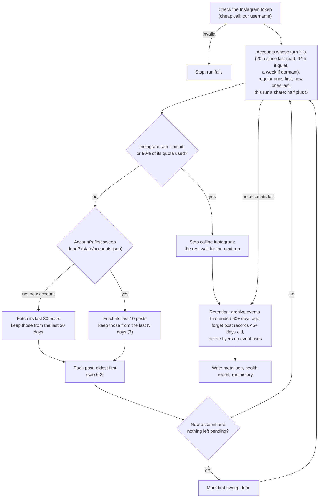

- **New accounts go last:** loading a new account's older posts can take several days of Gemini quota,
  and must never use up the quota for today's posts of the accounts already followed
  (`Sweep._due_accounts`).
- **A new account's first sweep** reads up to 30 posts from the last 30 days. It's "done" once all of them
  have been analyzed; if the quota or the time runs out, it continues in the next run.
- **Saved after every post:** `events.json` and `processed_posts.json` are written after each post, so an
  interrupted run keeps everything it did.
- **Bars and accounts limited to some styles** (`accounts.txt`, `account_options.py`). A line is the username,
  then optional words, and `#` starts a comment anywhere on it (an unknown word stops the run, so a typo can't
  sweep an account without its limits):

  ```
  galeriacafelibro        bar                      # emblematic salsa bar
  ritmomoderno            bar solo:salsa,bachata   # general bar: only its salsa and bachata nights
  ```

  - `bar`: a bar or club, open every week (the owner, 5 October 2026: salsa bars hold special nights, but most of
    their posts are their regular ones). The triage and the extraction get `prompts.BAR_RULES` after the caption:
    its regular nights aren't events, only special one-time occasions (a live band, a billed guest, an
    anniversary…); a band named for a date is special even at a bar with live music most weeks (7 Oct 2026: the
    test set showed Flash-Lite taking those for regular nights); when unsure, it isn't. Its
    events carry `bar: true` (`StoredEvent.bar`, docs/DATA.md in the site), set from `accounts.txt` on every run,
    so marking or unmarking an account updates its stored events. Its nights are a `party` ("Rumba" on the site),
    not a `social` (the owner, 6 October 2026: a bar's party isn't a dancers' social): the prompt says so, and
    `normalize.party_at_a_bar` makes it a fixed rule, on new readings and on stored events at every run, unless
    the title or a caption says "social", or names one by its other names, "milonga" (a tango social) or "práctica"
    (an academy's social held at a bar stays one; not "redes sociales", "red social", a "… Social Club" or "Club
    Social", or "eventos sociales", common in captions). The answer schema's type description says the same as the
    prompt. Its first sweep is a
    regular one (10 posts, the lookback): a bar's older posts are past nights.
  - `solo:<styles>` (salsa, bachata, merengue, kizomba, tango): a general bar, club or cultural space that also
    holds salsa or bachata nights. A post whose caption names none of those styles (`FOCUS_KEYWORDS`:
    `normalize.TEXT_STYLE_WORDS` plus looser parts of words such as "salser", "salsotec", "sonero", "orquesta",
    "bachat", "tanguer", accents and case ignored) is recorded as no event for free, before any Gemini request ("no
    menciona salsa ni bachata"); the others get `prompts.FOCUS_RULES` too. A caption edited later is checked
    again, and so is a post the filter left out whenever it comes back in the window (`Sweep._filtered_before`,
    free): words added to the lists reach the posts dropped before them (the audit of 7 Oct 2026 found "SALSOTECA",
    "Fania", "soneros", "Bachazouk" and "Kiz night" posts dropped).
  - A post added by hand (`--post`, PB Admin) gets neither the filter nor the rules: whoever adds it wants it read
    as it is. Its record keeps `by_hand`, so its later reads (the provisional upgrade, an edited caption) skip them
    too.
  - The filter only screens posts the triage would: a post that had events and whose caption is edited goes
    straight to the extraction, which can take its events down ("CANCELADO"), whatever styles it names now.
  - Captions are folded before matching (`text.fold`: compatibility forms first, then case), so Instagram's "fancy
    font" capitals (𝐒𝐀𝐋𝐒𝐀) read as plain letters.

### 6.2 Posts

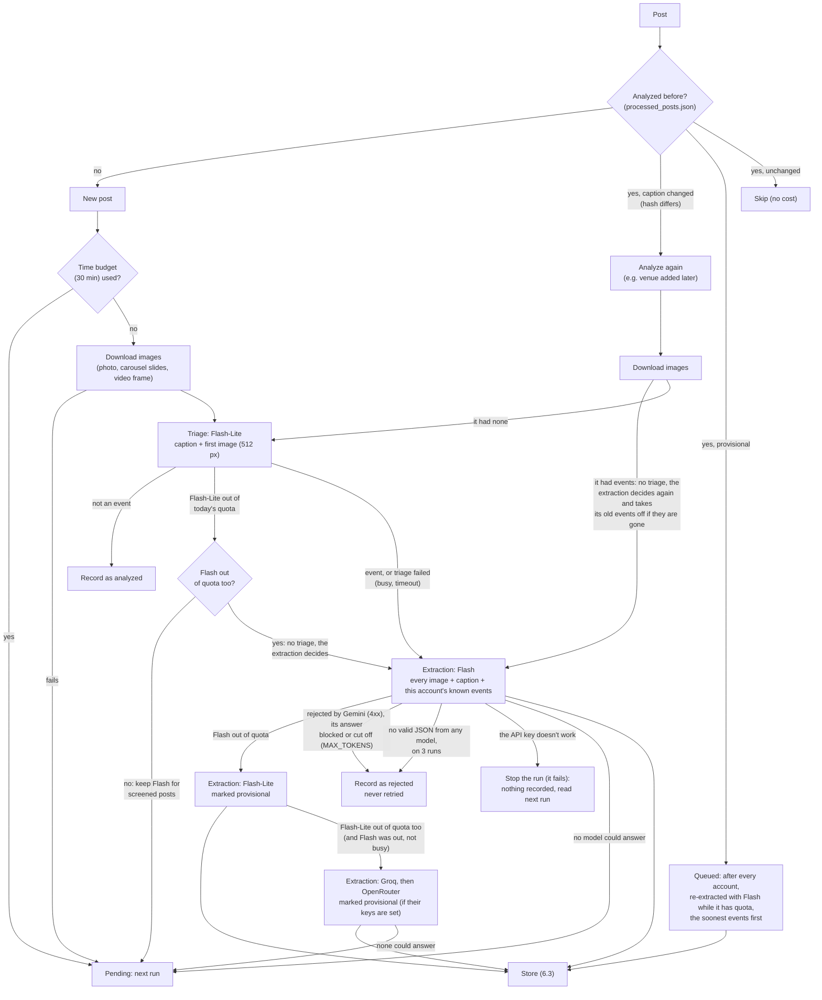

**Cancellations:** a re-analyzed post "had events" when its record's outcome is `event` or `merged` (or, with
no `outcome`, when Gemini called it an event post). When it had events and now has none, and its caption or
Gemini's reason says they're cancelled or postponed ("CANCELADO", "se cancela", aplazado, "se aplazó", pospuesto,
reprogramado, postergado, "no se realizará"…: `pipeline/base.py`, `_says_cancelled`). Only words that say it of the
event: a reminder that Flash re-reads as no event would take the event it joined off the site for good, so "no habrá"
("no habrá venta de boletas en taquilla"), "cancelación" ("política de cancelación"), "nueva fecha" and "se canceló"
("ya se canceló", paid) don't count (the bug hunt of 7 Oct 2026). Nor does "se cancela" meaning "is paid", read line by
line: a price's word before it ("la entrada se cancela en la puerta"), or how it's paid after it ("en efectivo", "por
Nequi"), never "se cancela por lluvia".
its own account's events leave the site even when other posts announce them too; another account's event
stays, with low confidence and a doubt ("@cuenta lo anunció cancelado o aplazado: revisar") that lists it for
review (section 11.1) (`Sweep._take_down_cancelled`).

**When Flash-Lite is out of today's quota:**
- and Flash isn't, new posts wait for the next run: skipping the triage would spend Flash's 20 requests on
  posts that mostly aren't events;
- and Flash is out too, the extraction would be the last resort's anyway (section 7.3), so the post goes
  straight to it, without a triage: the extraction decides alone whether it's an event.

The triage never goes to the last resort: Groq's 8,000 tokens a minute don't fit a triage (about 4,100 tokens)
and an extraction (about 7,250) of the same post, and a weaker model's "no" would lose the event for good. The
last resort's "no" is provisional, and its upgrade goes through Flash-Lite's triage first
(`Sweep._upgrade_post`). A triage that fails for another reason (busy, a timeout) lets the extraction decide.

Triage exists to save the scarce Flash quota (20 a day per model). Most posts aren't events, and a
512-pixel image plus the caption are enough to tell. When unsure, the triage prompt answers "yes": a
false "no" loses the event for good, while a false "yes" only costs one Flash call.

### 6.3 Storing what Gemini found

1. **Normalize** (`normalize.py`):
   - styles mapped to the fixed list, so "mambo" and "on2" become "salsa en línea"; salsa's other names stay in
     its family (the owner, 5 October 2026): pachanga, boogaloo (bugalú), salsa brava, salsa dura and salsa choke
     are "salsa", "cubano" and "estilo cubano" are "salsa cubana" ("son cubano" stays "son"; guaguancó is "afro",
     like rumba cubana), and the prompt says so too;
   - dates and times checked. An `end_date` (the last day of an event over several consecutive days) must
     come after `date` and make at most `MAX_EVENT_DAYS` (7) days in all; otherwise it's dropped and the
     event keeps its first day, with a doubt when the range was reversed ("fecha final anterior a la
     inicial") or too long ("dura más de una semana: revisar fechas"), so it's listed for review;
   - a workshop series' `sessions` (section 9.1) sorted, without repeats or invalid dates, each with valid
     times; the event's days, times and weekday follow them (`normalize.fit_sessions`). Sessions on
     consecutive days are an event over several days instead, and more than `MAX_SERIES_SESSIONS` (12)
     sessions or `MAX_SERIES_DAYS` (123, about 4 months) is a course: discarded as recurring ("más de 12
     sesiones o más de 4 meses: es un curso");
   - prices and text cleaned (`normalize.clean_prices`): a label, no negative amounts, and no 0 that is an
     amount in another currency (USD, US$, MXN, EUR, €, dólares, pesos mexicanos…, in the label or the
     condition), since the site shows 0 as free: it's dropped, with a doubt ("Precio en otra moneda: VIP
     (1,000.00 MXN)"), unless it reads as free (gratis, libre, free);
   - an event Gemini isn't sure is in Bogotá (`in_bogota` "unknown") gets the doubt "ciudad sin confirmar: ¿es
     en Bogotá?", which lists it for review (section 11.1). A free check in code (`normalize.doubtful_city`)
     makes it "unknown" too when Gemini placed it in Bogotá but it has no address of its own and the caption
     names another city or country (`_OTHER_PLACES`) and never Bogotá: on 3 October 2026 Flash-Lite read "Nos
     vemos en expofitness Medellín 2027" as a Bogotá event. A style or a guest's origin ("estilo", "desde",
     "llega de", "sabor"…) doesn't count, and places that are also words, surnames, styles or artists' origins
     (Pasto, Pereira, New York, Puerto Rico, La Habana) aren't in the list. A bar's events skip the check.
   - **Safeguards for lighter readings** (`Sweep._safeguarded`; free, no request). Measured on 5 October 2026 on
     every post Flash had read (20 posts, 35 events), Flash-Lite matched Flash on dates (26/26) but got styles
     wrong or missing on 7 of 26 events and mixed up times and prices in a post with three workshops. So:
     - an event that comes back with no styles gets the ones its title or caption names
       (`normalize.styles_in_text`: the style list and its synonyms, longest first, with the words around a style
       that captions use instead of its name: salsero, salsoteca, Fania, bachatero, perreo, afrobeats, milonga…),
       else its account's usual ones (`_usual_styles`: styles a model read on at least 80% of its 3+ stored
       events); otherwise the dance filters would miss the event. The text leaves out synonyms captions use as
       plain words or names, which gave wrong styles ("la mejor rumba" isn't afro, "street food", "Casino
       Royal", "Mambo Cafe"…); the model's
       own styles keep every synonym. One of several events in a post looks at its own title first, and takes
       the caption's styles only when they're all one family: a caption naming salsa and bachata doesn't say
       which event is which. Styles the model gave are never changed; guessed ones carry the doubt "estilos
       deducidos del texto o de la cuenta, no leídos en el post" (`normalize.GUESSED_STYLES_DOUBT`), so a later
       reading with styles replaces them when merged (`merging.merge_into`), and they never make an account's
       usual style;
     - a post with several events read only by a lighter model (a provisional reading, or Flash-Lite in lite-only
       mode) gets the doubt "varios eventos en una publicación, leída por un modelo ligero: confirma horas y
       precios" (`normalize.MULTI_DOUBT`) on each, which lists them for review (`health.review_reasons`, section
       11.1). A Flash reading of the post, or one merged into its event, takes it off (`Sweep._add_event`).

   The site relies on these formats.
2. **Keep only publishable events** (`Sweep._discard_reasons`): one-time (`is_recurring` false; a workshop
   series counts), with a valid date, in Bogotá (`in_bogota` isn't "no": an internal field of the extraction,
   never stored), and not over: an event whose last day (`end_date`, a series' last session, else `date`) is
   before today in Bogotá is published only if it's already stored (another post of it, or this post read
   again). A new account's first sweep reads posts a month old, and on 4 October 2026 a tour post of 17
   September published two past concerts in México. The rest count as "discarded", and the post's record says
   why (`recurrente`, `sin fecha`, `fuera de Bogotá`, `ya pasó`).
3. **Save flyers** (`storage.save_flyer`): the image Gemini says shows each event (`image_index`),
   shrunk to at most 1080×1350 and saved as WebP (quality 75: 15% smaller than 80 with no visible difference, measured on every flyer on 5 Oct 2026) in `data/flyers/<post id>-<slide>.webp`.
   When that slide is a video (a reel, or a carousel's video slide), `clips.make_clip` cuts its first 6
   seconds with ffmpeg (no sound, 480 px wide, H.264, about 100–400 KB) into
   `data/previews/<post id>-<slide>.mp4`, recorded as the media's `preview`: the site plays it, silent and
   looping. Carousels record their slide count (`slides`). Some videos come without a file from Instagram
   (likely licensed music): they get no clip. Posts stored before clips existed get theirs when a sweep
   fetches them again (`Sweep._complete_media`). Instagram's image and video links expire, so the site uses these copies. An image that shows several events
   (a monthly schedule) is saved once and shared.
4. **Detach the post from earlier results:** if the post was analyzed before (edited caption, upgrade),
   what it contributed is removed first. Events only it announced give their ids back, so their URLs
   don't change.
5. **Merge or add** each event (section 9).

---

## 7. Gemini: models, prompts and quotas

### 7.1 Two steps, three roles

| Step | Model(s) | Input | Output (schema) | Thinking |
|---|---|---|---|---|
| Triage | Flash-Lite (`LITE_MODELS`) | Caption, account, publication date, today's date, first image as a 512 px JPEG | `Triage`: `is_event_post`, `reason` | Low |
| Extraction | Flash: `gemini-3.8-flash`, `3.7`, `3.6`, then `3.5` | Every image (numbered), caption, dates, and this account's **known events** (id, date or first → last day and a series' sessions, time, title) | `PostAnalysis`: `is_event_post`, `reason`, `events[]` (each an `ExtractedEvent`, with `sessions`, `image_index`, `same_as` and `in_bogota`, the last three never stored) | Model default |
| Provisional extraction | `gemini-3-flash-preview`, then Flash-Lite | Same as extraction | Same, marked provisional: redone with Flash on a later run when there's quota | Model default |
| Story (admin tools) | Extraction's models, Flash-Lite when Flash is out (kept as it is) | Up to 4 screenshots of one story (numbered), when the screenshot was taken, the admin's notes and account, the account's known events | `StoryAnalysis`: the header's account, a reshared post's author, mentions, location sticker, the story's age, a `content_box` per screenshot, `events[]` (`StoryEvent`: dates as printed, a series' sessions too (`StorySession`), worked out in code by `stories.resolve_date`) | Model default |
| Discovery | Flash-Lite (`LITE_MODELS`, the triage's) | An account's profile and recent captions | `AccountClassification`: kind, in Bogotá, city, styles, whether it announces one-time events, reason | Model default |

Notes on the prompts and parameters:
- **The prompts** are in `pa_bailar/prompts.py`, and the JSON schemas are the Pydantic models in
  `pa_bailar/models.py`. The field descriptions are part of what Gemini reads.
- **Temperature** stays at the default, as Google advises for Gemini 3 models.
- **The extraction prompt covers:**
  - what is and isn't an event, shared with triage (`_EVENT_DEFINITION`): one-time socials, workshops,
    concerts, festivals (several consecutive days are one event) and workshop series (2 to 12 separate days,
    each dated in the post, within 4 months: one event with its sessions); not regular classes or courses whose
    sessions aren't each dated ("todos los sábados de noviembre", "8 semanas") or that are longer, recaps,
    showcases or tutorials, anything not about dancing, concerts and festivals that aren't for social or
    partner dancing (electronic, rock, reggaeton mass concerts…), events the post places in another city or
    country (no city stated means Bogotá), nor an event a post about something else only mentions in passing.
    It quotes the words academies use ("social", "taller", "todos los jueves", "así se vivió"…), which helps
    the lighter model most;
  - `in_bogota` for every event ("yes", "no" or "unknown"), checked in code (section 6.3), since the prompt
    alone let a tour's concerts abroad through;
  - how to pick the event type (social, party, workshop, concert, congress, festival, competition, show, other: a
    multi-day dance congress is a `congress`, its workshops included; a `social` is a night for dancers, an
    academy's or an organizer's, a `party` a night out, a bar's or a general public one) and the styles (from a fixed list);
  - dates: `date` is the event's (first) day, `end_date` its last over consecutive days ("NOV 13-15" → 13
    and 15; null for one day, a night past midnight included); one event per congress, not per day; the same
    workshop on separate dates is one event per date, while a workshop series (one sign-up) is one event with
    `sessions`; a post about one session, one teacher or one night is that series or festival. Times over
    several days: the first day's start and the last day's end;
  - how to resolve dates without a year;
  - prices: `amount_cop` only in Colombian pesos, 0 only when free; a price in another currency goes to the
    doubts, never as 0 (the code drops one anyway, section 6.3);
  - how to rate confidence (high, medium or low);
  - when to set `same_as` (section 9): only for a post that announces the event itself, on its date.

### 7.2 `ModelPool`: staying inside the free quotas

`pa_bailar/gemini.py`. Every Gemini call goes through `ModelPool.generate(models, contents, schema)`.

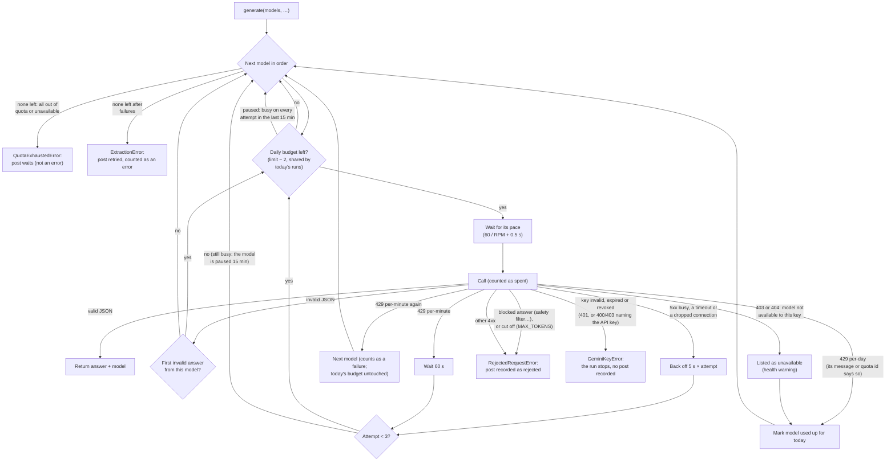

- **Budget:** each model's daily limit minus 2, kept free for manual runs and retries
  (`DAILY_BUDGET_MARGIN`).
- **Shared across the day's runs:** usage is saved in `state/gemini_usage.json` with its quota day,
  which is midnight to midnight Pacific time. So the 6:30 AM and 9:00 PM runs share one day's budget. So are the
  models Gemini said the key can't use (403, 404) that day: the day's later runs skip them without asking, and still
  report them, so the health check counts every run (until 6 Oct 2026 the second run reported none and the count of
  runs in a row started over).
  `discover`, run on your computer, uses the same key but keeps its own count: it reads the sweeps' usage
  from the `sweep-state` branch and always leaves them `DISCOVERY_LEAVES_FOR_SWEEPS` (250) Flash-Lite
  requests (section 12.1).
- **Waiting isn't failing:** when every model asked for is out of today's quota (or not available to the
  key), the pool raises `QuotaExhaustedError` and the post simply waits for a later run. Only real failures
  (busy servers, bad answers) count as errors. Before downloading a new post's images, the sweep checks that
  some model still has quota (`EventExtractor.can_analyze`).
- **A key that doesn't work** (any 401, or a 400 or 403 whose message names the key: `API_KEY_INVALID`,
  "API key not valid", "API key expired"; `gemini._is_key_error`) raises `GeminiKeyError`,
  which isn't an `ExtractionError`: the sweep stops and fails (the failed run emails), and no post is
  recorded as rejected, so all of them are read once the key is replaced (section 15).
- **A blocked answer** (a safety filter: `SAFETY`, `PROHIBITED_CONTENT`…) is rejected at once instead of
  being retried 3 times per model: it would be blocked every time. So is an answer cut off at the model's output
  limit (`MAX_TOKENS`): the post is recorded as rejected, "respuesta demasiado larga".
- **An answer that isn't valid JSON** is asked again once per model (`INVALID_ANSWER_ATTEMPTS`), then the next
  model. When the only failures were such answers, the pool raises `UnreadableAnswerError`: the sweep retries the
  post next run, counting the runs in `accounts.json` (`unreadable`), and on the third (`UNREADABLE_RUNS`) records
  it as rejected, so a post no model can read stops spending Flash's quota (a provisional post's upgrade keeps its
  provisional reading instead). A busy model among them makes it a plain failure, retried without counting.
- **A model the key can't use** (404, or a 403 that doesn't name the key, e.g. if Google took it out of the
  free tier) is skipped for the
  day like a spent one and listed in the run's `models_unavailable`. Repeated over 3 runs, it's a health
  warning (section 11.1).
- **Lite-only mode:** the repository variable `GEMINI_LITE_ONLY=1` makes Flash-Lite the extraction model, with
  final (not provisional) results (`config.LITE_ONLY`). It's the switch for a Flash cutoff. With no provisional
  fallback, an extraction's error stands as it is: a rejected post is recorded as rejected, and a failure is an
  error retried next run (not "no quota left").
- **Which 429:** only one whose message or quota id names the daily quota ("per day",
  `GenerateRequestsPerDay…`; `gemini._is_daily_quota_error`) marks the model used up for the day. A per-minute
  429 waits 60 seconds and retries; a second one moves on to the next model without touching the day's budget
  (counting it as daily once lost a model for a whole quota day), and if no model answers, the post is an
  error retried next run.
- **Pace:** calls to the same model are spaced to its per-minute limit.
- **Timeout:** each request gives up after 120 seconds, so a stuck call can't hang the run. The SDK raises
  timeouts and dropped connections as httpx's own errors (`httpx.TransportError`, neither an `APIError` nor an
  `OSError`): the pool retries them like a busy server, and if no model answers, the post waits like any
  failure (`pipeline.RETRYABLE_ERRORS`; an add-post request answers "Inténtalo de nuevo en un rato").
- **A model busy on every attempt is paused** for 15 minutes (`BUSY_PAUSE_SECONDS`): skipped like a busy one, its
  budget kept, and no provisional post is upgraded while Flash is paused (`EventExtractor.can_upgrade`). On 6 Oct
  2026 Flash answered 503 all morning, and 3 attempts per model per post spent its whole day (36 requests, all
  counted, since Google may count them) without a single answer; now an outage costs 3 per model per pause.
- **The upgrades wait once for a paused Flash** (`Sweep._wait_for_flash`): when every Flash model with budget left
  is only paused, the run waits for the first pause to end, if `FLASH_WAIT_MARGIN_SECONDS` (4 minutes) of its time
  budget still follow, then upgrades while Flash answers. On 7 Oct 2026 at 21:09 the 34 queued upgrades were given
  up at once, with 21 of the run's 30 minutes left; 40 of the 85 upcoming events had only a lighter reading. Out of
  quota, it doesn't wait; busy again after the wait, the rest waits for a later run.
- **Each upgrade measures the lighter read** (`Sweep._audit_upgrade`): an event only lighter models had read is
  compared before and after Flash's reading, field by field (date, end date, start time, title and venue folded,
  type, styles), and the run records what changed (`upgrade_changes` in `run_history.json`). `admin status` and
  the admin page sum it over the recorded runs ("Flash releyó 12 eventos que solo había leído un modelo más
  liviano: la hora en 1, los ritmos en 3…"): how the backup reads hold up on new posts, beyond the test set.

### 7.3 The last resort: Groq and OpenRouter

`pa_bailar/external.py` (`ExternalTier`), called by `EventExtractor` (`extraction.py`). The whole chain:

| Step | In order | Provisional? |
|---|---|---|
| Triage | Flash-Lite only: when it's out, the post waits, or goes straight to the extraction when Flash is out too (section 6.2) | (a yes/no) |
| Extraction | Flash (two models) → Flash-Lite → Groq → OpenRouter | Flash-Lite's and the last resort's, always |
| Lite-only mode | Flash-Lite → Groq → OpenRouter | The last resort's (re-read with Flash-Lite) |
| Upgrade of a provisional post | Flash only (a last-resort "no event": Flash-Lite's triage first) | No |
| Story (admin tools) | Flash → Flash-Lite | Never the last resort: a story isn't read again, so its reading would stay |

- **Only when Gemini is out:** the last resort is asked only when both Flash and Flash-Lite raised
  `QuotaExhaustedError` (all out of today's quota or not available to the key; `EventExtractor._extract`). A busy
  Flash (5xx, timeouts) or one that refused the post (a safety block) with Flash-Lite out leaves the post waiting
  for Gemini.
- **Off without keys:** each provider needs its key (`GROQ_API_KEY`, `OPENROUTER_API_KEY`). Lite-only mode keeps
  them as the last resort after Flash-Lite.
- **Always provisional:** an extraction from the last resort is stored like Flash-Lite's provisional ones, and
  upgraded with Flash on a later run when there's quota (section 6.2). Its record names the model with its
  provider, `groq:qwen/qwen3.8-27b` or `openrouter:google/gemma-4-31b-it:free`, and `admin why` shows it.
- **Fail fast:** one request per model and post, a 60-second timeout (`EXTERNAL_TIMEOUT_SECONDS`), no retries and no
  waiting on a busy model. On OpenRouter one request names the models of the same output mode (`models`), and
  OpenRouter itself tries the next one when a model is rate-limited or down; the answer says which one replied.
- **Time:** a post spends at most 3 minutes on the last resort (`EXTERNAL_MAX_SECONDS_PER_POST`), and a request
  starts only if its wait and a whole timeout fit before that and before the run's time budget ends (section 14):
  Groq's wait and request (60 + 60 s), then OpenRouter only if a request still fits. Otherwise the post waits.
- **Groq's tokens:** each request's tokens are estimated before it's sent (text / 4, 2,048 per image, 800 for
  the answer; replaced by the real count) and kept in a one-minute window. An extraction is about 7,250 tokens
  (4,200 of prompt and schema, one image, the answer) of Groq's 8,000 a minute, so each one waits for the one
  before to leave the minute (up to 60 seconds, `EXTERNAL_MAX_WAIT_SECONDS`): about one a minute. It gets the
  first images that fit in a minute's tokens, at most 3, usually one. A 413 or a token 429 skips Groq for the
  post without counting as a failure, and with less than `EXTERNAL_MIN_REQUEST_TOKENS` (5,000) of its daily
  tokens left Groq isn't available, so no post downloads its images just to be skipped.
- **Per run:** a model that fails twice (busy, a timeout, invalid JSON: `EXTERNAL_FAILURES_TO_QUARANTINE`) is set
  aside for the rest of the run, with one warning in the log; a model answering 404 (gone, or no longer free) at
  once. A provider answering 401, 402 or 403 is turned off for the run. What each model did (answered, busy,
  invalid, unavailable, skipped, refused, spent) is in the run's statistics
  (`RunStats.external`) and history, for the health checks.
- **Shared daily budgets:** requests (and Groq's tokens) per provider are saved in `state/external_usage.json`
  with their UTC day, like Gemini's usage. A provider's own daily-limit 429 spends it for the day.
- **Re-checking the models:** `admin bakeoff` (section 12.3, [`docs/ADMIN.md`](ADMIN.md)). The list in
  `config.EXTERNAL_PROVIDERS` stays explicit: nothing switches by itself. On 5 October 2026, on 15 posts,
  OpenRouter's free qwen read about as well as Flash-Lite but often failed upstream, and gemma never answered:
  why OpenRouter comes last. The same day `qwen/qwen3.8-27b:free` went paid-only (404) and left the list.
  `--discover` lists only models that answer in text: Google's Lyria shows a zero token price but is a paid
  music model.

---

## 8. Instagram: what is read and how

`pa_bailar/instagram.py`.

- **One call per account:** `fetch_recent_posts(account, limit)` asks Business Discovery for the latest
  `limit` posts with `id, caption, media_type, media_url, thumbnail_url, permalink, timestamp`, and for
  carousels each child's `media_type, media_url, thumbnail_url`.
- **Images:** a photo's `media_url`, the slides of a carousel (up to 10), or a video's `thumbnail_url`
  (its preview frame). They're downloaded straight from Instagram's CDN.
- **Errors:**
  - `InstagramError` carries Meta's code;
  - `is_not_visible`: 100 and 110, a personal, private or missing account;
  - `is_rate_limited`: 4, 17, 32, 613 and 80001–80009;
  - network failures and non-JSON answers become an `InstagramError` for that account only.
- **Quota awareness:** every answer updates `app_usage_percent` from both of Meta's usage headers (reading only
  `X-App-Usage`, which Instagram no longer sends, once meant the stop never triggered). `discover` pauses at
  60%. The sweep stops reading accounts at 90% (`INSTAGRAM_USAGE_STOP`), or on the first rate-limit error,
  and the remaining accounts go first next run.
- **The token never shows in errors:** it travels in the URL, and connection errors quote the URL, so
  `instagram.redact` removes it before an error's text reaches logs, `status.json` or an admin answer. It
  also hides `client_secret`, `fb_exchange_token` and `input_token`, which `refresh-token` sends, and that
  command redacts its own errors too.

---

## 9. One event, many posts: identity and merging

Academies announce the same event several times: the flyer, then a video, then a reminder. An organizer
and its venue, or two collaborators, may each post it too. Those posts must become **one event** that lists
all of them in `media`. `pa_bailar/merging.py`. None of this costs a Gemini request beyond the extraction.

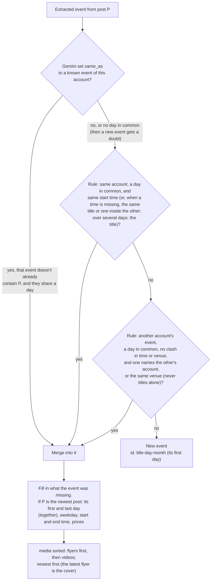

- **Gemini links first:** the extraction prompt lists the account's known upcoming events (id, date or
  first → last day and a workshop series' sessions, time, title), and Gemini sets `same_as` when the post
  announces one of them again. The rule-based match is the fallback.
- **A link needs a day in common** (`merging.refused_link`): `same_as` is accepted only when the post's event
  and the linked one share a day, as the rules require. Otherwise the event goes through the rules like any
  other, and if it's stored as new it carries the doubt "posible cambio de fecha: Gemini lo une a <id>", which
  lists it for review. Trusting the link alone moved an event to another post's date (a song release that
  mentioned a concert), its id still naming the old day, and could have cost a series its sessions. A real
  reschedule then shows as two events, the new one flagged, until the old one is hidden.
- **Days in common:** an event covers `date` to `end_date` (or just `date`), and two events match only if
  their days overlap. A post about one night or one teacher of a festival falls within the festival's days.
  A workshop series covers only its session days, not the days between them.
- **Workshop series** (section 9.1), same account:
  - a post about one of its sessions (a reminder, "sesión 3") is the series when it's dated on a session
    day, doesn't clash with that session's start time, and has the same title, a distinctive title word in
    common ("Intensivo: sesión 3" and "Programa intensivo de bachata"), or the same venue at the same
    start time (`merging._session_of`). It joins the series without changing its sessions;
  - two series are the same program only when at least half of the shorter one's sessions match, with the
    same start time on the sessions they share, and the same title or distinctive title words in common
    (`merging._same_series`): two levels of one academy's intensive on the same Sundays stay two events;
  - the newest post's sessions replace the series' (with `date` and `end_date`); an older post with the
    whole series (the program's flyer) turns an event stored from one of its sessions into the series.
- **The same account's event** (`looks_like_same_event`): between two one-day events, the same start time,
  or, when a time is missing, the same title or one title inside the other (`_same_title`: the shorter title's
  distinctive words all in the longer one, "Acere" and "Salsoteca DC - Acere"; not when the extra words name a
  kind of event, "Social con Juan" and "Masterclass con Juan", nor when the titles name different kinds,
  "Social con Juan" and "Taller con Juan" (`_kinds`: night, class, practice, competition, show; a party, a social
  and a concert are one kind, a night out: "Fiesta con Zafra" and "Zafra en concierto" at a bar the same day), nor
  with two different venues). Two month
  schedules of @elgocepagano listed every night twice before this (5 Oct 2026). When either lasts several days, the title decides (the same
  title, or distinctive title words in common, as below), never the start time alone: a festival weekend
  has several nights, and the same academy's social on one of them is another event.
- **Duplicates already stored are repaired** (`merging.merge_duplicates`, on every run's load): events of one
  account the rules say are one, from different posts, merge into the fuller one (more details, then the longer
  title), which takes the other's posts; the posts' records follow it. So a duplicate the rules let through, or
  one stored before a rule improved, is gone after the next run.
- **Another account's event** (`looks_like_shared_event`): Gemini only sees this account's events, so
  across accounts it's rules only. A day in common; never with different start times (compared between
  one-day events only) or different venues (when both are known); and one of:
  - one event names the other's account (its organizer, venue or contact, or a title word: "Bachatamanía"
    for `@bachatamania_bogota`, "Distrito Social" for `@distritosocialbog`, "Level" for `@levelupbfc`, or two or
    three words in a row: "DJ set Salsa Culto" for `@salsaculto`), plus the same start time or a title word in
    common; or, when a TITLE names it, the same venue for one-day events (a venue's calendar listing an
    organizer's night). Being held at the other account's venue names it too, but the venue alone isn't enough
    then: an academy's afternoon workshop at a bar isn't the bar's night (review, 7 Oct 2026);
  - the same venue (both known), plus the same start time and a title word in common, or two or more
    distinctive title words in common, or two counting kinds of events as long as one isn't one ("Tour de la
    Salsa — Capítulo 001" and a partner's "Primer capítulo del Tour de la Salsa" without a time, 7 Oct 2026).

  **Titles alone never merge two accounts' events:** two academies' "Halloween Party 2026", or "Bachata
  Congress 2026" and "Salsa Congress 2026" on the same weekend, are as likely two events as one. Words every
  dance title shares (social, clase, bachata, salsa…), place names (Bogotá) and anything with a digit (years,
  "100%") never count. Neither do kinds and occasions of events (congress, festival, party, Halloween,
  aniversario, masterclass, competencia, gala…: `merging._EVENT_WORDS`) for the two-words rule and for a
  title naming an account; with an account named, or the same venue and time, "Halloween" in both is enough. The
  event stays under the account that posted it first, and gains the other post's flyer. Over the site's
  history this merges the one real duplicate (Sept 19, 2026) and nothing else.
- **A post read again is the event it announced:** when an upgrade or "Volver a leer" re-reads a post and the
  rules don't match its event (Flash-Lite read the doors at 18:00, Flash the show at 23:00), the event this post
  announced before on that day is the one, if there's only one (`find_existing(announced=…)`): the event keeps its
  id, so links shared meanwhile still work (review, 7 Oct 2026). Three workshops a lighter model merged into one
  stay three when Flash reads them: the first takes the event, the others are new.
- **Two events in the same post are never merged** with each other.
- **One post, one identity:** the API and the post's public page (section 3.7) know a post by different
  ids (`public-<id>` for the page). Posts are matched by their link's code, so the same post is never
  analyzed twice: a post added by hand from its public page is renamed to the API's id when a sweep first
  sees it (`Sweep._adopt_public_record`), and a post read again by hand keeps the id it has.
- **The cover is the latest flyer:** an event's posts are sorted flyers (photos and carousels)
  first, then videos, then stories (a crop of a screenshot, linked to the account's profile), newest first
  within each (`ordered_media`). The first post is what the card,
  the link previews and the detail show first. A corrected or updated flyer replaces the first
  announcement as the cover. Every save applies this order to all events.
- **Logistics follow the newest post:** a later post may reschedule an event or change its prices, so
  `date`, `end_date`, `weekday`, `start_time`, `end_time` and `prices` come from the newest post. Everything
  else keeps its first value (the flyer's title beats a reminder's caption) and is only filled in when it was
  missing (for example, a venue "to be confirmed" on the flyer and given later).
  - **Except over a lighter model's reading:** when Flash re-reads a post (an upgrade, "Volver a leer") of an
    event every post of which was read by a lighter model (provisional), what Flash read replaces it all, title
    included (`Sweep._only_lighter_reads`, `merge_into(correcting=True)`). Without this, an event announced twice
    (a venue's calendar as a post and as a reel) kept Flash-Lite's wrong title through every upgrade (7 Oct 2026).
  - An empty value never clears a known one, so a reminder without dates keeps an event's last day.
  - A post about one day of an event over several days (one day of its own, within the event's) doesn't
    change its days or times: a teacher's class isn't the festival's new date.
  - The first and last day go together (and a series' `sessions` with them): the newest post's `date` and
    `end_date` replace both, so an event moved to one day, as posted, loses its old last day (13–15 Nov
    moved to 10 Nov is 10 Nov, not 10–15).
  - An older post only gives a last day to an event that has none and starts the same day (a flyer's
    "13–15 Nov" for an event stored on 13 Nov). It never mixes its days with a newer post's: "13–15 Nov"
    from an older post leaves a newer "14 Nov" as it is.
- **Ids are URLs** (`ids.py`): `<title>-<day>-<month>`, for example `social-de-halloween-24-oct`, with
  `-2`, `-3`… when taken. An event over several days is named after its first day
  (`level-up-bachata-fusion-congress-13-nov`), a workshop series after its first session.
  - An id is set once and never recomputed. A re-extraction that rewords the title keeps the old id,
    because the post "gives back" its ids before being stored again.
  - So a link shared on WhatsApp keeps working.

### 9.1 Workshop series: one event, several dated sessions

A **workshop series** is one finite program people sign up for once and attend on separate, non-consecutive
days: a "programa intensivo" on Sundays 8, 22 and 29 November and 6 December, a "ciclo de talleres", a short
course. It's listed as **one event** until its last session; the site shows the next session on the card and
every session in the details. Decided on 4 October 2026 (the first case, a story, was rejected as "no un
evento único").

- **What qualifies:** 2 to 12 sessions (`MIN_SERIES_SESSIONS`, `MAX_SERIES_SESSIONS`), **every one dated** in
  the post, the last at most `MAX_SERIES_DAYS` (123) days in all after the first (about 4 months). Regular
  classes ("todos los viernes", "clases regulares", monthly fees), programs with only a start date or "todos
  los sábados de noviembre", and longer courses stay out (recurring). A story's weekly social night publishes
  only its next date.
- **Not a series:** an event over consecutive days (a congress, "7, 8 y 9 de noviembre") keeps `date` and
  `end_date` without sessions, at most 7 days; the same workshop given again on another date (people attend
  one) is one event per date.
- **The `sessions` field** (in `events.json`, `EventDetails.sessions`, `models.Session`): `null` for every
  event that isn't a series (written as `null`, absent in data written before it existed); for a series, a
  list of 2 to 12 `{"date": "YYYY-MM-DD", "start_time": "HH:MM" | null, "end_time": "HH:MM" | null}`, sorted
  by date, no date twice. Then `date` is the first session's date and `end_date` the last's (so `end_date`
  can be up to 122 days after `date`, not 6), `start_time`, `end_time` and `weekday` the first session's.
  The id is named after the first session. `models.series_problems` holds these rules, and `StoredEvent`
  refuses a series that breaks them (normalization and merging keep them).

  ```json
  {
    "id": "programa-intensivo-de-bachata-8-nov",
    "title": "Programa intensivo de bachata",
    "event_type": "workshop",
    "date": "2026-11-08",
    "end_date": "2026-12-06",
    "sessions": [
      { "date": "2026-11-08", "start_time": "14:00", "end_time": "17:00" },
      { "date": "2026-11-22", "start_time": "14:00", "end_time": "17:00" },
      { "date": "2026-11-29", "start_time": "14:00", "end_time": "17:00" },
      { "date": "2026-12-06", "start_time": "14:00", "end_time": "17:00" }
    ],
    "weekday": "domingo",
    "start_time": "14:00",
    "end_time": "17:00"
  }
  ```

  (the other fields as for any event). `schema_version` stays 1: the field is optional and additive.
- **Upcoming and retention:** everything that goes by an event's last day (`EventDetails.last_day`: the
  known events Gemini is shown, health's events to review, `admin status`, `admin why`, the 60-day
  retention) uses `end_date`, the last session, so a series stays listed until its last session has passed.
- **Reading it:** the extraction prompt asks for one event with `sessions` (each with its own times), the
  triage counts a dated series as an event, and a story's sessions are copied as printed (`StorySession`) and
  dated in code (`stories.resolve_sessions`: the year that makes it the earliest series not over yet, so a
  story shared after the first sessions still gets this year's). `normalize.fit_sessions` then sets the
  event's days and times from them (section 6.3).
- **Merging:** section 9 (a post about one session joins the series; two series of one account merge only
  when they're the same program).
- **The admin tools' answers** show a series as "4 sesiones: 8, 22, 29 nov y 6 dic" (`text.sessions_label`).
- **Safety net:** `admin status` and the admin page list **Series nuevas**, the series first published in the
  last `NEW_SERIES_DAYS` (14) and not over yet (`status.new_series`), each with a one-tap **Ocultar**
  (`hide-event`), so each new series gets a look (ADMIN.md, "From the admin page").

---

## 10. State and outputs

### 10.1 State (`sweep-state` branch)

The `sweep-state` branch is an orphan branch that only holds JSON files. It's this repository's own
memory between runs; the site never sees it.

| File | Content | Why it matters |
|---|---|---|
| `processed_posts.json` | Every analyzed post: account, link, when, event or not, reason, model, `provisional`, caption hash, and its `outcome` (`event`, `merged`, `discarded` with a `detail` such as `recurrente`, `sin fecha`, `fuera de Bogotá`, `ya pasó` or `cancelado`, `not_event`, `rejected`, `hidden` for a story, or a post whose events were all hidden, taken off the site by hand) with the `event_ids` it became or joined. Stories added by hand are here too, under `story-<hash>`, with the perceptual hashes of their screenshots (`image_hashes`) | Posts are never sent to Gemini twice. Edited captions and provisional posts are spotted here. Records older than 45 days are forgotten, which is safe: older posts are never fetched again |
| `accounts.json` | Per account: when first seen, `backfill_done`, `last_swept_at`, `latest_post`, and `unreadable` (post id → runs on which no model gave valid JSON for it, section 7.2) | Whether the account still gets the deeper first sweep, and when its next turn is |
| `gemini_usage.json` | Today's quota day (Pacific), requests per model, and the models not available to the key today (`models.GeminiUsage`) | The day's runs share the daily budgets |
| `external_usage.json` | The last resort's day (UTC) and, per provider, requests, tokens and the answers per model | The day's runs share Groq's and OpenRouter's budgets (section 7.3) |
| `status.json` | What `admin status --json` reports after the run (section 12.3) | The admin page shows it, read through GitHub with the signed-in visitor's access |
| `hidden_events.json` | Events taken off the site by hand (`sweep --hide-event`), by id: the event as it was and when (`models.HiddenEvent`). Forgotten 60 days after its last day | The sweeps never publish them again from the same posts nor from a later post of the same event (`merging.matches_hidden`), and drop them from `events.json` on load. Adding one of its posts by hand publishes it again (ADMIN.md, "Ocultar evento") |
| `run_history.json` | The last 120 runs in short (about two months): accounts read, failed or skipped; posts, events, pending; errors; rate limit, time budget; Gemini requests (and the last resort's, per provider) and models the key couldn't use; what each of the last resort's models did, those set aside and the providers turned off; warning keys | The health rules compare a run with the previous ones (section 11) |

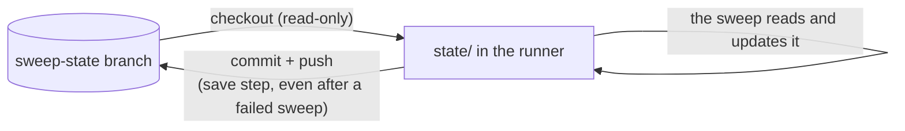

The save runs after the data PR step; when that PR couldn't be opened, `processed_posts.json` and
`accounts.json` keep their previous versions (section 5.2, step 11).

Locally, the same files live in `state/` (git-ignored), so local runs keep their own state. Tools that
need the sweeps' state on your computer (`admin status`, `discover`'s Gemini allowance) read the branch
itself: `pa_bailar/sweep_state.py` fetches it and reads each file with `git show`.

### 10.2 Outputs (the site repository's `data/`)

| File | Content |
|---|---|
| `data/events.json` | Every stored event, sorted by date (its first day) and time. The format is the data contract (`docs/DATA.md` in the site repository); `pa_bailar/models.py` (`StoredEvent`) is its source of truth |
| `data/meta.json` | `schema_version`, `generated_at` (Bogotá time), `accounts` (every account swept, the site's list of sources) and the stats of the run that wrote it. Rewritten every run, but only committed together with a real change to events or flyers |
| `data/archive/<year>.json` | Past events, archived instead of deleted: their records as in `events.json`, by the year of their last day, each flyer pointing to the archive's small copy and no clip. Not read by the site's pages |
| `data/flyers/*.webp`, `data/previews/*.mp4` | The flyer copies and videos' preview clips (6 s, silent). **Not in the site repository** (it ignores them): they live in `pa-bailar/media` (below). Unused ones are deleted at the end of every run |

**The images' repository, `pa-bailar/media`** (since 5 Oct 2026; `pa_bailar/media_store.py`, its `README.md`):
`flyers/`, `previews/` and `archive/flyers/` (the archive's small copies, 480 px, kept for good). Images in the site
repository grew its history by hundreds of MB a year, and its data PRs' references keep every old image alive, so
rewriting that history wouldn't shrink it. Here pushes are direct (no PRs), so the repository can be recreated with
only the current images when it gets big (save the old full-size ones first). The run copies the images in before
it starts and pushes what changed before the data PR (section 5.2); the site's build copies `flyers/` and
`previews/` into its `data/` the same way, so their addresses don't change. Moving them to other storage (e.g.
Cloudflare R2) would only change `media_store.py` and the site's copy step.

**Retention:** events whose last day (`end_date`, or `date`; a workshop series' last session) was more than 60
days ago leave the site and are **archived** (`storage.archive_events`, the owner's decision, 5 Oct 2026: "it could
be useful later"): the record to `data/archive/<year>.json`, a small copy of each flyer to `archive/flyers/`. Their
full flyers and clips are deleted with the unused ones.

---

## 11. Monitoring and health

Five layers, each catching what the others can't:

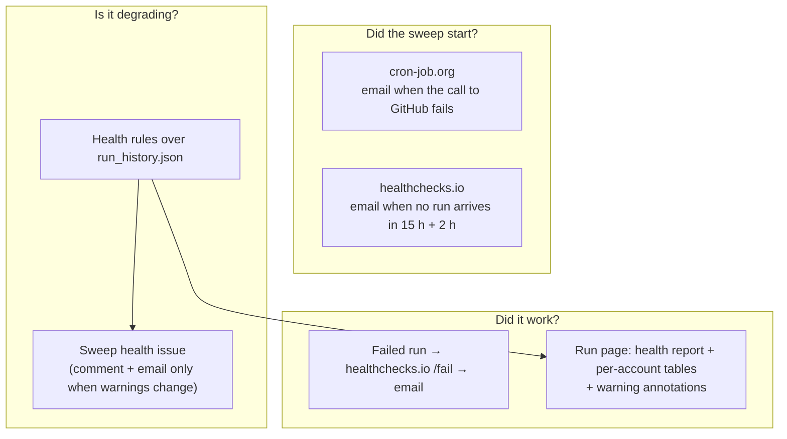

### 11.1 Health rules (`pa_bailar/health.py`)

They run after every sweep. No AI, no quota.

| Finding | Level | Rule |
|---|---|---|
| `@account` couldn't be read | Notice, then **warning** after 3 failed tries in a row | Renamed, private or no longer a business account? Each account is read about once a day, so runs that didn't try it (`RunRecord.read_accounts`) don't break the streak |
| Instagram's rate limit stopped the run early | Notice, then **warning** after 3 runs in a row | Too many accounts for the app's quota? Discovery or tests using it? |
| The run used its whole time budget | Notice, then **warning** after 3 runs in a row | Is the backlog too big? |
| Posts failed | Notice, then **warning** after 3 runs in a row | Gemini rejections, image downloads, unexpected errors. Posts waiting for quota aren't failures |
| A Gemini model the key can't use | Notice, then **warning** after 3 runs in a row (every run of the day reports it: asked again after midnight Pacific) | Google may have dropped it: the next model of the same role reads meanwhile, so take it out of `config.py`'s lists; only with every Flash of the extraction gone, `GEMINI_LITE_ONLY=1` (Flash-Lite as final results) |
| Pending posts | Notice, or **warning** when the backlog hasn't gone down in 4 runs | The quotas or the time are too small for the accounts followed |
| No events in a week | **Warning** | 14 runs with at least 10 posts analyzed and not a single event: are triage or extraction rejecting everything? |
| Posts read provisionally | Notice | Read without this generation's Flash (out of quota, busy, or kept for a later sweep that day): by an older Flash, Flash-Lite or the last resort, re-read with Flash on later runs |
| The last resort was used | Notice | Gemini ran out: requests per provider, what each model did (answered, busy, invalid, skipped…) and the ones set aside after failing twice |
| A provider of the last resort turned off | Notice, then **warning** after 3 runs in a row | Groq or OpenRouter answered 401, 402 or 403: check its key secret and the account, or delete the secret to stop using it |
| Account inactive | Notice | No post in 45 days (or none at all) |
| Events to review | Listed | Upcoming events (until their last day) with medium or low confidence, or whose doubts mention the date (`fecha`, `día`, a month or year guessed, a weekday that doesn't fit the date; a refused `same_as` link too), Bogotá (a city Gemini couldn't confirm) or a cancellation (`cancelado`, `aplazado`, `pospuesto`, `suspendido`, `reprogramado`, `postergado`: another account's post said so), or several events in one post read only by a lighter model ("varios eventos en una publicación…": times and prices may be mixed up), congresses or festivals with a single day ("un solo día: ¿faltan fechas?": their other days may be missing), and possible duplicates the rules didn't merge (`possible_duplicates`: one account, the same day, different posts, a distinctive title word in common: "¿el mismo evento que «…»?") |

### 11.2 Where it shows

- **The run's summary page** (`GITHUB_STEP_SUMMARY`) shows the health report first, then per-account
  tables and Gemini usage against the daily limits. Warnings are also workflow annotations.
- **The workflow** gets step outputs `warnings` (a count) and `fingerprint` (a hash of the warning
  keys), plus the report as a file (`HEALTH_REPORT_FILE`).
- **healthchecks.io** receives the report as the ping's body.
- **Text from Instagram can't tag anyone:** handles get an invisible word joiner after the `@`, so a
  handle like `@zafradance` never mentions the GitHub user of the same name.

### 11.3 The Sweep health issue

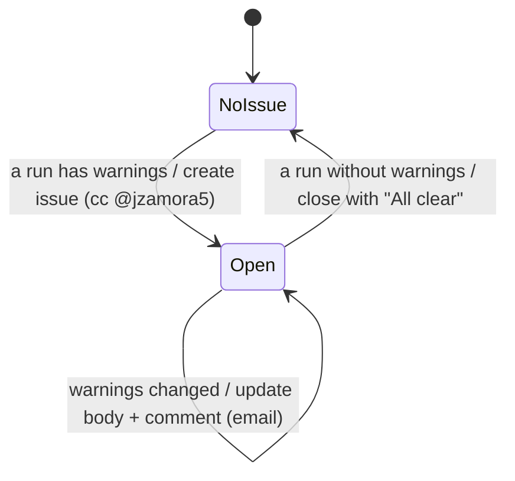

The fingerprint is stored in the issue body as an HTML comment, so the workflow can tell "same
warnings" from "new warnings". Counts don't change it, only which problems exist.

### 11.4 Logs

Each run's full log is on its Actions page, kept 90 days. It shows every account, every post's
link, every decision, every Gemini model used, and every event stored or merged.

---

## 12. The other commands: discover, refresh-token and admin

`python -m pa_bailar <command>` (`pa_bailar/__main__.py`). Each command imports only what it needs and
reads only its own secrets, so the sweep never needs the Meta app's secret.

### 12.1 `discover`: finding academies, organizers and artists among the accounts you follow

Runs on your computer. The input is your Instagram data export ("Followers and following", HTML or
JSON) in `private/`.

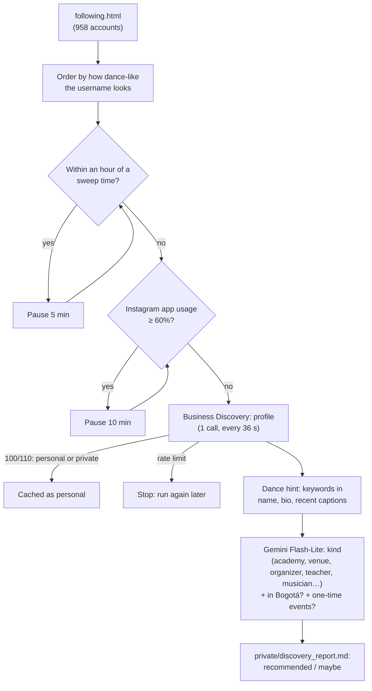

- **Resumable:** results are cached in `private/discovery.json`, and every run continues where the last
  stopped. Each run is capped (`--max-instagram`, `--max-gemini`). When Gemini can't classify (no quota, busy
  or unreachable, or a key that doesn't work), it stops classifying with a message and writes the report.
- **"Personal" goes stale:** an account Instagram couldn't see (100/110) is cached as personal with the date
  (`checked_on`), but it may switch to business later, or Meta may have answered that for another reason
  (d'Living Studio, 4 Oct 2026). `--recheck-personal N` asks again about N of them, dance-looking names first,
  each at most every 14 days (`RECHECK_PERSONAL_AFTER_DAYS`); readable ones are classified like the rest.
- **Leaves Gemini quota for the sweeps:** the key's quota is shared, but the sweeps' usage is on the
  `sweep-state` branch, not in your `state/`. Before classifying, it reads what the sweeps used today and
  classifies at most the daily budget minus that, minus its own use, minus `DISCOVERY_LEAVES_FOR_SWEEPS`
  (250, for today's later sweeps).
- **Keeps out of the sweep's way:** it pauses from an hour before each sweep time until 45 minutes after
  (`discovery.near_sweep`), because Meta counts calls over a rolling hour and the sweep must find the
  quota free.
- **Recommended** means, in or probably in Bogotá (`discovery.is_recommended`):
  - an academy, venue, organizer or dance company;
  - a teacher (a teacher, dancer or dance couple) or musician (an orchestra, band, singer or DJ) whose recent
    captions announce one-time events: their own workshops, intensives, socials, shows or concerts (since
    4 October 2026; before, artists who announce events in Bogotá were left out). Those whose posts are only
    videos and regular classes stay under "maybe": each followed account costs an Instagram call a day and a
    Flash-Lite triage per new post, for nothing. Cached classifications aren't redone: orchestras and DJs
    classified earlier as `dance_other` or `not_dance` stay so.
- **Personal accounts** (many teachers use one) can't be read by Business Discovery: they're skipped, and their
  posts can only be added one by one with the admin tools (Agregar), from the post's public page.
- **Adding an account** means adding a line to `accounts.txt` through a PR, in its section (academies, dance
  companies, event organizers, teachers and artists). The next sweep treats it as new and loads its older
  posts.
- **Salsa bars and restaurants** are swept with `bar` after the name in `accounts.txt` (general bars and clubs
  with `bar solo:salsa,bachata`), so only their special nights count (section 6.1). The ones not swept stay at
  the end of the file as commented-out notes, with what discovery found about each.

### 12.2 `refresh-token`: a Meta token that doesn't expire

Runs on your computer, only when the token stops working.

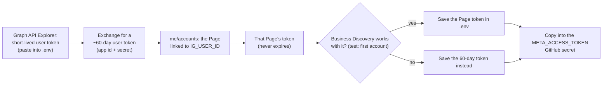

### 12.3 `admin`: running it day to day

`python -m pa_bailar admin <tool>` (`pa_bailar/commands/admin.py`), the tools behind the admin page.
They read what the sweeps record (no AI, no Gemini requests), except `bakeoff`. [`docs/ADMIN.md`](ADMIN.md) is the
guide.

- **`admin why <link>`** (`pa_bailar/why.py`): why a post's event is or isn't on the site. From the post's
  record (its `outcome`, Gemini's reason, the events in `events.json`), or, for a post never analyzed, its
  author from the public page (section 3.7), one Instagram call (the account's latest 50 posts) and the run
  history. ADMIN.md, "Revisar".
- **`admin add-account @x`**: checks that Instagram can read it (Business Discovery), then adds it to
  `accounts.txt` (`storage.add_account`, in its own section).
- **`sweep --post <link>`** (`Sweep.add_post`): one post by hand, without triage. Adds the account if it isn't
  swept. When the API doesn't give the post, it reads the post's public page (section 3.7; its id is
  `public-<id>`) and doesn't add an account the API can't read. A post analyzed before is only read again when
  its caption changed or it was "not an event" or rejected (`SETTLED_OUTCOMES`), or with `--again` ("Volver a
  leer", its events keep their ids). `AddPostError` says in Spanish why it couldn't. ADMIN.md, "Agregar".
- **`sweep --story <ids>`** (`Sweep.add_story`, `pa_bailar/stories.py`): an event from screenshots of an
  Instagram story, uploaded from the admin page. One Gemini request for all of them (`STORY_PROMPT`,
  `StoryAnalysis`), no triage; dates worked out in code (`stories.resolve_date`); stored as a `STORY` item
  (`post_id` `story-<hash>`, the profile as permalink, no caption). `--hide-story` takes one off the site
  again. ADMIN.md, "Agregar historia".
- **`sweep --hide-event <id>`** (`Sweep.hide_event`): takes any event off the site, whatever it came from, and
  keeps it off (`state/hidden_events.json`, section 10.1). ADMIN.md, "Ocultar evento".
- **`admin inbox`** (`pa_bailar/inbox.py`): reads an issue or comment with fixed patterns (a post link alone,
  a `/` command, or the issue form's fields) and writes the answer; the `admin` workflow
  (`.github/workflows/admin.yml`) runs it on new issues and comments from `jzamora5`. Only requests get an
  answer and a label (`inbox.is_request`: an issue labelled `admin`, or a text with a post link or a command);
  anything else is skipped (`action=skip`). A command is a `/word` at the start of a line, never ordinary
  words, since some commands spend Gemini or change `accounts.txt`. ADMIN.md, "From GitHub (the inbox)".
- **`admin status`** (`pa_bailar/status.py`): the latest and next sweeps; Gemini usage per model against
  its budget and when the quota resets (2:00 a.m. Bogotá while the US is on daylight time, 3:00 a.m.
  otherwise); whether the Instagram token works (one call, `--no-instagram` skips it) and the last sweep's highest
  reading of Instagram's quota with its measures (the token check's own reading is another counter: 1% at the end
  of a sweep stopped at 90%), and whether the sweep stopped there or Meta's own rate-limit error stopped it below
  that ("Meta lo frenó antes"); accounts still in their first sweep; provisional posts; upcoming events (until their last day);
  new workshop series to look at, with `/ocultar <id>` (section 9.1); discovery progress; the last resort's use
  today per provider (`external`), shown only when it was used.
  `--json` gives the same as data. On your computer it reads the sweeps' state from the `sweep-state`
  branch.
- **`admin bakeoff`** (`pa_bailar/bakeoff.py`): re-checks the last resort's models (section 7.3): runs
  Flash-Lite and each of them on recent posts Flash read and scores their events against Flash's, field by
  field, spending requests from the sweeps' daily quotas. On your computer only. ADMIN.md, "Re-checking the
  last resort's models". `--gold` scores any model against the test set in `gold/` instead: 40 posts checked by
  hand against their flyers, the measure for changes to the reading (7 Oct 2026).

---

## 13. CI, dependencies and security

### 13.1 Checks

`ci.yml` runs on every pull request (a ruleset on `main` requires it, so it has no path filter: a PR it skipped could never merge; not again on `main` after a merge: the PR ran the same checks; a Monday run on
`main` keeps the pip cache where every branch can use it, since a PR's cache stays with that PR):
- `ruff check` (lint, including a complexity cap: no function over 12, `C901`);
- `ruff format --check`;
- `mypy` (strict, with the Pydantic plugin);
- `pytest`;
- the admin page's Worker tests (`node --test "admin-web/test/*.test.mjs"`, Node 24);
- and, in its own workflow `media-ci.yml`, the video toolkit: `npm ci`, `tsc --noEmit` and its Node tests
  (`media/tests`), only on pull requests that change `media/` outside `media/site-checks/` (its Python tests run
  with the rest under `pytest`).

**Actions minutes** are free since the repository went public (6 Oct 2026). While it was private (2,000 a month,
each job billed as at least a whole minute: from 1 to 5 October 2026 CI took 246 of 533 minutes), CI stopped running
again after merges and the toolkit's job started only when `media/` changes; both stay, to keep the queue short.

Both test suites check the shapes the admin tools accept (`pa_bailar/patterns.py`, `admin-web/public/patterns.js`)
against the same examples, `tests/fixtures/patterns.json`, so the inbox and the admin page can't drift apart.

The tests use fake Instagram and Gemini clients, so no network or quota is involved. The
autouse fixture `isolated_files` sends every file a test writes to a temporary folder.

### 13.2 Dependencies

- **Direct dependencies** are pinned in `requirements.in` (the sweep) and `requirements-dev.in` (plus
  the development tools).
- **`requirements.txt` and `requirements-dev.txt` are generated** with `pip-compile --generate-hashes`.
  They pin **every indirect dependency with hashes**, and pip refuses any file that doesn't match, so a
  new or tampered release can't slip into a run.
- **Dependabot** updates them weekly, together with the GitHub Actions used.

### 13.3 Security choices

| Risk | Mitigation |
|---|---|
| A compromised dependency reading the repository token during the sweep | No checkout keeps credentials (`persist-credentials: false`). The write token is only handed to the steps that write (the state save, the account commit, issues), and the App token is minted after the sweep |
| Secrets exposed to steps that don't need them | The Gemini secrets (and Groq's and OpenRouter's) are only in the sweep step's environment; the Meta token and the Instagram user id, in the sweep step, the status step after it (`admin status --json`) and the admin workflow's Answer step (section 4). The Meta app secret isn't on GitHub at all |
| A leaked cron-job.org token | Scope: start or cancel runs of this repository only, no code or secrets. `--days` is capped at 30, so a forced run can't spend the day's quotas on old posts. `concurrency` caps the runs at one running and one waiting. The admin inputs (`post_url`, `story`, `hide`) need an open `admin` issue by `jzamora5` and their exact shapes, and never reach shell code directly (the `request` job, section 5.2), so the token can't publish or hide anything or run commands |
| The Meta token in error text | It's sent in the URL; `instagram.redact` removes it (and the app secret and exchanged tokens of `refresh-token`) from every error before logs, `status.json` or admin answers (section 8) |
| Odd text in a link or a public page reaching files, accounts or issues | Post codes match ASCII letters, digits, `_` and `-` only (`patterns.POST_LINK`, like the site's `check-data.mjs`); a public page's author must be a valid username; the admin page only accepts a value that is one post link and nothing else (`POST_LINK` in `admin-web/public/patterns.js`, which the Worker imports: anchored at both ends, no spaces or new lines) |
| A comment on an issue that isn't an admin request (e.g. a number passed to `daily-sweep` by hand) | Every answer goes through `.github/actions/answer-issue`: only an issue by `jzamora5` labelled `admin` (and open, in `daily-sweep`) gets one |
| Answering, labelling or spending Gemini on what isn't a request | The inbox only answers issues labelled `admin` or texts with a post link or a command; commands are the form's action or a `/command` at the start of a line, never ordinary words (section 12.3) |
| Bad data on the public site | The site's `ci` checks every data PR against the contract (`check-data.mjs`) before it can merge, and the site's `main` only takes squash-merged PRs that pass `ci` |
| Private files committed | `.env` and `private/` are git-ignored. `private/` holds your Instagram export, the discovery results and the App's `.pem` |
| Tagging strangers from the health issue | Handles in reports are neutralized (section 11.2) |
| A script injected into the admin page (e.g. through a request's title or an answer) using your session | Everything shown is escaped (`app.js`), and the Content Security Policy (`admin-web/public/_headers`) runs only the page's own `app.js`: no inline scripts, no other hosts, no `style=""`. The session cookie is `HttpOnly`, so scripts can't read it |
| Another site framing the admin page, or sending requests as you | `frame-ancestors 'none'` and `X-Frame-Options: DENY`. The cookie is `SameSite=Lax`, and the Worker only accepts POSTs whose `Origin` is the page's |
| Someone reading or deleting the story screenshots waiting in KV | Uploading needs your session; reading and deleting need GitHub's identity token (OIDC) from this repository's `daily-sweep.yml` on `main` (ADMIN.md, "The admin page"). Ids are 128 random bits. Only the flyer's crop is ever published, and the screenshots expire after 7 days anyway |
| Unreviewed changes to the backend's `main` | Enforced since it went public (section 3.3, `protect-main`): PRs only, `ci` required, no bypass |

---

## 14. Quotas and capacity

With **125 followed accounts** (5 October 2026, `accounts.txt`) and two runs a day (each account read about once a
day, quiet ones less often: section 5, "Whose turn it is"):

| Resource | Limit | Use per run | Use per day | Headroom |
|---|---|---|---|---|
| Instagram calls (Business Use Case quota, rolling 24 h) | Grows with our account's impressions; low for a small account | At most 68 (half the accounts, plus up to 5 late ones) | About 125 at most (fewer with quiet and dormant accounts) | The sweep stops at 90% usage (`INSTAGRAM_USAGE_STOP`) and the accounts not reached go first next run. `discover` keeps clear of sweep times |
| Gemini Flash-Lite (two models) | 500 / day each (996 usable) | 1 triage per new post, plus provisional extractions | Usually 30–100 new posts | Comfortable. Loading new accounts' older posts can use a few hundred for a few days; when it runs out, new posts wait for the next quota day |
| Groq (last resort) | 1,000 requests and 200,000 tokens / day; 8,000 tokens / minute (budget: 900 and 180,000) | Only when Flash and Flash-Lite are out, extractions only: about 7,250 tokens each (one image) | 0 on a normal day | About 24 extractions a day (180,000 / 7,250); the minute's 8,000 tokens fit one, so each waits for the one before (up to 60 s): one a minute |
| OpenRouter free models (last resort) | 50 / day without credit, 20 / minute (budget: 40) | Only when Gemini and Groq are out | 0 on a normal day | Small, and often busy upstream |
| Gemini Flash (four for extraction, one older for provisional reads) | 20 / day each (72 usable for extraction, 18 more provisional) | 1 per post that announces events, plus upgrades of provisional posts | All of it most days: about 40–70 posts a day announce events, the rest are read by Flash-Lite (provisional) | The binding limit, but it loses no events: the overflow is read by Flash-Lite and shown. Both sweeps share one quota day (midnight Pacific), so a sweep leaves the later ones their share (`later_sweeps_in_quota_day`: the 6:30 one keeps half for 21:00), and spare requests re-read provisional posts after every account is read, the soonest events first (`Sweep._upgrade_by_urgency`; the owner, 6 Oct 2026). Older provisional posts drop out of the line once they leave the lookback, so the backlog doesn't grow without end |
| GitHub Actions minutes (backend, public since 6 Oct 2026) | Unlimited | 15–30 min (measured 6 Oct 2026: Gemini's pacing and busy retries, Instagram; no longer waiting for the data PR, #124) | ~35–50 | Free. Before (private: 2,000 a month), about 1,100–1,500 a month went to the sweeps, plus ci on pull requests |
| GitHub Actions minutes (public site repository) | Unlimited | ci + deploy, ~2 min | | |
| cron-job.org | Unlimited jobs | 1 call | 2 | |
| healthchecks.io | Free plan | 1 ping | 2 | |

**The time budget:** a run stops starting Gemini work after 30 minutes (`MAX_RUN_MINUTES`). The step
itself stops at 35, and the job at 60, leaving room for the state, the PR and the merge. After the budget no
request starts, not even within a post already started (`gemini.OutOfTimeError`: the post waits), so a run ends
at most one request and one pause later (about 3 minutes), and no more accounts are fetched. A post left
waiting keeps its account due, so a "CANCELADO" edit is read on the next run. The last resort never starts a
request, or a wait for Groq's tokens, that wouldn't end before the budget (section 7.3).

**Adding accounts:** each new account costs about 1 Instagram call a day, plus a one-time load of up to
30 older posts. Regular accounts always go first, so new ones never crowd out today's posts. Artists post
more often than academies (a reel a day is common): each new post is one Flash-Lite triage, and Flash is
spent only on the few that announce events.

---

## 15. Failure modes and runbook

| Symptom | Likely cause | What to do |
|---|---|---|
| cron-job.org email "execution failed", with HTTP `401` | The fine-grained token expired or was revoked | Create a new one (resource owner `pa-bailar`, repository `backend`, Actions read/write) and replace it in both cron jobs |
| cron-job.org email with HTTP `404` | Workflow file renamed, or the token can't see the repository | Fix the URL or the token's repository access |
| healthchecks.io "DOWN", **no ping** | No run started: cron-job.org disabled, or GitHub accepted the call but never ran it | Check cron-job.org's history and the Actions page. Start a run with *Run workflow* |
| healthchecks.io "DOWN", **failure ping** | The run failed: open the run log linked in the ping body | See the next rows |
| "Instagram token invalid" | The Page token was revoked (for example, a Facebook password change) | Section 12.2: `refresh-token`, then update the `META_ACCESS_TOKEN` secret |
| "Every account failed" | Something besides the rate limit broke every call (the Graph API version retired, a permission removed from the Meta app) | Read the errors in the log. Check the app in Meta for Developers. Raise `GRAPH_API_URL`'s version if Meta retired it |
| "The data PR did not merge within 20 minutes" | The site's `ci` failed on the data (`check-data.mjs`), or GitHub was slow | Open the PR in the site repository and read `ci`. A contract mismatch means `models.py` and the site's `check-data.mjs` / `types.ts` disagree: fix both |
| Warning: `@account` couldn't be read in 3 runs | Renamed, made private, or switched to a personal account | Check on Instagram. Update or remove the line in `accounts.txt` |
| Warning: rate limit in 3 runs | Too many accounts, or `discover` running at sweep times | Reduce `discover` runs. Spread accounts across the two runs if needed |
| Warning: backlog stuck | Gemini's free quota is too small for the posts coming in | Lower `POSTS_PER_ACCOUNT`, remove inactive accounts, or check AI Studio's current limits and update `MODEL_LIMITS` |
| Warning: no events in a week | A prompt or the triage rejecting everything (for example, a model change) | Read "not an event" reasons in the logs; tune `prompts.py` |
| "Gemini API key doesn't work" (the run fails) | The key was revoked, expired or deleted | Create a key in Google AI Studio and update `GEMINI_API_KEY` (`.env` and the GitHub secret). No post was marked: they're read on the next run (`GeminiKeyError`) |
| "The data PR wasn't opened" (a warning; the run fails at step 9 or 10) | The App token couldn't be minted (key revoked, App uninstalled), or GitHub's API or the push failed | Fix the cause (section 4: `APP_ID`, `APP_PRIVATE_KEY`, the App's installation). Nothing is lost: the run kept this run's posts unread, so the next run reads them again and opens the PR. The run's artifact `site-data-<run id>` (14 days) holds the events and flyers it had, if you'd rather open the PR by hand |
| "A data PR hasn't merged" (the run fails at step 1b) | An earlier data PR's `ci` failed, or it took more than 20 minutes | Open it in the site repository: fix what `ci` says and merge it (or merge it if it just needed time). Sweeps resume on the next run |
| Notice: the last resort was used | Gemini's daily quotas ran out (a backlog of new accounts) | Nothing to do: its reads are provisional and Flash upgrades them. If it happens every day, see "backlog stuck" |
| Warning: Groq or OpenRouter turned off in 3 runs | The key was revoked, or the account needs credit | Create a new key and update `GROQ_API_KEY` or `OPENROUTER_API_KEY` (`.env` and the GitHub secret), or delete the secret to stop using it |
| The last resort's models stop answering (busy, invalid in every run) | A free model was pulled, paywalled or got worse | `admin bakeoff --discover`, then `admin bakeoff --models …` with candidates; update `config.EXTERNAL_PROVIDERS` |
| Gemini model names stop working (404) | Google retired a model | The pool skips it automatically. Update `MODEL_LIMITS` and the role tuples in `config.py` to current models |
| An event on the site is wrong | Gemini misread a flyer | Check it under "Events to review". Editing `data/events.json` by hand in a site PR works, but a later re-extraction of that post (edited caption) can overwrite it |

**Running a sweep by hand:** the Actions page → `daily-sweep` → *Run workflow* (optionally with
`days`, 1–30).

**Running locally:** see the README. Local runs write into the sibling site checkout
(`../pa-bailar-web/data`) and keep their own state in `state/`.

---

## 16. Code map

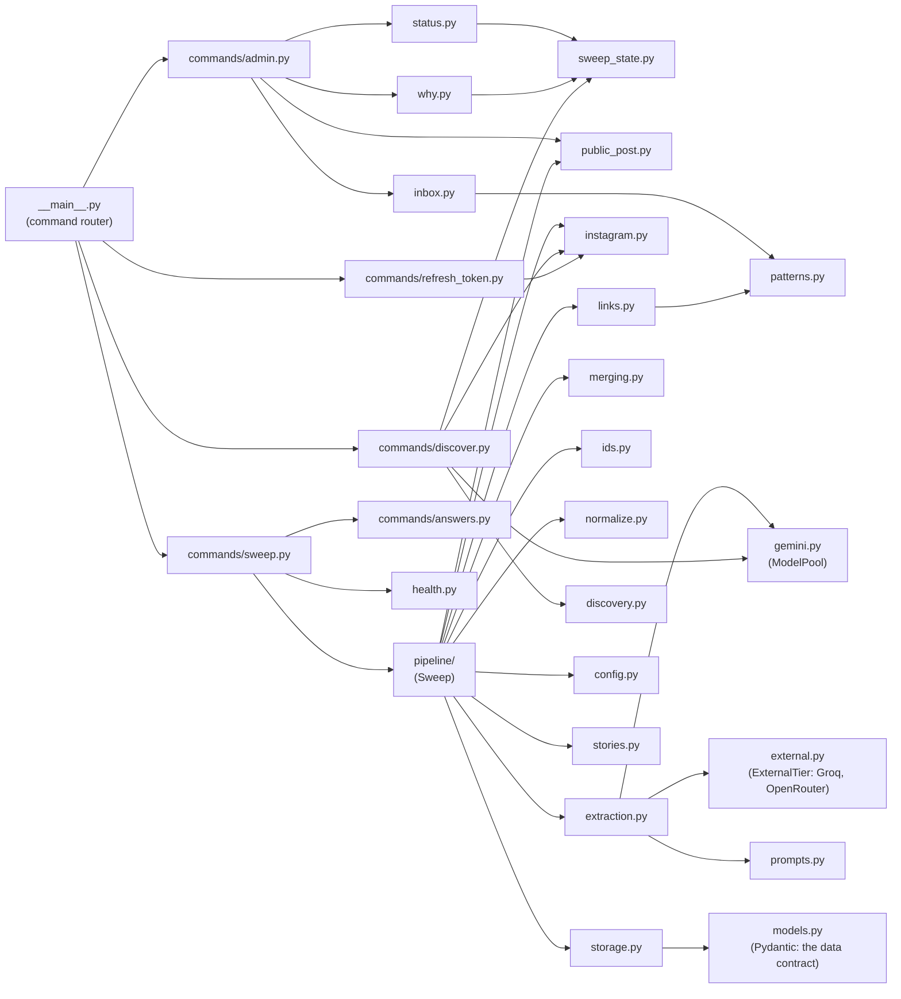

| Module | Responsibility |
|---|---|
| `config.py` | Paths, secrets from the environment, quotas, windows, retention, sweep times, Bogotá's time zone |
| `models.py` | Pydantic models: what Gemini returns (`Triage`, `PostAnalysis`, `ExtractedEvent`, `StoryAnalysis`, `AccountClassification`) and what is stored (`StoredEvent`, `EventMedia`, `Session`, `ProcessedPost`, `AccountState`), with a workshop series' rules (`series_problems`). The source of truth for the data contract |
| `instagram.py` | Graph API client: token check, posts, profiles, images, error classification, app usage |
| `public_post.py` | One post from its public embed page, for the admin tools when the API can't give it (section 3.7) |
| `gemini.py` | `ModelPool`: model order, pacing, daily budgets shared across runs, retries, error classes |
| `prompts.py` | The triage and extraction prompts, and the story prompt |
| `stories.py` | Stories from screenshots: their id and perceptual hash, when a screenshot was taken, dates (and a workshop series' sessions) worked out from what's printed, the flyer's crop, the account's name |
| `account_options.py` | What an `accounts.txt` line says besides the name: `bar` (only special nights) and `solo:<styles>` (the caption filter's words, `FOCUS_KEYWORDS`, from `normalize.TEXT_STYLE_WORDS` plus looser ones), parsed strictly (a typo fails) |
| `extraction.py` | `EventExtractor`: triage, then extraction, with the provisional fallback and the last resort (extraction only), and no request after the run's time budget |
| `external.py` | `ExternalTier`: the last resort on OpenAI-compatible chat APIs (Groq, OpenRouter): order, budgets, Groq's token pacing, per-run quarantine, JSON checked against the schemas |
| `bakeoff.py` | `admin bakeoff`: picks posts Flash read, runs other models on them, scores them field by field; the test set (`gold/`, `--gold`, `--ocr`); OpenRouter's free vision models |
| `ocr.py` | A flyer's text by OCR (RapidOCR, on the CPU), in rows as printed; optional (`rapidocr` isn't in `requirements.txt` yet): the input of the checks, and of `bakeoff --ocr` |
| `checks.py` | Rules (no AI) that flag a reading for a second look, worked out from the post's day: a coming date and no event, a time not read, a range or a list of dates not covered, three or more start times for one event (not a social's opening classes), a weekday's day ("sábado 10", "SÁB 10 OCT") or a relative day ("este sábado", "hoy jueves") with no event, an event before the post. It reads the Spanish flyers use (the audit of 7 Oct 2026): hours in words ("8 de la noche"), "1ro de noviembre", dates with their year, ranges and lists in their other spellings; not "MAR 13" as March, a "fiesta de cierre" as a deadline, nor "antes de las 10 pm" as a start. Measured on the test set (0 false flags) and on the site's posts; not yet called by the sweep |
| `normalize.py` | Cleans Gemini's output into the formats the site relies on; a workshop series' days and times follow its sessions; prices in another currency never shown as free |
| `merging.py` | Matches an extracted event to a stored one and merges posts into one event |
| `ids.py` | Readable, stable event ids (the event's URL) |
| `pipeline/` | `Sweep`, one class built from a module per part (the package re-exports the public names): |
| `pipeline/common.py` | Run statistics (`RunStats`), the clients' protocols, `AddPostError`, retryable errors, flyers and media records |
| `pipeline/base.py` | `SweepBase`: the state (events, analyzed posts, hidden events, accounts), storing one analyzed post (only upcoming events in Bogotá; a cancelled post's events taken down), one identity per post |
| `pipeline/sweep.py` | `Sweep`: accounts whose turn it is, their posts, retention; `hours_overdue` |
| `pipeline/manual_post.py`, `story_admin.py`, `hiding.py` | The admin tools, mixed into `Sweep`: add a post (`add_post`), add a story (`add_story`), hide a story or an event (`hide_story`, `hide_event`) |
| `clips.py` | Videos' preview clips: download, cut 6 silent seconds with ffmpeg |
| `storage.py` | Reading and writing every JSON file (atomically, LF line endings), flyers, the archive of past events, `accounts.txt` |
| `media_store.py` | The images' repository (`pa-bailar/media`): `pull` into the site's data before a run, `push` what changed after it |
| `health.py` | Run history, health rules, events to review, the report and its fingerprint |
| `status.py` | What `admin status` shows: sweeps, Gemini usage, Instagram, accounts, events, new workshop series (data and Spanish text) |
| `sweep_state.py` | The sweeps' latest state on your computer: reads the `sweep-state` branch with git |
| `why.py` | `admin why`: why a post's event is or isn't on the site (fixed checks, Spanish answer) |
| `inbox.py` | The admin inbox: what an issue or comment asks for |
| `links.py` | Instagram post links (code, account), profile links, and links to the site's events |
| `patterns.py` | The shapes the admin tools accept (an @account, a post link, a story's, an event's and an upload's id), mirrored by `admin-web/public/patterns.js` and checked against the same examples (`tests/fixtures/patterns.json`) |
| `discovery.py` | Parsing the Instagram export, dance hints, the classification prompt, the report, quiet windows around sweeps |
| `text.py`, `logs.py` | Accent-insensitive comparison, dates and times for the admin answers ("13–15 nov 2026", "sábado 10 oct 2026", "4 sesiones: 8, 22, 29 nov y 6 dic", "9:00 p. m."), reading "HH:MM", Spanish weekdays, logging setup |
| `commands/*.py` | The commands (sweep, discover, refresh-token, admin): arguments, wiring, exit codes, GitHub outputs |
| `commands/answers.py` | The admin tools' answers to `sweep --post`, `--story`, `--hide-story` and `--hide-event`, in Spanish |
