# Pa' Bailar: architecture and infrastructure (backend)

How the whole system works, from an academy posting a flyer on Instagram to that event showing up on
<https://pa-bailar.github.io>. This document covers the **backend** (this private repository,
`pa-bailar/backend`) in depth, and every service around it. The site's side is in the site
repository's `docs/ARCHITECTURE.md` (`pa-bailar/pa-bailar.github.io`).

Last reviewed: 2 October 2026.

Contents:

1. [The system in one picture](#1-the-system-in-one-picture)
2. [Repositories and what each one owns](#2-repositories-and-what-each-one-owns)
3. [External services](#3-external-services)
4. [Secrets and settings](#4-secrets-and-settings)
5. [The daily sweep, end to end](#5-the-daily-sweep-end-to-end)
6. [Inside the sweep: the pipeline](#6-inside-the-sweep-the-pipeline)
7. [Gemini: models, prompts and quotas](#7-gemini-models-prompts-and-quotas)
8. [Instagram: what is read and how](#8-instagram-what-is-read-and-how)
9. [One event, many posts: identity and merging](#9-one-event-many-posts-identity-and-merging)
10. [State and outputs](#10-state-and-outputs)
11. [Monitoring and health](#11-monitoring-and-health)
12. [The other commands: discover, refresh-token and admin](#12-the-other-commands-discover-refresh-token-and-admin)
13. [CI, dependencies and security](#13-ci-dependencies-and-security)
14. [Quotas and capacity](#14-quotas-and-capacity)
15. [Failure modes and runbook](#15-failure-modes-and-runbook)
16. [Code map](#16-code-map)

---

## 1. The system in one picture

Pa' Bailar has no server. Everything runs on free services:

- the sweep runs on **GitHub Actions**;
- the site is static files on **GitHub Pages**;
- the reading of posts is done by **Gemini** on Google AI Studio's free tier.

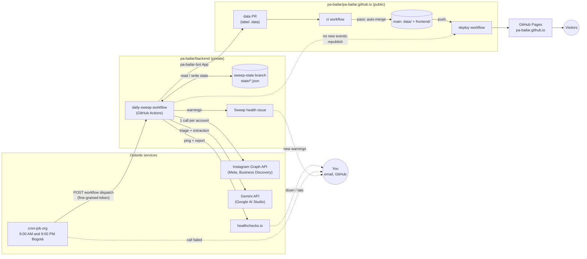

In words:

1. **cron-job.org** calls GitHub's API twice a day to start the `daily-sweep` workflow. This is the same
   as pressing *Run workflow*.
2. **The sweep** reads the recent posts of every followed academy from **Instagram**. It asks **Gemini**
   which posts announce one-time events, and to extract their details. It saves the events, plus a copy of
   each flyer, into a checkout of the site repository.
3. **When events changed**, the sweep opens a **data pull request** in the site repository as the
   **pa-bailar-bot** GitHub App. The site's `ci` checks the data and the build. The PR then merges itself,
   and the merge triggers the **deploy** to GitHub Pages.
4. **Every run** reports to **healthchecks.io**, and is checked by rules against the previous runs
   (section 11).
5. **State** stays in this repository's `sweep-state` branch: which posts were already analyzed, how far
   each new account's first sweep got, and today's Gemini usage.

---

## 2. Repositories and what each one owns

| Repository | Visibility | Owns | Does not own |
|---|---|---|---|
| `pa-bailar/backend` (this one) | Private | The collector: the `pa_bailar` Python package, `accounts.txt`, the prompts, the sweep workflow, the sweep state (`sweep-state` branch), the health checks, local tools (`discover`, `refresh-token`), the admin page (`admin-web/`, docs/ADMIN.md) | The data files and the site: it only writes them into a checkout of the site repository and proposes them through a PR |
| `pa-bailar/pa-bailar.github.io` | Public | The site (`frontend/`, Astro), the published data (`data/events.json`, `data/meta.json`, `data/flyers/`, `data/previews/`), the data contract (`docs/DATA.md`), its CI and the GitHub Pages deploy | Collecting data. It never calls Instagram or Gemini |

**Why two repositories:**
- **The collector's code stays private:** the prompts, which accounts are followed, and the tooling.
- **The site repository has to be public:** GitHub Pages is free for public repositories, and so are
  unlimited Actions minutes.

The site repository's name (`<org>.github.io`) makes the site live at the organization's root,
`https://pa-bailar.github.io`.

The only link between the two repositories:
- **Backend to site:** the backend checks the site out (anonymously, it's public), writes `data/`, and
  pushes a branch plus opens a PR with the pa-bailar-bot App's token. On days without changes, the same
  token starts the site's deploy.
- **Site to backend:** none. The site knows nothing about the backend except the data contract
  (`docs/DATA.md` in the site repository).

---

## 3. External services

Every service the system depends on. All of them are on free plans.

### 3.1 Meta: Instagram Graph API (Business Discovery)

| | |
|---|---|
| **What for** | Reading the public posts of the academies (photos, carousels, videos, captions, dates, links), and the profiles of accounts during discovery |
| **Endpoint** | `GET https://graph.facebook.com/v26.0/{IG_USER_ID}?fields=business_discovery.username(<account>){media.limit(N){…}}` (`config.GRAPH_API_URL`) |
| **What it needs** | A **Meta app** (Meta for Developers, with the Instagram Graph API product). A **Facebook Page** linked to **our own Instagram professional account**, whose id is `IG_USER_ID`. An access token for that Page (`META_ACCESS_TOKEN`) |
| **Token** | A **Page access token that doesn't expire**. It's made from a short-lived Graph API Explorer token by `python -m pa_bailar refresh-token` (section 12.2). It stops working only if it's revoked (for example, a Facebook password change) |
| **What it can see** | Only **business and creator** accounts. Personal or private accounts answer with error 100/110 ("not visible") |
| **Limits** | A quota for our app, counted by Meta over a rolling window. Every answer reports the share used, now in the `X-Business-Use-Case-Usage` header (`call_count`, `total_cputime`, `total_time`, in percent; older apps got `X-App-Usage`). `InstagramClient.app_usage_percent` reads both and keeps the highest. The sweep stops reading accounts at 90% (`INSTAGRAM_USAGE_STOP`) instead of running into the limit; when the quota is spent anyway, the answer is error 4, 17, 32, 613 or 80001–80009 (`is_rate_limited`). Accounts not reached stay due and go first next run (section 5) |
| **Cost per sweep** | **1 call per account read**, no matter how many posts are asked for (10 regular, 30 for a new account). Each account is read about once a day, so a sweep reads about half of them (section 5). Images are then downloaded from Instagram's CDN, which isn't an API call |
| **Cost** | Free |
| **If it fails** | Token invalid: the run stops at the start and fails, and healthchecks.io emails you. Rate limit: the run stops calling Instagram, and the remaining accounts wait for the next run (a notice, and a warning after 3 runs in a row). One account fails: logged, and the others continue |

### 3.2 Google AI Studio: Gemini API

| | |
|---|---|
| **What for** | Deciding whether a post announces an event (triage), extracting the event's details as JSON (extraction), and classifying accounts during discovery |
| **SDK** | `google-genai` (`pa_bailar/gemini.py`), using structured output: `response_mime_type="application/json"` plus a Pydantic `response_schema` |
| **Key** | `GEMINI_API_KEY`, an API key from Google AI Studio (aistudio.google.com) |
| **Models and roles** | `gemini-3.5-flash-lite` does triage, provisional extraction and discovery. `gemini-3.8-flash`, then `gemini-3.5-flash`, do extraction (`config.TRIAGE_MODELS`, `EXTRACTION_MODELS`, `PROVISIONAL_MODELS`) |
| **Free quotas** | Flash-Lite: 15 requests/minute and 500/day. Each Flash model: 5/minute and 20/day (`config.MODEL_LIMITS`, read from AI Studio on 2026-10-02). Each model has its own quota. Days reset at **midnight Pacific time** |
| **Cost** | Free (the free tier may use prompts to improve Google's products; posts are public anyway) |
| **If it fails** | The model is out of quota: the next model is used, and if all are out, the post stays pending. A server error: retried. The request itself is rejected: the post is recorded as rejected and never retried (section 7) |

### 3.3 GitHub

| Piece | What for |
|---|---|
| **Repositories** | Section 2 |
| **GitHub Actions** | Runs the sweep (`daily-sweep.yml`) and the backend's checks (`ci.yml`) on `ubuntu-latest` runners. The private repository gets **2,000 free minutes a month**, and the public site repository unlimited |
| **Actions secrets and variables** | Hold the keys (section 4) |
| **`sweep-state` branch** | The sweep's memory between runs (section 10.1). An orphan branch that only holds JSON files |
| **pa-bailar-bot (GitHub App)** | App id `5164772`, installed on the `pa-bailar` organization for the site repository. The sweep uses it to push the data branch, open the data PR, enable auto-merge and start the site's deploy. A short-lived token is minted per run with `actions/create-github-app-token`. Using an App, rather than the workflow's own token, means its PR runs the site's `ci` like anyone's |
| **Issues** | The `Sweep health` issue (label `sweep-health`), opened and updated by the sweep (section 11) |
| **Dependabot** | Weekly update PRs for the Python dependencies and the GitHub Actions used (`.github/dependabot.yml`) |
| **GitHub Pages** | Hosts the site, deployed by the site repository's `deploy` workflow |
| **Rulesets** | The site repository's `main` is protected (`protect-main`): changes only through squash-merged PRs that pass `ci`; force pushes and deletion blocked; no bypass. **The backend's `main` is not protected:** rulesets on private repositories need a paid plan (GitHub Pro or Team). Changes still go through PRs by convention, and `ci` runs on every PR and on `main`, but nothing enforces it |

### 3.4 cron-job.org

| | |
|---|---|
| **What for** | Starting the sweep at fixed times: **9:00 AM and 9:00 PM, Bogotá time**, 12 hours apart |
| **Why not GitHub's own `schedule`** | It never fired in this repository. That's a known, undocumented problem of new private repositories, with no fix from GitHub, and community reports describe runs delayed by hours or dropped. The workflow has **no `schedule:` trigger** on purpose: if GitHub's scheduler started working, every run would happen twice |
| **The two jobs** | `pa-bailar sweep 9:00` and `pa-bailar sweep 21:00`, time zone America/Bogota |
| **The request** | `POST https://api.github.com/repos/pa-bailar/backend/actions/workflows/daily-sweep.yml/dispatches`, with body `{"ref":"main"}` and headers `Accept: application/vnd.github+json`, `X-GitHub-Api-Version: 2022-11-28`, `Content-Type: application/json` and `Authorization: Bearer <token>`. GitHub answers `204 No Content` |
| **Token** | A **fine-grained personal access token**, owned by the `pa-bailar` organization, limited to this repository and to **Actions: read and write**. It can start and cancel runs; it can't read the code or the secrets. Stored only in cron-job.org |
| **Cost** | Free |
| **If it fails** | cron-job.org emails when a call fails (for example `401` once the token expires), and disables a job after repeated failures (that email is also on). healthchecks.io emails when no run arrives |

### 3.5 healthchecks.io

| | |
|---|---|
| **What for** | A dead man's switch: it emails when a sweep **fails**, or when **no sweep arrives** in time, which is the case GitHub itself never reports |
| **How** | The workflow's last step always runs. It pings `HEALTHCHECK_URL` on success, or `HEALTHCHECK_URL/fail` on failure, with the run's health report as the body, so the report shows in the check's event log |
| **Schedule** | **Period 12 hours, grace 2 hours:** the runs are 12 hours apart, so a single missed run is noticed within about 14 hours |
| **Cost** | Free |

### 3.6 Cloudflare Workers

| | |
|---|---|
| **What for** | Hosting the admin page (Worker `pa-bailar-admin`, at `https://pa-bailar-admin.jzamorac-9.workers.dev`) and its server side: the sign-in with GitHub (the `pa-bailar-admin` GitHub App) and reading the status. GitHub Pages can't: it's not free for a private repository and has no server side |
| **How** | Cloudflare's build (Workers Builds) deploys `admin-web/` (`wrangler.jsonc`) from this repository on every push to `main`, no preview builds. Its GitHub connection is limited to this repository |
| **Status** | Sign-in with GitHub, the status dashboard and the admin tools. Installable on Android, where it receives posts shared from Instagram. Described in [`docs/ADMIN.md`](ADMIN.md) |
| **Cost** | Free |

### 3.7 Instagram's public post pages (fallback)

| | |
|---|---|
| **What for** | Reading one post the Graph API can't give, for the admin tools only: a personal or private account's post, a collaboration listed under its author, or any post once Meta's quota is spent. Never in the sweeps |
| **Endpoint** | `https://www.instagram.com/p/<code>/embed/captioned/` (`public_post.EMBED_URL`): the page websites embed to show a post. No login, no token |
| **How** | `public_post.fetch_public_post` asks for it as a browser would (`curl_cffi`, `impersonate="chrome"`): plain scripts get an empty page. It reads the post's data from the page (`contextJSON`), or else from its HTML (author, caption, image) |
| **Limits** | Unofficial: Instagram can change the page or block it at any time. One request per use, so it stays well under any limit. It can't list an account's posts (that needs a login), so it can't sweep personal accounts |
| **Cost** | Free |

### 3.8 Services used by the site only

- **GoatCounter:** visit statistics without cookies.
- **Google Fonts:** the site's typefaces.
- **GitHub Pages:** hosting.

They're described in the site repository's `docs/ARCHITECTURE.md`. The backend doesn't use them.

### 3.9 Your computer

- **The discovery tool runs locally.** `python -m pa_bailar discover` reads your Instagram data export
  from `private/`, which is never committed (section 12.1).
- **`refresh-token` runs locally.** It needs the Meta app's id and secret, which exist only in the local
  `.env`.
- **The local `.env`** holds the same keys as the GitHub secrets, plus `META_APP_ID` and
  `META_APP_SECRET`.
- **The App's private key** (`private/*.pem`) stays on your computer. Its contents are the
  `APP_PRIVATE_KEY` secret.

---

## 4. Secrets and settings

| Name | Kind | Where | Used by | Notes |
|---|---|---|---|---|
| `GEMINI_API_KEY` | Secret | GitHub Actions secret, local `.env` | Sweep step, `discover` | Google AI Studio API key |
| `META_ACCESS_TOKEN` | Secret | GitHub Actions secret, local `.env` | Sweep step, `discover`, `refresh-token` | Non-expiring Page token (section 3.1) |
| `IG_USER_ID` | Secret | GitHub Actions secret, local `.env` | Sweep step, `discover`, `refresh-token` | Id of our Instagram professional account |
| `META_APP_ID`, `META_APP_SECRET` | Secret | Local `.env` only | `refresh-token` | Never on GitHub: only the token command needs them |
| `APP_PRIVATE_KEY` | Secret | GitHub Actions secret (the `.pem` file stays in `private/`) | "Get a token" step | pa-bailar-bot's private key, used to mint a short-lived installation token |
| `APP_ID` | Variable | GitHub Actions variable | "Get a token" step | `5164772` |
| `GEMINI_LITE_ONLY` | Variable | GitHub Actions variable (optional) | Sweep step | `1`: Flash-Lite also extracts, as final results (`config.LITE_ONLY`). For when Flash isn't available to the key; unset otherwise |
| `HEALTHCHECK_URL` | Secret | GitHub Actions secret | "Report to the health check" step | The check's ping URL. Optional: without it the step does nothing |
| `GITHUB_TOKEN` | Automatic | Created by GitHub per run | Save the state, health issue | Permissions `contents: write` and `issues: write` (workflow level). Only handed to the steps that need it |
| cron-job.org token | Secret | cron-job.org only | The two cron jobs | Fine-grained PAT, Actions read/write on this repository only |

Settings that aren't secrets live in code, mostly in `pa_bailar/config.py`. That includes the models and
quotas, the lookback windows, the retention, the sweep times and the time budget. The followed accounts
are in `accounts.txt`.

---

## 5. The daily sweep, end to end

### 5.1 Sequence

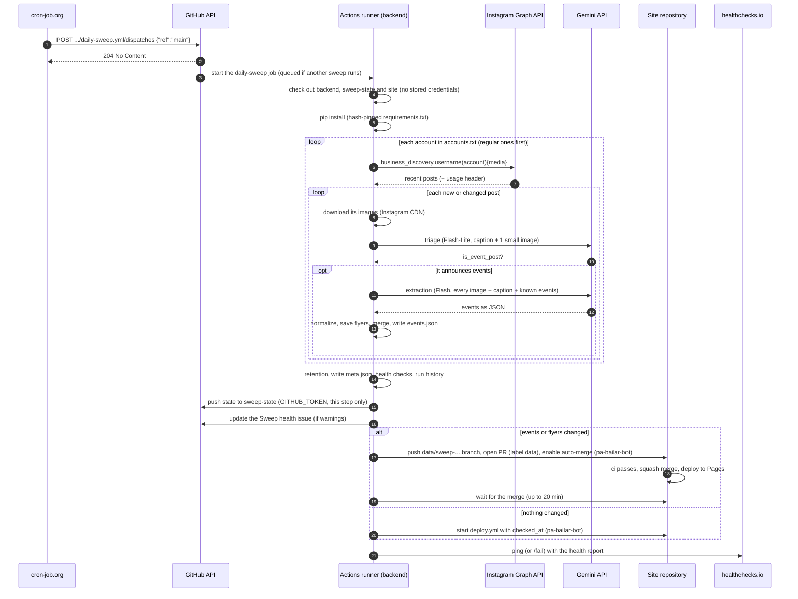

### 5.2 The workflow's steps

`.github/workflows/daily-sweep.yml`, two jobs on `ubuntu-latest`:
- **`request`** checks an add-post request before anything else runs (only with `post_url` or `issue`):
  `issue` must be a number, and that issue an open `admin` issue by `jzamora5`. Otherwise the run fails
  and the sweep job doesn't start: whoever can start the workflow (the cron-job.org token) can't publish a
  post with it. The inputs only reach shell commands through environment variables.
- **`sweep`** (after `request`), the steps below. Job limit: 60 minutes.

| # | Step | Runs when | What it does | Credentials |
|---|---|---|---|---|
| 1 | Check out this repository | Always | The code | None kept (`persist-credentials: false`) |
| 2 | Read the sweep state | Always | Checks out the `sweep-state` branch into `sweep-state/` | None kept |
| 3 | Copy the state | Always | `sweep-state/*.json` → `state/` | |
| 4 | Check out the site repository | Always | Into `site/`. `DATA_DIR` points to `site/data` | None (public repository) |
| 5 | Set up Python | Always | Python from `.python-version` (3.12), pip cache | |
| 6 | Install | Always | `pip install -r requirements.txt`, every package pinned and hash-checked | |
| 6b | Make sure ffmpeg is installed | Always | For videos' preview clips (`clips.py`); usually already on the runner | |
| 6c | Make sure the last data PR merged | Always | Fails if a `data` PR is still open in the site repository: the sweep reads the events from the site's `main`, so sweeping past an unmerged PR would lose its events for good (their posts are already marked analyzed). Merge or fix it first | `GITHUB_TOKEN` (reads the public site repository) |
| 7 | **Run the sweep** | Always | With `post_url` (admin tools): `python -m pa_bailar sweep --post <link> [--account x]`, one post by hand. Otherwise `python -m pa_bailar sweep --days N` (N from the `days` input, 7 by default, at most 30). Step limit: 35 minutes; the code stops starting Gemini work at 30 | `GEMINI_API_KEY`, `META_ACCESS_TOKEN`, `IG_USER_ID` (this step only) |
| 8 | Write the status for the admin page | Unless cancelled; its failure doesn't fail the run | `python -m pa_bailar admin status --json` → `state/status.json`, saved with the state (one Graph API call, no Gemini). The admin page reads it | `META_ACCESS_TOKEN`, `IG_USER_ID` (this step only) |
| 9 | Save the sweep state | Unless cancelled | Copies `state/*.json` back and commits. Then `gh auth setup-git` and push to `sweep-state`. Runs even when the sweep failed partway: its progress is real | `GITHUB_TOKEN` (this step only) |
| 9b | Save an account added by hand | `post_url`, and `accounts.txt` changed | Commits `accounts.txt` to `main` | `GITHUB_TOKEN` (this step only) |
| 10 | Update the sweep health issue | Unless cancelled, and the sweep produced its health output | Opens, updates, comments on or closes the `Sweep health` issue (section 11.3) | `GITHUB_TOKEN` (issues) |
| 11 | Get a token for the site repository | Unless cancelled | Mints a pa-bailar-bot installation token for the site repository only | `APP_ID`, `APP_PRIVATE_KEY` |
| 12 | Open a data PR | Unless cancelled | Only if `data/events.json` or `data/flyers` changed (clips change `events.json` too) (`meta.json` alone doesn't count). Branch `data/sweep-<day>-<run id>`, commit as the bot, PR labelled `data`, auto-merge (squash) enabled | App token |
| 13 | Wait for the data PR to merge | A PR was opened | Polls every 30 s, up to 20 minutes. Fails if the PR is closed or doesn't merge in time | App token |
| 14 | Republish the site | Success, no PR, not `post_url` | `gh workflow run deploy.yml -f checked_at=<now in Bogotá>`, so "Actualizado el" stays current on days without new events | App token |
| 15 | Report to the health check | Always, except `post_url` runs | Pings `HEALTHCHECK_URL` (success) or `HEALTHCHECK_URL/fail`, with the report as the body | `HEALTHCHECK_URL` |
| 16 | Answer on the admin issue | `issue` given (admin tools) | Comments the result of adding the post (`ADMIN_REPORT_FILE`) and the data PR, then closes the issue | `GITHUB_TOKEN` |

Other workflow settings:
- **`concurrency: data`** (`cancel-in-progress: false`): two sweeps never run at the same time. A new one
  waits, and if several are started meanwhile, only the newest waits (the others show as "cancelled").
- **`workflow_dispatch` only:** there's no schedule (section 3.4), and no push trigger.
- **Single-post mode** (`post_url`, started by the `admin` workflow): `sweep --post` adds one post by hand,
  then the same state save and data PR. It isn't recorded in the run history, opens no health issue and
  doesn't ping healthchecks.io. GitHub keeps only one waiting run per concurrency group (a newer one cancels
  it), so the `admin` workflow waits until no sweep is running or waiting before starting one.

### Whose turn it is: each account about once a day

Instagram's quota for us is small (it grows with our own account's impressions), so each account is read
about **once a day**, half of them in each sweep, instead of every account twice a day
(`Sweep._due_accounts`, `pipeline.hours_overdue`):

- **Each account's turn:** 20 hours after a sweep last read it (`SWEEP_EVERY_HOURS`: the same sweep the next
  day finds it due). Quiet accounts, with no post in 45 days (`QUIET_AFTER_DAYS`), every 44 hours: lower
  priority, never dropped. `accounts.json` keeps `last_swept_at` and `latest_post`.
- **Order:** due accounts in their regular sweep before new ones (a new account's first, deeper sweep can
  take days of quota); within each, those that waited longest first.
- **A sweep's share:** half the accounts plus 5 (`EXTRA_ACCOUNTS_PER_RUN`), and it stops earlier at 90% of
  Instagram's quota. Accounts not reached stay due, and having waited longest, they're first next time: a
  short quota shortage delays a few accounts by one sweep, it can't snowball.
- **Not over its turn:** an account whose posts still wait (Gemini's quota, time) stays due next sweep. An
  account that couldn't be read for another reason (not visible) waits for its next turn.
- **Watching it:** each run records the share of Instagram's quota used (`instagram_usage`), and the dashboard
  lists accounts waiting more than a sweep past their turn.
- **Everyone now:** `sweep --all` (the workflow's `all_accounts` input).

### 5.3 What a run decides is a failure

A run **fails** (red, healthchecks.io `/fail`, email) only when something is actually broken:

- **The Instagram token is invalid:** the run stops before reading anything.
- **Every account failed for a reason other than Instagram's rate limit** (`commands/sweep.is_broken`).
- **A workflow step failed:** for example the state push, or a data PR that didn't merge in 20 minutes.

Everything else is retried on its own and reported, but doesn't fail the run:
- a post that failed;
- Instagram's rate limit;
- Gemini's quota running out;
- the 30-minute budget running out.

Section 11 covers how those are reported.

---

## 6. Inside the sweep: the pipeline

`pa_bailar/pipeline.py`, class `Sweep`.

### 6.1 Accounts

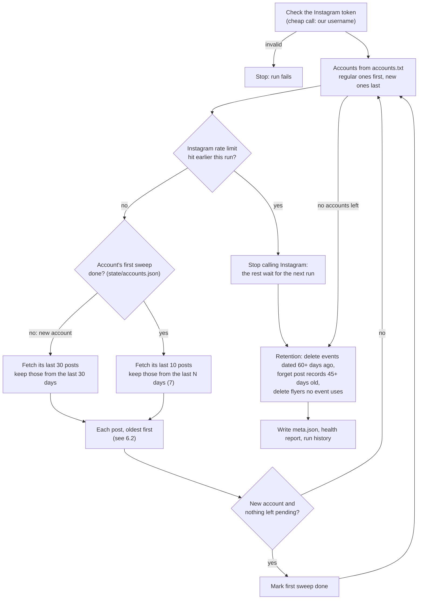

- **New accounts go last:** loading a new account's older posts can take several days of Gemini quota,
  and must never use up the quota for today's posts of the accounts already followed
  (`Sweep._due_accounts`).
- **A new account's first sweep** reads up to 30 posts from the last 30 days. It's "done" once all of them
  have been analyzed; if the quota or the time runs out, it continues in the next run.
- **Saved after every post:** `events.json` and `processed_posts.json` are written after each post, so an
  interrupted run keeps everything it did.

### 6.2 Posts

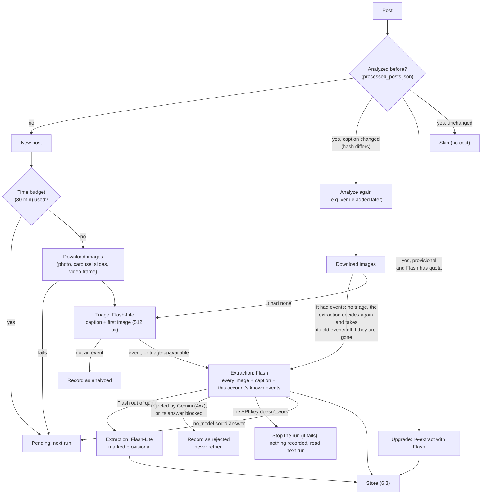

Triage exists to save the scarce Flash quota (20 a day per model). Most posts aren't events, and a
512-pixel image plus the caption are enough to tell. When unsure, the triage prompt answers "yes": a
false "no" loses the event for good, while a false "yes" only costs one Flash call.

### 6.3 Storing what Gemini found

1. **Normalize** (`normalize.py`):
   - styles mapped to the fixed list, so "mambo" and "on2" become "salsa en línea";
   - times checked;
   - prices and text cleaned.

   The site relies on these formats.
2. **Keep only publishable events:** one-time (`is_recurring` false) and with a valid date. The rest
   count as "discarded".
3. **Save flyers** (`storage.save_flyer`): the image Gemini says shows each event (`image_index`),
   shrunk to at most 1080×1350 and saved as WebP (quality 80) in `data/flyers/<post id>-<slide>.webp`.
   When that slide is a video (a reel, or a carousel's video slide), `clips.make_clip` cuts its first 6
   seconds with ffmpeg (no sound, 480 px wide, H.264, about 100–400 KB) into
   `data/previews/<post id>-<slide>.mp4`, recorded as the media's `preview`: the site plays it, silent and
   looping. Carousels record their slide count (`slides`). Some videos come without a file from Instagram
   (likely licensed music): they get no clip. Posts stored before clips existed get theirs when a sweep
   fetches them again (`Sweep._complete_media`), since Instagram's video links expire.
   Instagram's image links expire, so the site uses these copies. An image that shows several events
   (a monthly schedule) is saved once and shared.
4. **Detach the post from earlier results:** if the post was analyzed before (edited caption, upgrade),
   what it contributed is removed first. Events only it announced give their ids back, so their URLs
   don't change.
5. **Merge or add** each event (section 9).

---

## 7. Gemini: models, prompts and quotas

### 7.1 Two steps, three roles

| Step | Model(s) | Input | Output (schema) | Thinking |
|---|---|---|---|---|
| Triage | `gemini-3.5-flash-lite` | Caption, account, publication date, today's date, first image as a 512 px JPEG | `Triage`: `is_event_post`, `reason` | Low |
| Extraction | `gemini-3.8-flash`, then `gemini-3.5-flash` | Every image (numbered), caption, dates, and this account's **known events** (id, date, time, title) | `PostAnalysis`: `is_event_post`, `reason`, `events[]` (each an `ExtractedEvent`, with `image_index` and `same_as`) | Model default |
| Provisional extraction | `gemini-3.5-flash-lite` | Same as extraction | Same, marked provisional: redone with Flash on a later run when there's quota | Model default |
| Discovery | `gemini-3.5-flash-lite` | An account's profile and recent captions | `AccountClassification`: kind, in Bogotá, city, styles, reason | Model default |

Notes on the prompts and parameters:
- **The prompts** are in `pa_bailar/prompts.py`, and the JSON schemas are the Pydantic models in
  `pa_bailar/models.py`. The field descriptions are part of what Gemini reads.
- **Temperature** stays at the default, as Google advises for Gemini 3 models.
- **The extraction prompt covers:**
  - what is and isn't an event, shared with triage (`_EVENT_DEFINITION`): one-time socials, workshops,
    concerts, festivals (a multi-day intensive is one event, dated on its first day)… but not regular
    classes, programs spread over several weeks, recaps, showcases or tutorials, nor anything that isn't
    about dancing (like a drawing workshop at a dance venue). It quotes the words academies use
    ("social", "taller", "todos los jueves", "así se vivió"…), which helps the lighter model most;
  - how to pick the event type (social, workshop, concert, congress, festival, competition, show, other: a
    multi-day dance congress is a `congress`, its workshops included) and the styles (from a fixed list);
  - how to resolve dates without a year;
  - how to rate confidence (high, medium or low);
  - when to set `same_as` (section 9).

### 7.2 `ModelPool`: staying inside the free quotas

`pa_bailar/gemini.py`. Every Gemini call goes through `ModelPool.generate(models, contents, schema)`.

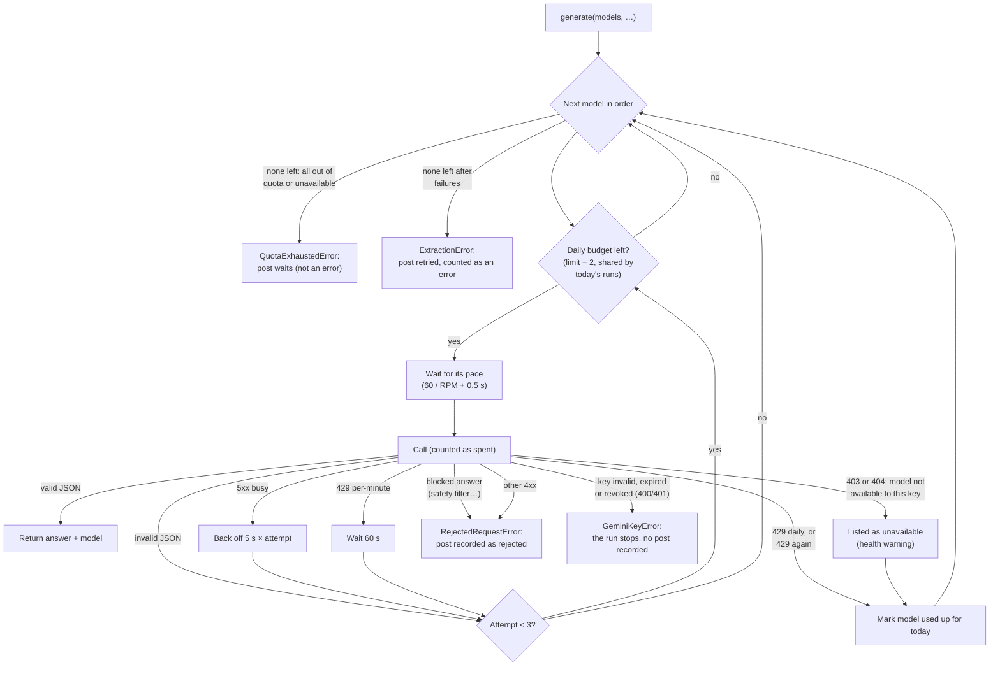

- **Budget:** each model's daily limit minus 2, kept free for manual runs and retries
  (`DAILY_BUDGET_MARGIN`).
- **Shared across the day's runs:** usage is saved in `state/gemini_usage.json` with its quota day,
  which is midnight to midnight Pacific time. So the 9:00 AM and 9:00 PM runs share one day's budget.
  `discover`, run on your computer, uses the same key but keeps its own count: it reads the sweeps' usage
  from the `sweep-state` branch and always leaves them `DISCOVERY_LEAVES_FOR_SWEEPS` (250) Flash-Lite
  requests (section 12.1).
- **Waiting isn't failing:** when every model asked for is out of today's quota (or not available to the
  key), the pool raises `QuotaExhaustedError` and the post simply waits for a later run. Only real failures
  (busy servers, bad answers) count as errors. Before downloading a new post's images, the sweep checks that
  some model still has quota (`EventExtractor.can_analyze`).
- **A key that doesn't work** (400 `API_KEY_INVALID`, "API key expired", 401) raises `GeminiKeyError`,
  which isn't an `ExtractionError`: the sweep stops and fails (the failed run emails), and no post is
  recorded as rejected, so all of them are read once the key is replaced (section 15).
- **A blocked answer** (a safety filter: `SAFETY`, `PROHIBITED_CONTENT`…) is rejected at once instead of
  being retried 3 times per model: it would be blocked every time.
- **A model the key can't use** (403 or 404, e.g. if Google took it out of the free tier) is skipped for the
  day like a spent one and listed in the run's `models_unavailable`. Repeated over 3 runs, it's a health
  warning (section 11.1).
- **Lite-only mode:** the repository variable `GEMINI_LITE_ONLY=1` makes Flash-Lite the extraction model, with
  final (not provisional) results (`config.LITE_ONLY`). It's the switch for a Flash cutoff.
- **Pace:** calls to the same model are spaced to its per-minute limit.
- **Timeout:** each request gives up after 120 seconds, so a stuck call can't hang the run.

---

## 8. Instagram: what is read and how

`pa_bailar/instagram.py`.

- **One call per account:** `fetch_recent_posts(account, limit)` asks Business Discovery for the latest
  `limit` posts with `id, caption, media_type, media_url, thumbnail_url, permalink, timestamp`, and for
  carousels each child's `media_type, media_url, thumbnail_url`.
- **Images:** a photo's `media_url`, the slides of a carousel (up to 10), or a video's `thumbnail_url`
  (its preview frame). They're downloaded straight from Instagram's CDN.
- **Errors:**
  - `InstagramError` carries Meta's code;
  - `is_not_visible`: 100 and 110, a personal, private or missing account;
  - `is_rate_limited`: 4, 17, 32, 613 and 80001–80009;
  - network failures and non-JSON answers become an `InstagramError` for that account only.
- **Quota awareness:** every answer updates `app_usage_percent` from Meta's usage headers (until 2026-10-03 only
  `X-App-Usage` was read, which Instagram no longer sends, so this never triggered). `discover` pauses at
  60%. The sweep stops reading accounts at 90% (`INSTAGRAM_USAGE_STOP`), or on the first rate-limit error,
  and the remaining accounts go first next run.
- **The token never shows in errors:** it travels in the URL, and connection errors quote the URL, so
  `instagram.redact` removes it before an error's text reaches logs, `status.json` or an admin answer.

---

## 9. One event, many posts: identity and merging

Academies announce the same event several times: the flyer, then a video, then a reminder. An organizer
and its venue, or two collaborators, may each post it too. Those posts must become **one event** that lists
all of them in `media`. `pa_bailar/merging.py`. None of this costs a Gemini request beyond the extraction.

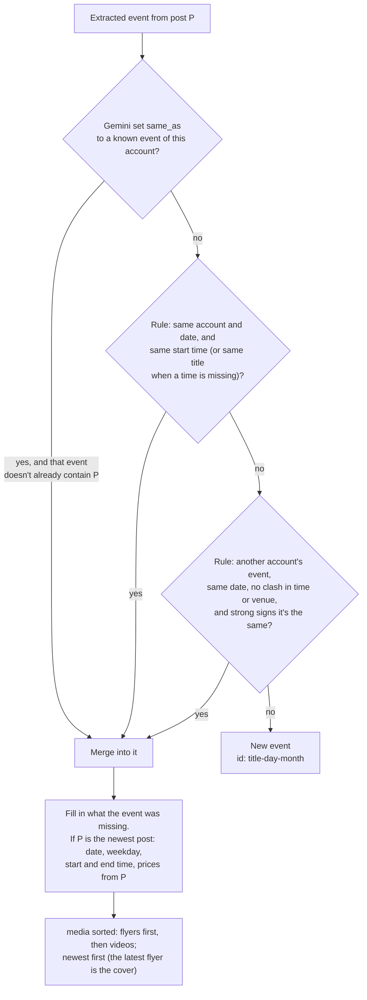

- **Gemini links first:** the extraction prompt lists the account's known upcoming events (id, date,
  time, title), and Gemini sets `same_as` when the post announces one of them again. The rule-based match
  is the fallback.
- **Another account's event** (`looks_like_shared_event`): Gemini only sees this account's events, so
  across accounts it's rules only. Same date; never with different start times or different venues (when
  both are known); and one of:
  - one event names the other's account (its organizer, venue or contact, or a title word: "Bachatamanía"
    for `@bachatamania_bogota`, "Distrito Social" for `@distritosocialbog`), plus the same start time or a
    title word in common;
  - the same venue and start time, plus a title word in common;
  - two or more distinctive title words in common ("Level Up … Fusion Congress").

  Words every dance title shares (social, clase, bachata, salsa…) and place names (Bogotá) don't count. The
  event stays under the account that posted it first, and gains the other post's flyer. Over the site's
  history this merges the one real duplicate (Sept 19, 2026) and nothing else.
- **Two events in the same post are never merged** with each other.
- **One post, one identity:** the API and the post's public page (section 3.7) know a post by different
  ids (`public-<id>` for the page). Posts are matched by their link's code, so the same post is never
  analyzed twice: a post added by hand from its public page is renamed to the API's id when a sweep first
  sees it (`Sweep._adopt_public_record`), and a post read again by hand keeps the id it has.
- **The cover is the latest flyer:** an event's posts are sorted flyers (photos and carousels)
  first, then videos, newest first within each (`ordered_media`). The first post is what the card,
  the link previews and the detail show first. A corrected or updated flyer replaces the first
  announcement as the cover. Every save applies this order to all events.
- **Logistics follow the newest post:** a later post may reschedule an event or change its prices, so
  `date`, `weekday`, `start_time`, `end_time` and `prices` come from the newest post. Everything else
  keeps its first value (the flyer's title beats a reminder's caption) and is only filled in when it was
  missing (for example, a venue "to be confirmed" on the flyer and given later).
- **Ids are URLs** (`ids.py`): `<title>-<day>-<month>`, for example `social-de-halloween-24-oct`, with
  `-2`, `-3`… when taken.
  - An id is set once and never recomputed. A re-extraction that rewords the title keeps the old id,
    because the post "gives back" its ids before being stored again.
  - So a link shared on WhatsApp keeps working.

---

## 10. State and outputs

### 10.1 State (`sweep-state` branch)

The `sweep-state` branch is an orphan branch that only holds JSON files. It's this repository's own
memory between runs; the site never sees it.

| File | Content | Why it matters |
|---|---|---|
| `processed_posts.json` | Every analyzed post: account, link, when, event or not, reason, model, `provisional`, caption hash, and its `outcome` (`event`, `merged`, `discarded` with a `detail` such as `recurrente` or `sin fecha`, `not_event`, `rejected`) with the `event_ids` it became or joined | Posts are never sent to Gemini twice. Edited captions and provisional posts are spotted here. Records older than 45 days are forgotten, which is safe: older posts are never fetched again |
| `accounts.json` | Per account: when first seen, `backfill_done`, `last_swept_at`, `latest_post` | Whether the account still gets the deeper first sweep, and when its next turn is |
| `gemini_usage.json` | Today's quota day (Pacific) and requests per model | The day's runs share the daily budgets |
| `status.json` | What `admin status --json` reports after the run (section 12.3) | The admin page shows it, read through GitHub with the signed-in visitor's access |
| `run_history.json` | The last 120 runs in short (about two months): accounts read, failed or skipped; posts, events, pending; errors; rate limit, time budget; Gemini requests and models the key couldn't use; warning keys | The health rules compare a run with the previous ones (section 11) |

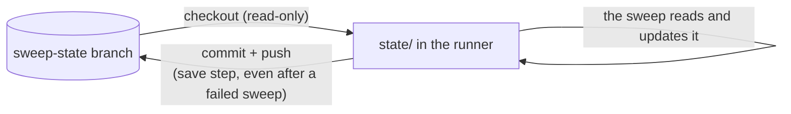

Locally, the same files live in `state/` (git-ignored), so local runs keep their own state. Tools that
need the sweeps' state on your computer (`admin status`, `discover`'s Gemini allowance) read the branch
itself: `pa_bailar/sweep_state.py` fetches it and reads each file with `git show`.

### 10.2 Outputs (the site repository's `data/`)

| File | Content |
|---|---|
| `data/events.json` | Every stored event, sorted by date and time. The format is the data contract (`docs/DATA.md` in the site repository); `pa_bailar/models.py` (`StoredEvent`) is its source of truth |
| `data/meta.json` | `schema_version`, `generated_at` (Bogotá time), `accounts` (every account swept, the site's list of sources) and the stats of the run that wrote it. Rewritten every run, but only committed together with a real change to events or flyers |
| `data/flyers/*.webp` | The flyer copies. Unused ones are deleted at the end of every run |
| `data/previews/*.mp4` | Videos' preview clips (6 s, silent). Deleted with their events, like flyers |

**Retention:** events dated more than 60 days ago are deleted, together with their flyers, so `data/`
doesn't grow forever. Git history keeps them.

---

## 11. Monitoring and health

Five layers, each catching what the others can't:

### 11.1 Health rules (`pa_bailar/health.py`)

They run after every sweep. No AI, no quota.

| Finding | Level | Rule |
|---|---|---|
| `@account` couldn't be read | Notice, then **warning** after 3 failed tries in a row | Renamed, private or no longer a business account? Each account is read about once a day, so runs that didn't try it (`RunRecord.read_accounts`) don't break the streak |
| Instagram's rate limit stopped the run early | Notice, then **warning** after 3 runs in a row | Too many accounts for the app's quota? Discovery or tests using it? |
| The run used its whole time budget | Notice, then **warning** after 3 runs in a row | Is the backlog too big? |
| Posts failed | Notice, then **warning** after 3 runs in a row | Gemini rejections, image downloads, unexpected errors. Posts waiting for quota aren't failures |
| A Gemini model the key can't use | Notice, then **warning** after 3 runs in a row | Google may have changed the free tier: extraction falls back to Flash-Lite; `GEMINI_LITE_ONLY=1` makes that the plan |
| Pending posts | Notice, or **warning** when the backlog hasn't gone down in 4 runs | The quotas or the time are too small for the accounts followed |
| No events in a week | **Warning** | 14 runs with at least 10 posts analyzed and not a single event: are triage or extraction rejecting everything? |
| Flash's quota ran out | Notice | Posts were extracted provisionally |
| Account inactive | Notice | No post in 45 days (or none at all) |
| Events to review | Listed | Upcoming events with medium or low confidence, or whose doubts mention the date (`fecha`, `día`) |

### 11.2 Where it shows

- **The run's summary page** (`GITHUB_STEP_SUMMARY`) shows the health report first, then per-account
  tables and Gemini usage against the daily limits. Warnings are also workflow annotations.
- **The workflow** gets step outputs `warnings` (a count) and `fingerprint` (a hash of the warning
  keys), plus the report as a file (`HEALTH_REPORT_FILE`).
- **healthchecks.io** receives the report as the ping's body.
- **Text from Instagram can't tag anyone:** handles get an invisible word joiner after the `@`, so a
  handle like `@zafradance` never mentions the GitHub user of the same name.

### 11.3 The Sweep health issue

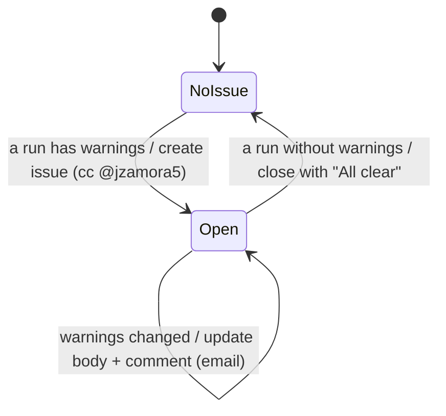

The fingerprint is stored in the issue body as an HTML comment, so the workflow can tell "same
warnings" from "new warnings". Counts don't change it, only which problems exist.

### 11.4 Logs

Each run's full log is on its Actions page, kept 90 days. It shows every account, every post's
link, every decision, every Gemini model used, and every event stored or merged.

---

## 12. The other commands: discover, refresh-token and admin

`python -m pa_bailar <command>` (`pa_bailar/__main__.py`). Each command imports only what it needs and
reads only its own secrets, so the sweep never needs the Meta app's secret.

### 12.1 `discover`: finding academies among the accounts you follow

Runs on your computer. The input is your Instagram data export ("Followers and following", HTML or
JSON) in `private/`.

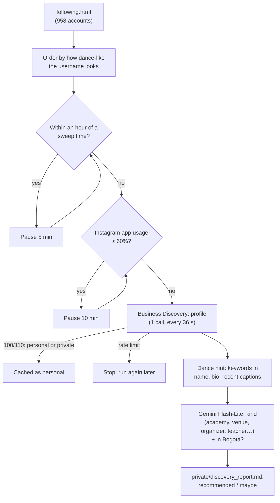

- **Resumable:** results are cached in `private/discovery.json`, and every run continues where the last
  stopped. Each run is capped (`--max-instagram`, `--max-gemini`).
- **Leaves Gemini quota for the sweeps:** the key's quota is shared, but the sweeps' usage is on the
  `sweep-state` branch, not in your `state/`. Before classifying, it reads what the sweeps used today and
  classifies at most the daily budget minus that, minus its own use, minus `DISCOVERY_LEAVES_FOR_SWEEPS`
  (250, for today's later sweeps).
- **Keeps out of the sweep's way:** it pauses from an hour before each sweep time until 45 minutes after
  (`discovery.near_sweep`), because Meta counts calls over a rolling hour and the sweep must find the
  quota free.
- **Recommended** means an academy, venue, organizer or dance company, in or probably in Bogotá. Adding
  an account means adding a line to `accounts.txt` through a PR. The next sweep treats it as new and loads
  its older posts.
- **Salsa bars and restaurants** are kept in `accounts.txt` as commented-out notes, with what discovery
  found about each. They're not swept for now.

### 12.2 `refresh-token`: a Meta token that doesn't expire

Runs on your computer, only when the token stops working.

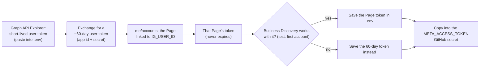

### 12.3 `admin`: running it day to day

`python -m pa_bailar admin <tool>` (`pa_bailar/commands/admin.py`), the tools behind the admin page.
They read what the sweeps record (no AI, no Gemini requests). [`docs/ADMIN.md`](ADMIN.md) is the guide.

- **`admin why <link>`** (`pa_bailar/why.py`): why a post's event is or isn't on the site. From the post's
  record (its `outcome`, Gemini's reason, the events in `events.json`), or, for a post never analyzed, its
  author from the public page (section 3.7: a collaboration follows its author), one Instagram call (the
  account's latest 50 posts) and the run history: posted after the last sweep, account not swept yet, too
  old, the account couldn't be read or isn't visible to the API, waiting for quota.
- **`admin add-account @x`**: checks that Instagram can read it (Business Discovery), then adds it to
  `accounts.txt` (`storage.add_account`, in its own section).
- **`sweep --post <link>`** (`Sweep.add_post`): one post by hand, without triage. Adds the account if it isn't
  swept. When the API doesn't give the post (not visible, not among the latest 50, a collaboration, the rate
  limit), it reads the post's public page (section 3.7; its id is `public-<id>`) and doesn't add an account
  the API can't read. A post analyzed before is only read again (one Gemini request) when its caption changed
  or it was filtered out as "not an event" or rejected; otherwise the answer is what it already became
  (`SETTLED_OUTCOMES`). `AddPostError` says in Spanish why it couldn't (neither source worked, no quota).
- **`admin inbox`** (`pa_bailar/inbox.py`): reads an issue or comment with fixed patterns (a link, `/agregar`,
  `/cuenta @x`, `/estado`, or the issue form's fields) and writes the answer; the `admin` workflow
  (`.github/workflows/admin.yml`) runs it on new issues and comments from `jzamora5`.
- **`admin status`** (`pa_bailar/status.py`): the latest and next sweeps; Gemini usage per model against
  its budget and when the quota resets (2:00 a.m. Bogotá while the US is on daylight time, 3:00 a.m.
  otherwise); whether the Instagram token works and the share of Instagram's quota used (one call, `--no-instagram`
  skips it); accounts still in their first sweep; provisional posts; upcoming events; discovery progress.
  `--json` gives the same as data. On your computer it reads the sweeps' state from the `sweep-state`
  branch.

---

## 13. CI, dependencies and security

### 13.1 Checks

`ci.yml` runs on every pull request and on every push to `main`:
- `ruff check` (lint);
- `ruff format --check`;
- `mypy` (strict, with the Pydantic plugin);
- `pytest`.

The tests use fake Instagram and Gemini clients, so no network or quota is involved. The
autouse fixture `isolated_files` sends every file a test writes to a temporary folder.

### 13.2 Dependencies

- **Direct dependencies** are pinned in `requirements.in` (the sweep) and `requirements-dev.in` (plus
  the development tools).
- **`requirements.txt` and `requirements-dev.txt` are generated** with `pip-compile --generate-hashes`.
  They pin **every indirect dependency with hashes**, and pip refuses any file that doesn't match, so a
  new or tampered release can't slip into a run.
- **Dependabot** updates them weekly, together with the GitHub Actions used.

### 13.3 Security choices

| Risk | Mitigation |
|---|---|
| A compromised dependency reading the repository token during the sweep | No checkout keeps credentials (`persist-credentials: false`). The write token is only in the "save the state" step, and the App token is minted after the sweep |
| Secrets exposed to steps that don't need them | The Gemini and Meta secrets are only in the sweep step's environment. The Meta app secret isn't on GitHub at all |
| A leaked cron-job.org token | Scope: start or cancel runs of this repository only, no code or secrets. `--days` is capped at 30, so a forced run can't spend the day's quotas on old posts. `concurrency` caps the runs at one running and one waiting. Adding a post by hand (`post_url`) needs an open `admin` issue by `jzamora5` (the `request` job, section 5.2), and inputs never reach shell code directly, so the token can't publish a post or run commands |
| The Meta token in error text | It's sent in the URL; `instagram.redact` removes it from every error before logs, `status.json` or admin answers (section 8) |
| Bad data on the public site | The site's `ci` checks every data PR against the contract (`check-data.mjs`) before it can merge, and the site's `main` only takes squash-merged PRs that pass `ci` |
| Private files committed | `.env` and `private/` are git-ignored. `private/` holds your Instagram export, the discovery results and the App's `.pem` |
| Tagging strangers from the health issue | Handles in reports are neutralized (section 11.2) |
| Unreviewed changes to the backend's `main` | **Not enforced** (section 3.3): rulesets need a paid plan on private repositories. Work goes through PRs with `ci` by convention |

---

## 14. Quotas and capacity

With **50 followed accounts** and two runs a day (each account read about once a day: section 5,
"Whose turn it is"):

| Resource | Limit | Use per run | Use per day | Headroom |
|---|---|---|---|---|
| Instagram calls (Business Use Case quota, rolling 24 h) | Grows with our account's impressions; low for a small account | About 30 (half the accounts, plus up to 5 late ones) | About 55 | The sweep stops at 90% usage (`INSTAGRAM_USAGE_STOP`) and the accounts not reached go first next run. `discover` keeps clear of sweep times |
| Gemini Flash-Lite | 500 / day (498 usable) | 1 triage per new post, plus provisional extractions | Usually 20–80 new posts | Comfortable. Loading new accounts' older posts can use a few hundred for a few days |
| Gemini Flash (two models) | 20 / day each (36 usable) | 1 per post that announces events | Usually under 20 | Tight while new accounts load (provisional fallback); fine afterwards |
| GitHub Actions minutes (private repository) | 2,000 / month | 3–5 min normally; up to ~35 while new accounts load | ~10 normally | ~300 a month normally; heavy loading weeks stay under the limit. Set an Actions spending limit of $0 so runs stop instead of being charged |
| GitHub Actions minutes (public site repository) | Unlimited | ci + deploy, ~2 min | | |
| cron-job.org | Unlimited jobs | 1 call | 2 | |
| healthchecks.io | Free plan | 1 ping | 2 | |

**The time budget:** a run stops starting Gemini work after 30 minutes (`MAX_RUN_MINUTES`). The step
itself stops at 35, and the job at 60, leaving room for the state, the PR and the merge.

**Adding accounts:** each new account costs about 1 Instagram call a day, plus a one-time load of up to
30 older posts. Regular accounts always go first, so new ones never crowd out today's posts.

---

## 15. Failure modes and runbook

| Symptom | Likely cause | What to do |
|---|---|---|
| cron-job.org email "execution failed", with HTTP `401` | The fine-grained token expired or was revoked | Create a new one (resource owner `pa-bailar`, repository `backend`, Actions read/write) and replace it in both cron jobs |
| cron-job.org email with HTTP `404` | Workflow file renamed, or the token can't see the repository | Fix the URL or the token's repository access |
| healthchecks.io "DOWN", **no ping** | No run started: cron-job.org disabled, or GitHub accepted the call but never ran it | Check cron-job.org's history and the Actions page. Start a run with *Run workflow* |
| healthchecks.io "DOWN", **failure ping** | The run failed: open the run log linked in the ping body | See the next rows |
| "Instagram token invalid" | The Page token was revoked (for example, a Facebook password change) | Section 12.2: `refresh-token`, then update the `META_ACCESS_TOKEN` secret |
| "Every account failed" | Something besides the rate limit broke every call (the Graph API version retired, a permission removed from the Meta app) | Read the errors in the log. Check the app in Meta for Developers. Raise `GRAPH_API_URL`'s version if Meta retired it |
| "The data PR did not merge within 20 minutes" | The site's `ci` failed on the data (`check-data.mjs`), or GitHub was slow | Open the PR in the site repository and read `ci`. A contract mismatch means `models.py` and the site's `check-data.mjs` / `types.ts` disagree: fix both |
| Warning: `@account` couldn't be read in 3 runs | Renamed, made private, or switched to a personal account | Check on Instagram. Update or remove the line in `accounts.txt` |
| Warning: rate limit in 3 runs | Too many accounts, or `discover` running at sweep times | Reduce `discover` runs. Spread accounts across the two runs if needed |
| Warning: backlog stuck | Gemini's free quota is too small for the posts coming in | Lower `POSTS_PER_ACCOUNT`, remove inactive accounts, or check AI Studio's current limits and update `MODEL_LIMITS` |
| Warning: no events in a week | A prompt or the triage rejecting everything (for example, a model change) | Read "not an event" reasons in the logs; tune `prompts.py` |
| "Gemini API key doesn't work" (the run fails) | The key was revoked, expired or deleted | Create a key in Google AI Studio and update `GEMINI_API_KEY` (`.env` and the GitHub secret). No post was marked: they're read on the next run (`GeminiKeyError`) |
| "A data PR hasn't merged" (the run fails at step 6c) | An earlier data PR's `ci` failed, or it took more than 20 minutes | Open it in the site repository: fix what `ci` says and merge it (or merge it if it just needed time). Sweeps resume on the next run |
| Gemini model names stop working (404) | Google retired a model | The pool skips it automatically. Update `MODEL_LIMITS` and the role tuples in `config.py` to current models |
| An event on the site is wrong | Gemini misread a flyer | Check it under "Events to review". Editing `data/events.json` by hand in a site PR works, but a later re-extraction of that post (edited caption) can overwrite it |

**Running a sweep by hand:** the Actions page → `daily-sweep` → *Run workflow* (optionally with
`days`, 1–30).

**Running locally:** see the README. Local runs write into the sibling site checkout
(`../pa-bailar-web/data`) and keep their own state in `state/`.

---

## 16. Code map

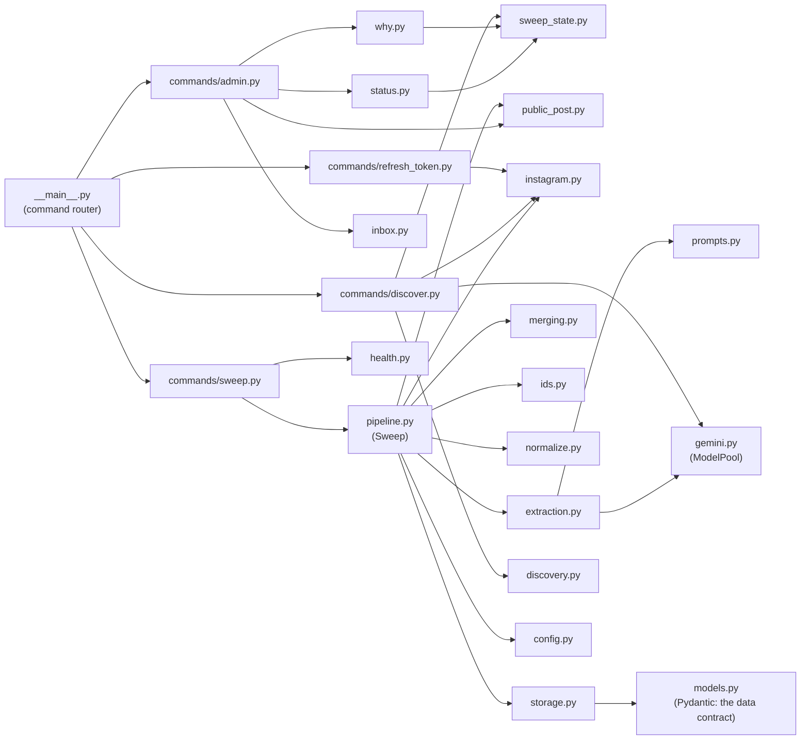

| Module | Responsibility |
|---|---|
| `config.py` | Paths, secrets from the environment, quotas, windows, retention, sweep times, Bogotá's time zone |
| `models.py` | Pydantic models: what Gemini returns (`Triage`, `PostAnalysis`, `ExtractedEvent`, `AccountClassification`) and what is stored (`StoredEvent`, `EventMedia`, `ProcessedPost`, `AccountState`). The source of truth for the data contract |
| `instagram.py` | Graph API client: token check, posts, profiles, images, error classification, app usage |
| `public_post.py` | One post from its public embed page, for the admin tools when the API can't give it (section 3.7) |
| `gemini.py` | `ModelPool`: model order, pacing, daily budgets shared across runs, retries, error classes |
| `prompts.py` | The triage and extraction prompts |
| `extraction.py` | `EventExtractor`: triage, then extraction, with the provisional fallback |
| `normalize.py` | Cleans Gemini's output into the formats the site relies on |
| `merging.py` | Matches an extracted event to a stored one and merges posts into one event |
| `ids.py` | Readable, stable event ids (the event's URL) |
| `pipeline.py` | `Sweep`: accounts, posts, storing, retention, run statistics |
| `clips.py` | Videos' preview clips: download, cut 6 silent seconds with ffmpeg |
| `storage.py` | Reading and writing every JSON file (atomically, LF line endings), flyers, `accounts.txt` |
| `health.py` | Run history, health rules, events to review, the report and its fingerprint |
| `status.py` | What `admin status` shows: sweeps, Gemini usage, Instagram, accounts, events (data and Spanish text) |
| `sweep_state.py` | The sweeps' latest state on your computer: reads the `sweep-state` branch with git |
| `why.py` | `admin why`: why a post's event is or isn't on the site (fixed checks, Spanish answer) |
| `inbox.py` | The admin inbox: what an issue or comment asks for |
| `links.py` | Instagram post links (code, account) and links to the site's events |
| `discovery.py` | Parsing the Instagram export, dance hints, the classification prompt, the report, quiet windows around sweeps |
| `text.py`, `logs.py` | Accent-insensitive comparison, logging setup |
| `commands/*.py` | The commands (sweep, discover, refresh-token, admin): arguments, wiring, exit codes, GitHub outputs |
